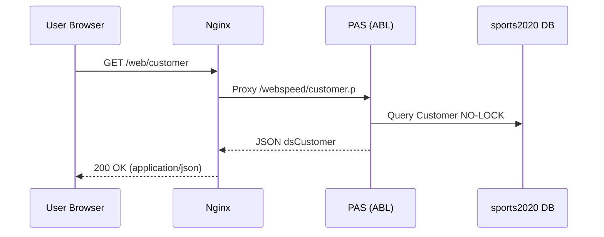
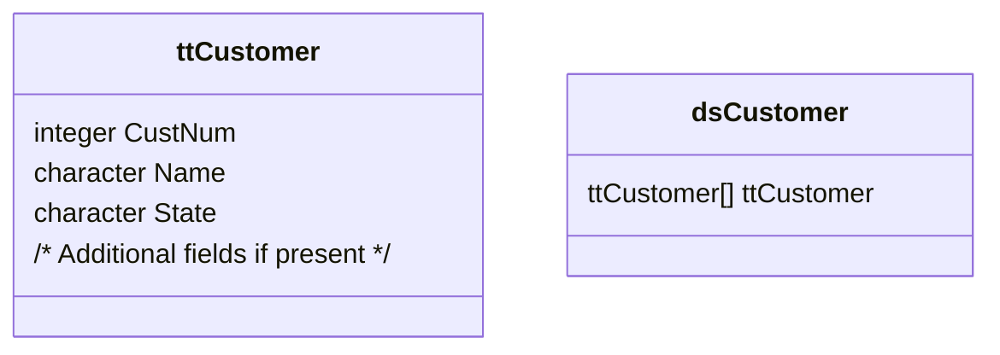

# Phase 1: Repository Inspection & Technical Documentation Generation

This prompt governs the first documentation pass over the Progress OpenEdge Sports App codebase. The goal is to extract architecture, behavior, and requirements directly from source artifacts—producing traceable, accurate markdown documents with supporting diagrams.

## 1. Objectives
1. Enumerate and document functional requirements (MOSCOW prioritization) evidenced by existing code.
2. Enumerate and document non-functional requirements (performance, security, scalability, maintainability, usability) manifested in scripts, configuration, and patterns.
3. Map deployment scenarios and environment variants (legacy vs modern, local vs AWS).
4. Capture usability features surfaced in UI layer (`src/webui/`, HTML templates, menus).
5. Produce architecture, sequence, and structural diagrams (Mermaid) illustrating data flow and component interaction.
6. Establish and record the documentation process for reproducibility.

## 2. Scope
Covered directories & files:
- Core business logic: `src/webspeed/*.p`, `src/webspeed/*.html`, include files (`*.i`).
- UI assets: `src/webui/*.html`, `src/webui/*.js`.
- Build/deploy scripts: `build.sh`, `deploy.sh`, `test.sh`, `scripts/*.sh`.
- Runtime configuration: `app/pas/openedge.properties`, `app/pas/autoreconnect.pf`, `app/web/nginx.conf`.
- Infrastructure & legacy configs: `iac/**`, `app/db/*.properties`.
- GitHub workflow: `github/workflows/pipeline.yml`.

## 3. Output Artifacts
Create or update markdown files under `documentation/` using these subfolders:
- `architecture/` – High-level component views, sequence diagrams.
- `api/` – Endpoint & procedure references (JSON output, temp-table schemas).
- `requirements/` – Functional (MOSCOW) + Non-functional catalogs.
- `deployment/` – Scenarios (local 117, 122, AWS), artifact packaging, environment variables.
- `usability/` – UI navigation, user flows, supported interactions.
- `process/` – `DOCUMENTATION_PROCESS.md` detailing methodology and traceability.

## 4. Functional Requirements Format (MOSCOW)
Each entry:
- **Requirement**: Concise capability description.
- **Priority**: Must have | Should have | Could have | Won't have.
- **Rationale**: Why it matters for users or system.
- **Source**: File(s) & symbol(s) proving implementation (e.g., `src/webspeed/customer.p: FOR EACH Customer ...`).
- **Evidence** (optional): Snippet or behavior summary.

Example:
```markdown
**Requirement**: Serve customer list as JSON dataset.
**Priority**: Must have
**Rationale**: Enables UI grid population for customer management.
**Source**: `src/webspeed/customer.p` (dataset `dsCustomer`, temp-table `ttCustomer` population).
**Evidence**: Procedure constructs `ttCustomer` via FOR EACH Customer NO-LOCK and serializes dataset.
```

## 5. Non-Functional Requirements Format
Each entry:
- **Requirement**: Short description.
- **Category**: Performance | Security | Scalability | Maintainability | Usability.
- **Rationale**: Importance.
- **Source**: File(s) or pattern (e.g., `test.sh` response validation; `openedge.properties` PROPATH settings).
- **Mechanism** (optional): How requirement is achieved (e.g., NO-LOCK reads for concurrency).

Example:
```markdown
**Requirement**: Read-only queries minimize blocking.
**Category**: Performance
**Rationale**: Reduces contention on sports2020 DB for concurrent requests.
**Source**: `src/webspeed/customer.p` (NO-LOCK used in FOR EACH Customer).
**Mechanism**: ABL NO-LOCK prevents record locks, improving throughput.
```

## 6. Diagram Guidelines (Mermaid)
Use these types:
- Flowchart: Component relationships (Browser → Nginx → PAS → DB).
- SequenceDiagram: Request lifecycle (UI request to dataset serialization).
- ClassDiagram: Illustrate logical data structures (temp-table, dataset, JSON model) – treat ABL temp-tables as classes with fields.
- ER-style (emulated via graph) for key tables if inferred (Customer, State).

Sequence Example:


Class (Temp-table) Example:


## 7. Data Representation
Document temp-table & dataset schemas with field name, inferred type, optionality, and origin (table vs computed).
If field list incomplete, mark with "(Pending Confirmation)".

## 8. Deployment Scenarios
Identify and document:
- Legacy local (117): Differences in config & packaging.
- Modern local (122): PAS + Nginx separation, artifact directories.
- AWS: CloudFormation parameters, S3 artifact separation (`web.tar.gz`, `pas.tar.gz`, `db.tar.gz`).
Include ports, service layering, host substitution patterns.

## 9. Usability Features
From UI files (`src/webui/*.html`, `menu.html`, `index.html`):
- Navigation structure (menu items → pages).
- Data presentation components (grid.js usage).
- Any inline help or structural layout patterns.

## 10. Process Documentation (`DOCUMENTATION_PROCESS.md`)
Record:
- Date of analysis.
- Files scanned (list or glob patterns).
- Extraction methodology (e.g., static code inspection, dataset inference).
- Tools or scripts referenced.
- Outstanding questions / assumptions.
Provide reproducible steps for next contributor.

## 11. Quality Checklist (Apply Before Finalizing)
1. Every requirement cites at least one source file.
2. Diagrams render (no syntax errors in Mermaid blocks).
3. JSON examples align with dataset structure.
4. No speculative features without source evidence.
5. All links relative & valid.
6. Priorities (MOSCOW) applied consistently to functional requirements.

## 12. Naming & Consistency Rules
- Use consistent casing for ABL entities; do not rename fields.
- Refer to database as `sports2020`.
- Use "PAS" for Pacific Application Server.
- Use "artifact package" for build output tarballs.

## 13. Do / Don't
DO:
- Cross-link related docs instead of duplicating content.
- Mark assumptions clearly.
- Highlight modernization deltas (legacy vs PAS).
DON'T:
- Copy large existing doc sections verbatim.
- Invent database fields.
- Omit source references.

## 14. Completion Signal
When phase output is ready, end main summary doc with: `Status: Phase 1 Documentation Complete`.

## 15. Handling Ambiguities
If a detail cannot be derived (e.g., missing field definitions):
- Add a subsection "Open Questions" with bullet points.
- Tag with `TODO` for follow-up.

## 16. Suggested Artifact List (Minimum)
- `documentation/architecture/architecture-overview.md`
- `documentation/api/customer.md`
- `documentation/requirements/functional-requirements.md`
- `documentation/requirements/non-functional-requirements.md`
- `documentation/deployment/deployment-scenarios.md`
- `documentation/usability/ui-navigation.md`
- `documentation/process/DOCUMENTATION_PROCESS.md`

## 17. Example Functional vs Non-Functional Pair
```markdown
Functional:
**Requirement**: Provide state list for UI selection.
**Priority**: Should have
**Rationale**: Enhances filtering and user interaction.
**Source**: `src/webspeed/state-data.p` (temp-table population, dataset output).

Non-Functional:
**Requirement**: Lightweight JSON serialization.
**Category**: Performance
**Rationale**: Reduces payload size for client-side rendering.
**Source**: Use of dataset with only needed fields in `customer.p`.
```

## 18. Verification Hooks
Reference `test.sh` outputs to confirm endpoint behavior. If test coverage missing, note gap in `DOCUMENTATION_PROCESS.md`.

## 19. Version Awareness
Mark version-specific behaviors with inline callouts:
> **Version:** 117 (Legacy) – single-tier local packaging.
> **Version:** 122 (Modern) – PAS + Nginx separation.

## 20. Change Tracking
Add a simple change log section to newly created docs:
```markdown
---
Changes:
- 2025-10-21: Initial extraction (Phase 1).
```

## 21. Final Remark
All content must be source-derived. If in doubt, prefer omission + TODO over speculation.

---
End of Phase 1 prompt.
