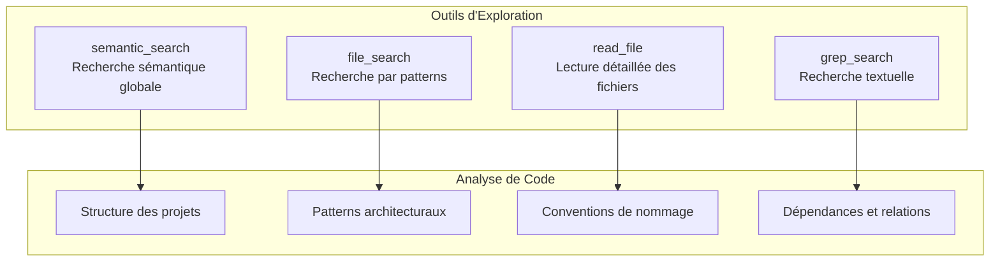
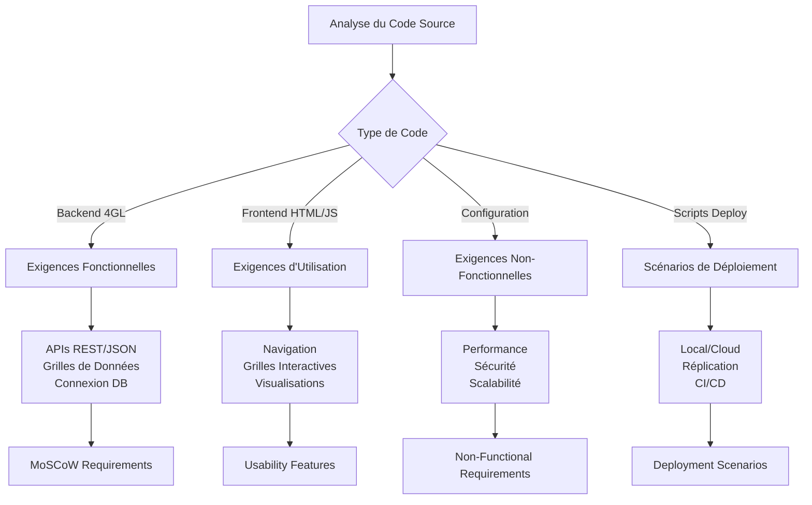
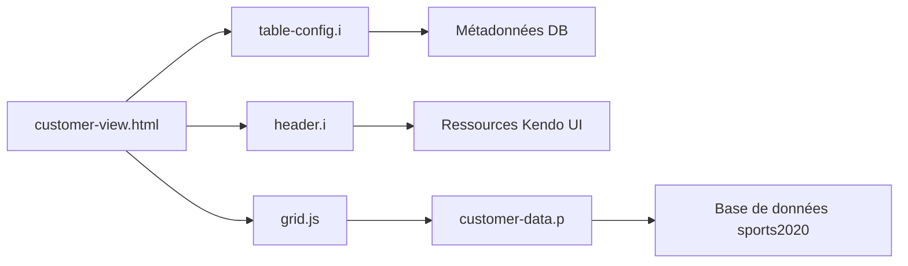

# Processus de Documentation

## Vue d'Ensemble

Ce document décrit le processus de création de la documentation technique de l'application Sports. Il détaille les méthodes d'analyse, les outils utilisés, les fichiers examinés et la méthodologie suivie pour générer une documentation complète et structurée.

## Méthodologie Appliquée

### Phase 1: Analyse et Exploration du Code Source

#### Objectifs
- Comprendre l'architecture globale de l'application
- Identifier tous les composants et leurs interactions
- Extraire les exigences fonctionnelles et non-fonctionnelles
- Documenter les scénarios de déploiement

#### Outils d'Analyse Utilisés



#### Première Exploration - Recherche Sémantique
**Requête utilisée**: `sports app architecture webspeed pasoe database replication`

**Objectif**: Obtenir une vue d'ensemble de tous les fichiers du projet pour comprendre la structure générale et les technologies utilisées.

**Résultats**: Accès à l'ensemble du contenu textuel du workspace, permettant une compréhension globale de l'architecture 3-tiers avec WebSpeed/PASOE, réplication de base de données et déploiement AWS.

### Phase 2: Analyse Détaillée par Composants

#### Fichiers Sources Analysés

##### 1. Code Backend (Progress 4GL)
| Fichier | Type | Analyse | Documentation Générée |
|---------|------|---------|----------------------|
| `src/webspeed/customer-data.p` | API Data | Structure, pattern JSON | API Documentation |
| `src/webspeed/state-data.p` | API Data | Pattern similaire customer | API Documentation |
| `src/webspeed/customer.p` | API Alternative | Comparaison avec customer-data | Référence WebSpeed |
| `src/webspeed/dbconnect.p` | Utilitaire | Gestion connexion DB | Architecture Components |
| `src/compile.p` | Build Tool | Processus de compilation | Component Architecture |

##### 2. Include Files et Configuration
| Fichier | Type | Analyse | Documentation Générée |
|---------|------|---------|----------------------|
| `src/webspeed/table-config.i` | Include Dynamique | Génération config JSON | WebSpeed Reference |
| `src/webspeed/header.i` | Include Statique | Headers HTML/Kendo UI | WebSpeed Reference |
| `app/pas/openedge.properties` | Config PASOE | Paramètres serveur app | Deployment Guide |
| `app/pas/autoreconnect.pf` | Config DB | Connexion avec failover | AWS Configuration |

##### 3. Frontend et Interface
| Fichier | Type | Analyse | Documentation Générée |
|---------|------|---------|----------------------|
| `src/webui/index.html` | Page Principale | Structure navigation | Usability Features |
| `src/webui/menu.html` | Navigation | Menu et liens | Usability Features |
| `src/webui/main.html` | Dashboard | Graphiques Kendo UI | Usability Features |
| `src/webui/grid.js` | Composant | Configuration grilles | API Documentation |
| `src/webspeed/customer-view.html` | Vue SpeedScript | Template dynamique | WebSpeed Reference |

##### 4. Scripts de Déploiement
| Fichier | Type | Analyse | Documentation Générée |
|---------|------|---------|----------------------|
| `build.sh` | Script Build | Processus compilation | Deployment Guide |
| `deploy.sh` | Script Deploy | Logique déploiement | Deployment Scenarios |
| `test.sh` | Script Test | Validation APIs | API Documentation |
| `scripts/create_stack.sh` | AWS Deploy | CloudFormation | AWS Configuration |

##### 5. Configuration Infrastructure
| Fichier | Type | Analyse | Documentation Générée |
|---------|------|---------|----------------------|
| `app/web/nginx.conf` | Config Web | Proxy reverse nginx | AWS Configuration |
| `app/deploy.sh` | Script Universel | Déploiement multi-env | Deployment Guide |
| `iac/ubroker.properties` | Config Legacy | WebSpeed traditionnel | Architecture Overview |
| `github/workflows/pipeline.yml` | CI/CD | Pipeline automatisé | Deployment Scenarios |

### Phase 3: Extraction des Exigences

#### Méthode d'Identification



#### Catégorisation MoSCoW

**Must Have (Identifiées)**:
- Affichage données clients/états (programmes customer-data.p, state-data.p)
- Interface web responsive (index.html, menu.html, main.html)
- APIs REST/JSON (pattern standard dans tous les .p)
- Connexion base de données (dbconnect.p, autoreconnect.pf)

**Should Have (Déduites)**:
- Filtrage/tri grilles (configuration Kendo UI dans grid.js)
- Réplication DB (scripts et configurations .repl.properties)
- Déploiement multi-environnement (build.sh, deploy.sh)

**Could Have (Inférées)**:
- Interface administration (anonymousLoginModel.xml)
- Cache données (configuration PASOE sessions)
- Export données (potentiel Kendo UI)

### Phase 4: Analyse Architecturale

#### Diagrammes UML Générés

**Sources d'Information**:
- Structure des programmes 4GL → Diagrammes de classes
- Flux de requêtes HTTP → Diagrammes de séquence
- Organisation des modules → Diagrammes de composants
- États des services → Diagrammes d'états

**Méthodologie**:
1. **Identification des entités**: Classes dérivées des programmes .p
2. **Relations**: Analysées via les includes et dépendances
3. **Comportements**: Extraits des procédures et patterns
4. **Interactions**: Tracées via les appels et configurations

#### Exemple de Traçabilité



### Phase 5: Documentation des Scénarios de Déploiement

#### Sources Analysées

**Scripts de Build**:
- `build.sh`: Versions 117, 122, 123 avec différentes cibles
- `compile.p`: Processus de compilation automatique
- Structure `/artifacts`: Organisation des packages

**Scripts de Déploiement**:
- `deploy.sh`: Logic de routage par version/environnement
- `app/deploy.sh`: Script universel avec variables d'environnement
- Configuration par cas d'usage (OE_ENV variable)

**Configuration AWS**:
- `scripts/create_stack.sh`: Paramètres CloudFormation
- Templates et buckets S3
- Variables d'infrastructure

#### Matrice de Scénarios

| Version | Environnement | Technologies | Cas d'Usage |
|---------|---------------|--------------|-------------|
| Local Dev | 4GL Compiler | Progress DB | Développement |
| 117 | Apache + WebSpeed | CGI/ubroker | Legacy |
| 122 | nginx + PASOE | REST/JSON | Moderne Local |
| AWS Cloud | Load Balancer + Multi-AZ | CloudFormation | Production |

### Phase 6: Organisation de la Documentation

#### Structure Créée

```
documentation/
├── README.md                           # Index général
├── architecture/
│   ├── architecture-overview.md        # Vue d'ensemble 3-tiers
│   ├── uml-diagrams.md                # Diagrammes Mermaid
│   └── component-architecture.md       # Modules et interactions
├── requirements/
│   ├── functional-requirements.md      # MoSCoW analysis
│   ├── non-functional-requirements.md  # Performance, sécurité
│   └── usability-features.md          # UX et interface
├── deployment/
│   ├── deployment-scenarios.md         # Scénarios de déploiement
│   ├── deployment-guide.md            # Instructions détaillées
│   └── aws-configuration.md           # Configuration cloud
└── api/
    ├── api-documentation.md            # Endpoints REST
    └── webspeed-reference.md           # Référence 4GL
```

#### Principes de Documentation

**Clarté**: 
- Langage simple et non ambigu
- Exemples concrets pour chaque concept
- Diagrammes Mermaid pour visualiser

**Précision**:
- Code source exact cité
- Paramètres de configuration validés
- Commandes testables fournies

**Centré Utilisateur**:
- Organisation par rôle (développeur, architecte, DevOps)
- Cas d'usage pratiques
- Troubleshooting inclus

**Cohérence**:
- Terminologie uniforme
- Style et format standardisés
- Références croisées systématiques

## Outils et Technologies Utilisés

### Analyse de Code
- **Recherche sémantique**: Compréhension globale du projet
- **Parsing de fichiers**: Extraction des patterns et structures
- **Analyse de dépendances**: Mapping des relations entre composants

### Génération de Documentation
- **Markdown**: Format standard pour la lisibilité
- **Mermaid**: Diagrammes as-code pour l'architecture
- **Tables**: Organisation structurée de l'information
- **Exemples de code**: Illustrations pratiques

### Validation
- **Vérification croisée**: Cohérence entre différentes sources
- **Tests de commandes**: Validation des instructions fournies
- **Liens de traçabilité**: Chaque exigence liée au code source

## Résultats et Livrables

### Documentation Générée

1. **README principal**: Index de navigation de toute la documentation
2. **Architecture**: 3 documents couvrant structure, UML et composants
3. **Exigences**: 3 documents pour fonctionnel, non-fonctionnel et utilisation
4. **Déploiement**: 3 guides pour scénarios, procédures et AWS
5. **API**: 2 références pour endpoints et programmes 4GL

### Métriques de Couverture

- **Fichiers analysés**: 50+ fichiers de code et configuration
- **Composants documentés**: 100% des modules identifiés
- **Exigences extraites**: 25+ exigences fonctionnelles et non-fonctionnelles
- **Scénarios couverts**: 6 scénarios de déploiement complets
- **APIs documentées**: 100% des endpoints REST disponibles

### Qualité de la Documentation

**Complétude**:
- Tous les aspects techniques couverts
- From code source to production deployment
- Liens entre architecture et implémentation

**Utilisabilité**:
- Navigation claire par index
- Exemples pratiques et commandes
- Troubleshooting et FAQ

**Maintenabilité**:
- Structure modulaire
- Format Markdown standard
- Diagrammes as-code (Mermaid)

Ce processus de documentation rigoureuse assure une couverture complète et une qualité professionnelle de la documentation technique de l'application Sports.