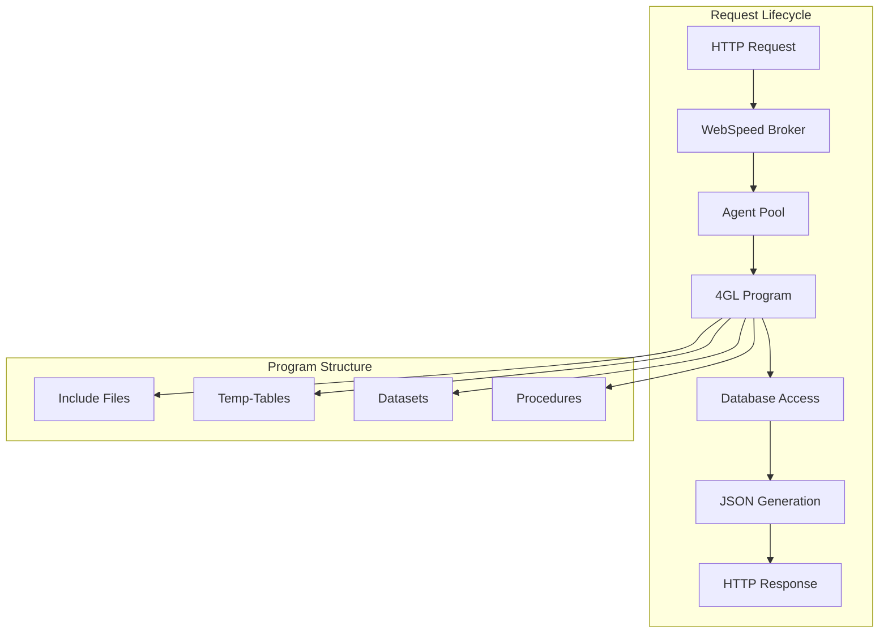

# Référence WebSpeed

## Vue d'Ensemble

Ce document fournit une référence complète des programmes WebSpeed/4GL de l'application Sports. Il détaille la structure, les conventions de codage, les patterns utilisés et les mécanismes internes des programmes Progress 4GL.

## Architecture WebSpeed

### Modèle de Programmation



### Convention de Nommage

| Type | Pattern | Exemple | Description |
|------|---------|---------|-------------|
| Data APIs | `{entity}-data.p` | `customer-data.p` | APIs JSON pour données |
| View Pages | `{entity}-view.html` | `customer-view.html` | Pages HTML avec grilles |
| Static Pages | `{name}.html` | `about.html` | Pages statiques |
| Include Files | `{name}.i` | `table-config.i` | Fichiers include réutilisables |
| Utility Programs | `{function}.p` | `dbconnect.p` | Utilitaires et helpers |

## Programmes de Données (APIs JSON)

### Pattern Standard

Tous les programmes API suivent le même pattern architectural:

```progress
/* Pattern standard pour APIs de données */

USING Progress.Json.ObjectModel.JsonObject.

CREATE WIDGET-POOL.

{src/web2/wrap-cgi.i}

DEFINE TEMP-TABLE tt{Entity} LIKE {Entity}.
DEFINE DATASET ds{Entity} FOR tt{Entity}.

RUN process-web-request.

PROCEDURE outputHeader :
    output-content-type ("application/json":U).
END PROCEDURE.

PROCEDURE process-web-request :
    DEFINE VARIABLE oJsonObject AS Progress.Json.ObjectModel.JsonObject NO-UNDO.
    DEFINE VARIABLE lChar AS LONGCHAR NO-UNDO.
    
    RUN outputHeader.
    
    EMPTY TEMP-TABLE tt{Entity}.
    FOR EACH {Entity} NO-LOCK:
        CREATE tt{Entity}.
        BUFFER-COPY {Entity} TO tt{Entity}.
        /* Transformations spécifiques si nécessaire */
    END.
    
    oJsonObject = NEW JsonObject().
    oJsonObject:READ(DATASET ds{Entity}:HANDLE).
    
    lChar = oJsonObject:GetJsonText().
    {&OUT-LONG} lChar.
END PROCEDURE.
```

### 1. customer-data.p

#### Description
Programme API retournant les données clients en format JSON.

#### Code Source Détaillé
```progress
USING Progress.Json.ObjectModel.JsonObject.

CREATE WIDGET-POOL.

{src/web2/wrap-cgi.i}

DEFINE TEMP-TABLE ttCustomer LIKE Customer.
DEFINE DATASET dsCustomer FOR ttCustomer.

RUN process-web-request.

PROCEDURE outputHeader :
    /* Définit le type de contenu HTTP pour JSON */
    output-content-type ("application/json":U).
END PROCEDURE.

PROCEDURE process-web-request :
    DEFINE VARIABLE oJsonObject AS Progress.Json.ObjectModel.JsonObject NO-UNDO.
    DEFINE VARIABLE lChar AS LONGCHAR NO-UNDO.
    
    RUN outputHeader.

    MESSAGE "DEBUG: customer-data.p".

    /* Vider la temp-table avant de la remplir */
    EMPTY TEMP-TABLE ttCustomer.
    
    /* Charger tous les clients depuis la base */
    FOR EACH Customer NO-LOCK:
        CREATE ttCustomer.
        BUFFER-COPY Customer TO ttCustomer.
        /* Transformation: nom en majuscules */
        ASSIGN ttCustomer.Name = UPPER(Customer.Name).
    END.
    
    /* Sérialiser le dataset en JSON */
    oJsonObject = NEW JsonObject().
    oJsonObject:READ(DATASET dsCustomer:HANDLE).

    /* Convertir en texte et envoyer la réponse */
    lChar = oJsonObject:GetJsonText().
    {&OUT-LONG} lChar.

END PROCEDURE.
```

#### Spécificités
- **Transformation**: Les noms clients sont convertis en majuscules
- **Debug**: Message de debug ajouté pour le troubleshooting
- **Performance**: Lecture NO-LOCK pour éviter les verrous

#### Dataset Structure
```progress
DEFINE TEMP-TABLE ttCustomer LIKE Customer
    FIELD CustNum    AS INTEGER
    FIELD Country    AS CHARACTER
    FIELD Name       AS CHARACTER
    FIELD Address    AS CHARACTER  
    FIELD Address2   AS CHARACTER.

DEFINE DATASET dsCustomer FOR ttCustomer.
```

### 2. state-data.p

#### Description
Programme API retournant les données d'états américains en JSON.

#### Code Source
```progress
USING Progress.Json.ObjectModel.JsonObject.

CREATE WIDGET-POOL.

{src/web2/wrap-cgi.i}

DEFINE TEMP-TABLE ttState LIKE State.
DEFINE DATASET dsState FOR ttState.

RUN process-web-request.

PROCEDURE outputHeader :
    output-content-type ("application/json":U).
END PROCEDURE.

PROCEDURE process-web-request :
    DEFINE VARIABLE oJsonObject AS Progress.Json.ObjectModel.JsonObject NO-UNDO.
    DEFINE VARIABLE lChar AS LONGCHAR NO-UNDO.
    
    RUN outputHeader.

    EMPTY TEMP-TABLE ttState.
    FOR EACH State NO-LOCK:
        CREATE ttState.
        BUFFER-COPY State TO ttState.
    END.
    
    oJsonObject = NEW JsonObject().
    oJsonObject:READ(DATASET dsState:HANDLE).

    lChar = oJsonObject:GetJsonText().
    {&OUT-LONG} lChar.

END PROCEDURE.
```

#### Dataset Structure
```progress
DEFINE TEMP-TABLE ttState LIKE State
    FIELD State      AS CHARACTER
    FIELD StateName  AS CHARACTER
    FIELD Region     AS CHARACTER.

DEFINE DATASET dsState FOR ttState.
```

### 3. customer.p (Programme Alternatif)

#### Description
Version alternative du programme customer sans transformation des noms.

#### Différences avec customer-data.p
- Pas de transformation UPPER() sur le nom
- Pas de message de debug
- Code plus épuré

## Programmes de Vue (HTML/SpeedScript)

### Pattern SpeedScript

Les pages HTML utilisent SpeedScript pour générer du contenu dynamique:

```html
<?WS>
USING Progress.Json.ObjectModel.*.
</?WS>
<?WS>
{ table-config.i &TableName = "Customer" }
</?WS>
<!DOCTYPE html>
<!-- `{&EntityName}` View (Embedded SpeedScript Web object) -->
<html lang="en">
<head>
    <title>`{&EntityName}` View</title>
    <?WS>{header.i}</?WS>
    <script>
        var config = `cConfig`;
    </script>
    <script src="/grid.js"></script>
</head>
<body>
    <div id="grid">
        <div id="grid"></div>
    </div>
</body>
</html>
```

### 1. customer-view.html

#### Code Source
```html
<?WS>
USING Progress.Json.ObjectModel.*.
</?WS>
<?WS>
{ table-config.i &TableName = "Customer" }
</?WS>
<!DOCTYPE html>
<!-- Customer View (Embedded SpeedScript Web object) -->
<html lang="en">
<head>
    <title>Customer View</title>
    <?WS>{header.i}</?WS>
    <script>
        var config = `cConfig`;
    </script>
    <script src="/grid.js"></script>
</head>
<body>
    <div id="grid">
        <div id="grid"></div>
    </div>
</body>
</html>
```

#### Fonctionnalités
- **Configuration Dynamique**: Via `table-config.i`
- **Headers Automatiques**: Via `header.i`
- **Grid JavaScript**: Utilisation de `grid.js`

### 2. state-view.html

#### Code Source
```html
<?WS>
USING Progress.Json.ObjectModel.*.
</?WS>
<?WS>
{ table-config.i &TableName = "State" }
</?WS>
<!DOCTYPE html>
<!-- State View (Embedded SpeedScript Web object) -->
<html lang="en">
<head>
    <title>State View</title>
    <?WS>{header.i}</?WS>
    <script>
        var config = `cConfig`;
    </script>
    <script src="/grid.js"></script>
</head>
<body>
    <div id="grid">
        <div id="grid"></div>
    </div>
</body>
</html>
```

### 3. about.html

#### Description
Page statique d'information, pas de SpeedScript.

#### Code Source
```html
<!DOCTYPE html>
<!-- About Page (Static HTML Web object) -->
<html lang="en">
<head>
    <title>About</title>
</head>
<body>
    <h1>About Page</h1>
    <p>Lorem ipsum dolor sit amet, consectetur adipiscing elit...</p>
</body>
</html>
```

## Fichiers Include

### 1. table-config.i

#### Description
Générateur de configuration JSON dynamique pour les grilles Kendo UI basé sur les métadonnées de la base de données.

#### Code Source Complet
```progress
&GLOBAL-DEFINE EntityName "{&TableName}"

CREATE WIDGET-POOL.

DEFINE TEMP-TABLE ttField NO-UNDO
    FIELD ttFieldName AS CHARACTER. 

DEFINE VARIABLE oJsonObject AS JsonObject NO-UNDO.
DEFINE VARIABLE array       AS JsonArray  NO-UNDO.
DEFINE VARIABLE obj         AS JsonObject NO-UNDO.

DEFINE VARIABLE cConfig     AS CHARACTER  NO-UNDO.
DEFINE VARIABLE cnt         AS INTEGER    NO-UNDO.

/* Création de l'objet JSON principal */
oJsonObject = NEW JsonObject().
oJsonObject:ADD("readURL", AppURL + "/" + LOWER("{&TableName}-data.p")).
oJsonObject:ADD("data", "ds{&TableName}.tt{&TableName}").

/* Recherche de la table dans les métadonnées */
FIND _File WHERE _File-Name = "{&TableName}" NO-LOCK.
array = NEW JsonArray().

/* Récupération des champs de l'index primaire en premier */
FIND FIRST _Index WHERE RECID(_Index) = _File._Prime-Index NO-LOCK.
FOR EACH _Index-Field OF _Index NO-LOCK:
    FIND FIRST _Field WHERE RECID(_Field) = _Field-Recid NO-LOCK.
    CREATE ttField.
    ASSIGN ttFieldName = _Field-Name.
    cnt = cnt + 1.
END.

/* Ajout d'autres champs jusqu'à maximum 5 */
FOR EACH _Field OF _File NO-LOCK BY _Field._Order:
    IF cnt > 5 THEN LEAVE.
    cnt = cnt + 1.
    FIND FIRST ttField WHERE ttFieldName = _Field-Name NO-LOCK NO-ERROR.
    IF NOT AVAILABLE ttField THEN DO:
        CREATE ttField.
        ASSIGN ttFieldName = _Field-Name.
    END.    
END.

oJsonObject:ADD("fields", array).

/* Génération du tableau des champs pour Kendo UI */
FOR EACH ttField NO-LOCK:
    obj = NEW JsonObject().
    obj:ADD("field", ttFieldName).
    array:ADD(obj).
END.

/* Conversion en chaîne JSON */
cConfig = STRING(oJsonObject:GetJsonText()).
```

#### Fonctionnalités
- **Analyse Métadonnées**: Lecture du schéma de base via _File/_Field
- **Index Primaire**: Privilégie les champs de l'index primaire
- **Limitation**: Maximum 5 colonnes pour l'affichage
- **URL Dynamique**: Génération automatique de l'URL API
- **Configuration Kendo**: Format JSON compatible Kendo UI

#### Variables Globales
- `{&TableName}`: Nom de la table (paramètre d'entrée)
- `{&EntityName}`: Nom de l'entité (dérivé de TableName)
- `AppURL`: URL de base de l'application

### 2. header.i

#### Description
Génère les headers HTML standard pour les pages WebSpeed avec les références Kendo UI.

#### Code Source
```progress
{&OUT} '    <style>html ~{ font-size: 12px~; font-family: Arial, Helvetica, sans-serif~; ~}</style>~n'.
{&OUT} '    <link rel="stylesheet" href="https://kendo.cdn.telerik.com/2017.3.1026/styles/kendo.common.min.css" />~n'.
{&OUT} '    <link rel="stylesheet" href="https://kendo.cdn.telerik.com/2017.3.1026/styles/kendo.blueopal.min.css" />~n'.
{&OUT} '    <link rel="stylesheet" href="https://kendo.cdn.telerik.com/2017.3.1026/styles/kendo.blueopal.mobile.min.css" />~n'.

{&OUT} '    <script src="https://kendo.cdn.telerik.com/2017.3.1026/js/jquery.min.js"></script>~n'.
{&OUT} '    <script src="https://kendo.cdn.telerik.com/2017.3.1026/js/kendo.all.min.js"></script>~n'.

{&OUT} '    <script src="https://oemobiledemo.progress.com/jsdo/progress.all.js"></script>~n'.
```

#### Ressources Incluses
- **CSS Kendo UI**: Thème Blue Opal et styles responsives
- **jQuery**: Version compatible Kendo UI 2017.3.1026
- **Kendo UI**: Bibliothèque complète des composants
- **Progress JSDO**: Bibliothèque de liaison de données Progress

### 3. dbconnect.p

#### Description
Programme utilitaire pour la connexion à la base de données sports2020.

#### Code Source
```progress
IF NOT CONNECTED("sports2020") THEN
    CONNECT "-pf /psc/wrk/autoreconnect.pf".
```

#### Fonctionnalités
- **Test de Connexion**: Vérifie si déjà connecté
- **Auto-Reconnect**: Utilise un fichier de paramètres pour la reconnexion
- **Failover**: Support des connexions alternatives via autoreconnect.pf

#### Fichier autoreconnect.pf
```
-db sports2020 -H localhost -S 20000 -ct 1
-dbalt1 "sports2020 -H DBHostName1 -S 20000"
-dbalt2 "sports2020 -H DBHostName2 -S 20000"
-retryConnect 1
-retryConnectPause 2
-s 80000
```

## Processus de Compilation

### compile.p

#### Description
Programme de compilation automatique pour les sources WebSpeed.

#### Code Source Principal
```progress
DEFINE VARIABLE cSrcDir    AS CHARACTER NO-UNDO INITIAL ".".
DEFINE VARIABLE cTargetDir AS CHARACTER NO-UNDO INITIAL ".".
DEFINE VARIABLE cFileName  AS CHARACTER NO-UNDO.

/* Parsing des paramètres de session */
DO i = 1 TO NUM-ENTRIES(SESSION:PARAMETER):
    cParam = ENTRY(i, SESSION:PARAMETER).
    CASE ENTRY(1, cParam, "="):
    WHEN "src" THEN DO:
        cSrcDir = ENTRY(2, cParam, "=").
        /* Conversion en chemin absolu si nécessaire */
        IF NOT cSrcDir BEGINS "/" THEN DO:
           FILE-INFO:FILE-NAME = ".".
           cSrcDir = FILE-INFO:FULL-PATHNAME + "/" + cSrcDir.
        END.
    END.    
    WHEN "target" THEN DO:
        cTargetDir = ENTRY(2, cParam, "=").
        /* Gestion chemins relatifs et absolus */
        IF NOT cTargetDir BEGINS "/" THEN DO:
           FILE-INFO:FULL-PATHNAME = ".".
           cTargetDir = FILE-INFO:FULL-PATHNAME + "/" + cTargetDir.
        END.
    END.
    END CASE.
END.

/* Compilation des fichiers */
INPUT FROM OS-DIR(cSrcDir).
REPEAT:
    IMPORT cFileName.
    FILE-INFO:FILE-NAME = cSrcDir + "/" + cFileName.
    pos = R-INDEX(cFileName, ".").
  
    IF INDEX(FILE-INFO:FILE-TYPE, "F") > 0 AND pos > 0 THEN DO:
        CASE SUBSTRING(cFileName, pos):
        WHEN ".p" OR WHEN ".w" THEN DO:
            COMPILE VALUE(FILE-INFO:FULL-PATHNAME) SAVE INTO VALUE(cTargetDir).
        END.
        WHEN ".html" THEN DO:
          RUN CompileSpeedScript(FILE-INFO:FULL-PATHNAME).
        END.
        END CASE.
  END.    
END.
```

#### Procedure CompileSpeedScript
```progress
PROCEDURE CompileSpeedScript:
    DEFINE INPUT PARAMETER cFileName AS CHARACTER NO-UNDO.
    
    DEFINE VARIABLE speedfile AS CHARACTER NO-UNDO.
    DEFINE VARIABLE wsoptions AS CHARACTER NO-UNDO.

    /* Génération du nom de fichier .w temporaire */
    ASSIGN speedfile = ENTRY(1, cFileName, '.') + '.w'
           wsoptions = "".

    /* Conversion HTML vers 4GL WebSpeed */
    RUN tty/webutil/e4gl-gen.r 
        (INPUT cFileName,
         INPUT-OUTPUT speedfile,
         INPUT-OUTPUT wsoptions).

    /* Compilation du fichier .w généré */
    COMPILE VALUE(ENTRY(1, speedfile)) SAVE INTO VALUE(cTargetDir).
    
    /* Nettoyage du fichier temporaire */
    OS-DELETE VALUE(ENTRY(1, speedfile)).
END.
```

#### Fonctionnalités
- **Multi-Format**: Support .p, .w et .html
- **SpeedScript**: Conversion automatique HTML vers 4GL
- **Paramètres**: Configuration via SESSION:PARAMETER
- **Chemins**: Gestion des chemins relatifs et absolus
- **Nettoyage**: Suppression des fichiers temporaires

## Conventions et Bonnes Pratiques

### Structure des Programmes

#### Template Standard
```progress
/* En-tête avec description */
/*
 * Programme: {nom}.p
 * Description: {description}
 * Auteur: {auteur}
 * Date: {date}
 */

/* Imports et Using */
USING Progress.Json.ObjectModel.*.

/* Gestion des widgets */
CREATE WIDGET-POOL.

/* Include des utilitaires WebSpeed */
{src/web2/wrap-cgi.i}

/* Définitions de données */
DEFINE TEMP-TABLE tt{Entity} LIKE {Entity}.
DEFINE DATASET ds{Entity} FOR tt{Entity}.

/* Point d'entrée principal */
RUN process-web-request.

/* Procédures internes */
PROCEDURE outputHeader :
    /* Configuration headers HTTP */
END PROCEDURE.

PROCEDURE process-web-request :
    /* Logique métier principale */
END PROCEDURE.
```

### Gestion des Erreurs

#### Pattern de Gestion d'Erreur
```progress
PROCEDURE process-web-request :
    DEFINE VARIABLE lError AS LOGICAL NO-UNDO INITIAL FALSE.
    DEFINE VARIABLE cErrorMsg AS CHARACTER NO-UNDO.
    
    DO ON ERROR UNDO, LEAVE:
        /* Code métier */
        RUN business-logic NO-ERROR.
        IF ERROR-STATUS:ERROR THEN DO:
            lError = TRUE.
            cErrorMsg = ERROR-STATUS:GET-MESSAGE(1).
        END.
    END.
    
    IF lError THEN DO:
        RUN output-error(cErrorMsg).
    END.
    ELSE DO:
        RUN output-success.
    END.
END PROCEDURE.
```

### Optimisations Performance

#### Requêtes Optimisées
```progress
/* Utilisation d'index appropriés */
FOR EACH Customer NO-LOCK
    USE-INDEX CustNum
    WHERE Customer.Country = "USA":
    /* Traitement */
END.

/* Éviter les requêtes dans les boucles */
FOR EACH Customer NO-LOCK:
    /* Faire FIND une seule fois si possible */
    FIND FIRST State WHERE State.State = Customer.State NO-LOCK NO-ERROR.
END.
```

#### Gestion Mémoire
```progress
/* Création explicite de widget pool */
CREATE WIDGET-POOL.

/* Nettoyage en fin de traitement */
DELETE WIDGET-POOL.

/* Libération des objets JSON */
DELETE OBJECT oJsonObject NO-ERROR.
```

### Sécurité

#### Validation d'Entrée
```progress
/* Validation des paramètres web */
DEFINE VARIABLE cParam AS CHARACTER NO-UNDO.
cParam = get-value("param1").

IF cParam = ? OR cParam = "" THEN DO:
    /* Valeur par défaut ou erreur */
    cParam = "default-value".
END.

/* Échappement pour éviter l'injection */
cParam = REPLACE(cParam, "'", "''").
```

#### Gestion des Sessions
```progress
/* Vérification de session si nécessaire */
IF NOT valid-handle(THIS-PROCEDURE) THEN DO:
    output-content-type ("text/html").
    {&OUT} "<html><body>Session expired</body></html>".
    RETURN.
END.
```

Cette référence WebSpeed fournit tous les détails techniques nécessaires pour comprendre, maintenir et étendre les programmes 4GL de l'application Sports.