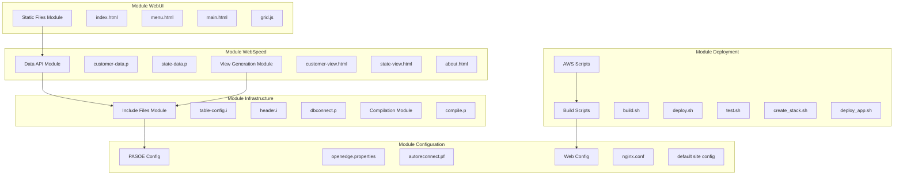
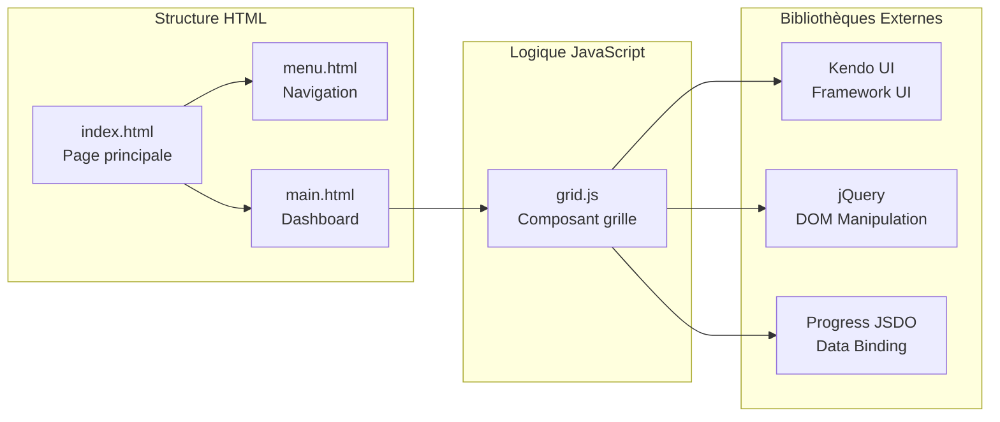
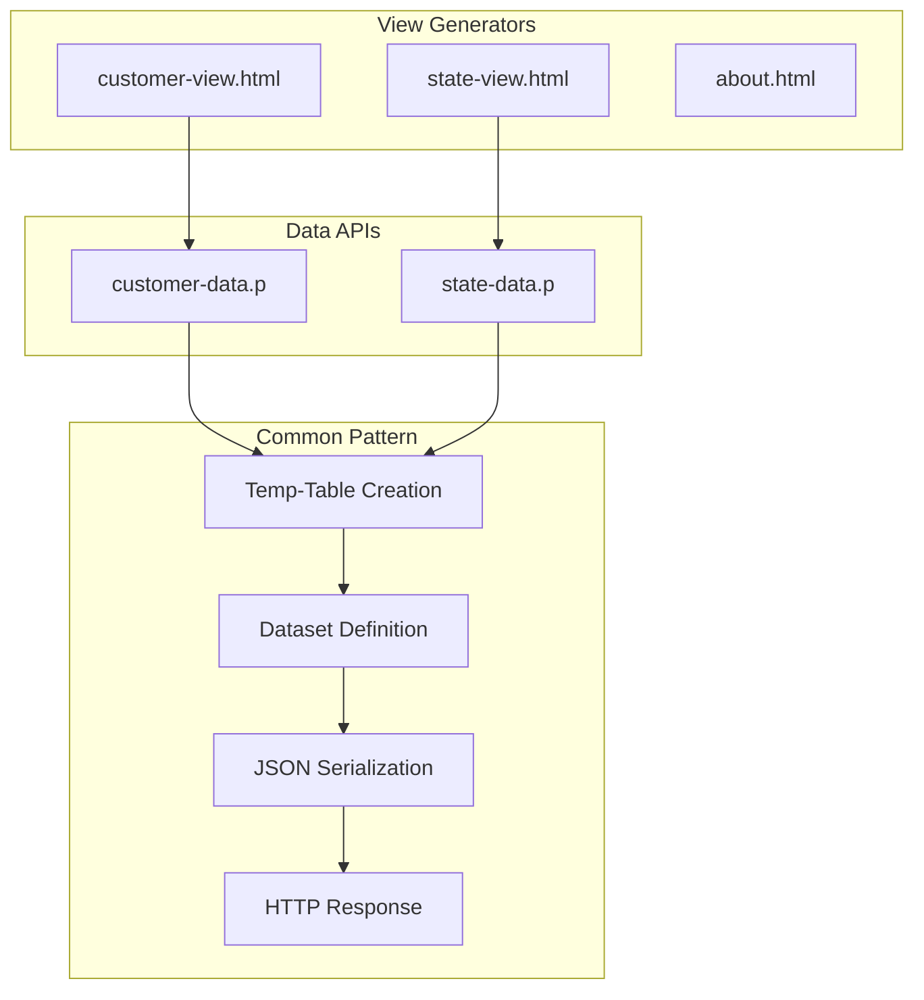
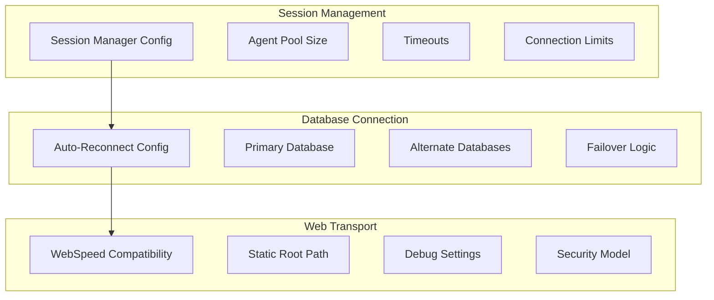
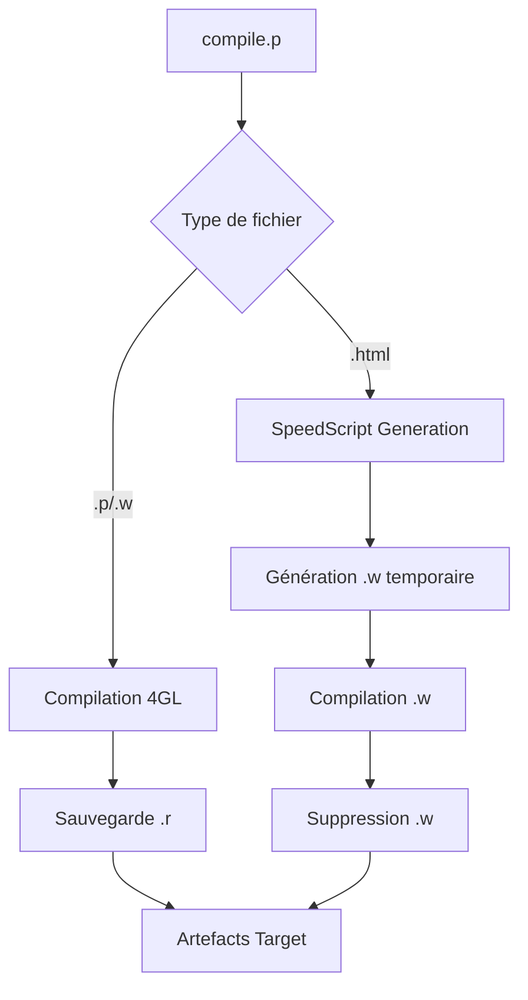
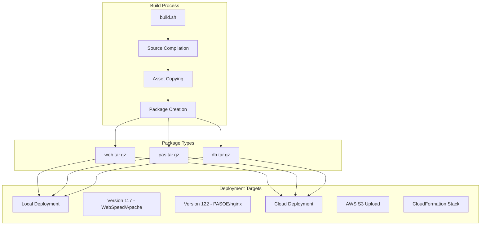
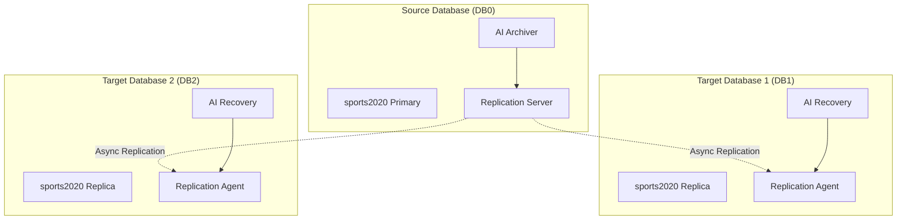
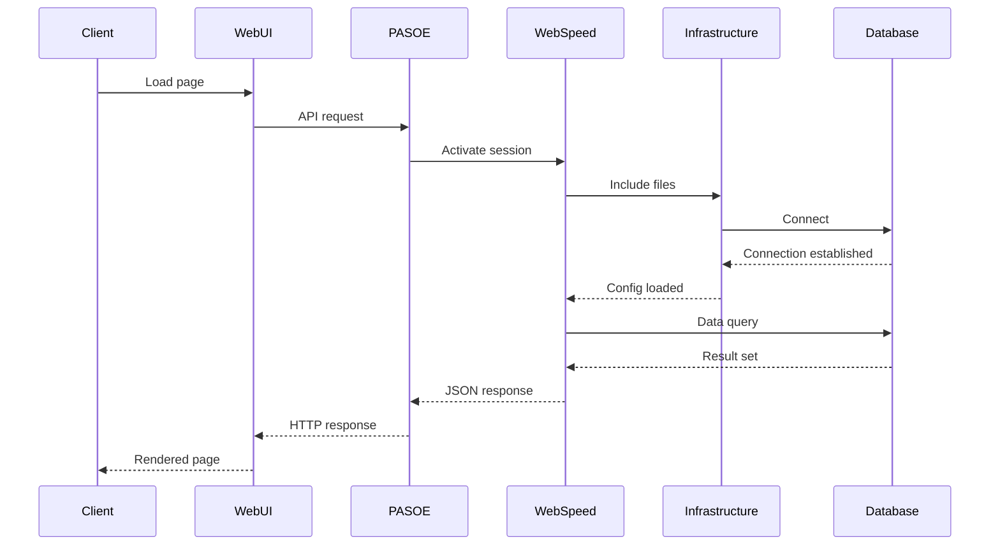

# Architecture des Composants

## Vue d'Ensemble des Modules

L'application Sports est organisée en modules distincts, chacun ayant des responsabilités spécifiques et des interfaces bien définies.



## Module WebUI - Interface Utilisateur

### Composants Statiques



#### Responsabilités
- **index.html**: Point d'entrée avec layout en iframes
- **menu.html**: Navigation entre les vues
- **main.html**: Tableau de bord avec graphique Kendo UI
- **grid.js**: Composant réutilisable pour les grilles de données

## Module WebSpeed - Backend 4GL

### APIs de Données



#### Pattern de Données Commun

```progress
// Pattern standard pour les APIs de données
DEFINE TEMP-TABLE tt{Entity} LIKE {Entity}.
DEFINE DATASET ds{Entity} FOR tt{Entity}.

PROCEDURE process-web-request :
    // 1. Vider la temp-table
    EMPTY TEMP-TABLE tt{Entity}.
    
    // 2. Charger les données depuis la DB
    FOR EACH {Entity} NO-LOCK:
        CREATE tt{Entity}.
        BUFFER-COPY {Entity} TO tt{Entity}.
    END.
    
    // 3. Sérialiser en JSON
    oJsonObject = NEW JsonObject().
    oJsonObject:READ(DATASET ds{Entity}:HANDLE).
    
    // 4. Retourner la réponse
    lChar = oJsonObject:GetJsonText().
    {&OUT-LONG} lChar.
END PROCEDURE.
```

## Module Infrastructure - Utilitaires

### Include Files

```mermaid
graph TB
    subgraph "Configuration Dynamique"
        A[table-config.i]
        A1[Génération config JSON]
        A2[Métadonnées de schéma]
        A3[Configuration de grille]
    end
    
    subgraph "Headers Web"
        B[header.i]
        B1[Liens CSS Kendo UI]
        B2[Scripts JavaScript]
        B3[Configuration JSDO]
    end
    
    subgraph "Connexion DB"
        C[dbconnect.p]
        C1[Connexion sports2020]
        C2[Paramètres de connexion]
    end
    
    A --> A1
    A1 --> A2
    A2 --> A3
    
    B --> B1
    B1 --> B2
    B2 --> B3
    
    C --> C1
    C1 --> C2
```



#### table-config.i - Générateur de Configuration

Ce fichier include génère dynamiquement la configuration JSON pour les grilles Kendo UI en analysant le schéma de la base de données.

**Fonctionnalités**:
- Analyse des métadonnées de table
- Génération des configurations de champs
- URLs d'API automatiques
- Configuration des colonnes de grille

## Module PASOE - Serveur d'Applications

### Configuration et Propriétés



#### Configuration Clé (openedge.properties)

```properties
# Activation automatique des sessions
sessionActivateProc=dbconnect.p

# Configuration des agents
minAgents=1
maxAgents=2
numInitialAgents=1

# Timeouts
idleSessionTimeout=1800000
connectionWaitTimeout=3000

# WebSpeed compatibility
wsRoot=/static/webspeed
```

## Module de Compilation

### Processus de Build



#### Fonctionnalités du Compilateur

- **Support multi-format**: .p, .w, .html
- **SpeedScript**: Conversion HTML vers programmes 4GL
- **Organisation**: Structure de répertoires source/target
- **Paramètres**: Configuration via arguments de session

## Module de Déploiement

### Architecture de Build



## Module de Base de Données

### Réplication OpenEdge



#### Configuration de Réplication

**Source Database**:
- Service: `replserv`
- Agents de contrôle: agent1, agent2
- Méthode: asynchrone

**Target Databases**:
- Service: `replagent`
- Connexion aux autres agents
- Transition manuelle activée

## Interactions Entre Modules

### Flux de Requête Complète



## Patterns d'Architecture

### 1. Pattern Template Method
Les programmes WebSpeed utilisent un template method pattern:
- Structure commune (temp-table + dataset + JSON)
- Variations par entité (Customer, State)
- Include files pour la réutilisation

### 2. Pattern Configuration
Les include files implémentent un pattern de configuration:
- `table-config.i`: Configuration dynamique basée sur métadonnées
- `header.i`: Configuration statique des headers
- Paramétrage via variables globales

### 3. Pattern Proxy
nginx agit comme proxy avec plusieurs responsabilités:
- Routage des requêtes statiques vs dynamiques
- Load balancing vers PASOE
- Terminaison SSL et headers de sécurité

Cette architecture modulaire assure une séparation claire des responsabilités, une maintenabilité élevée et une scalabilité optimale.