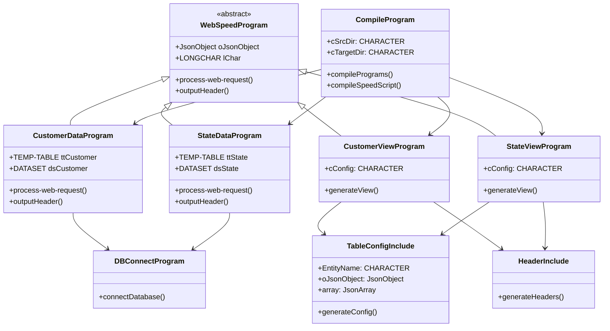
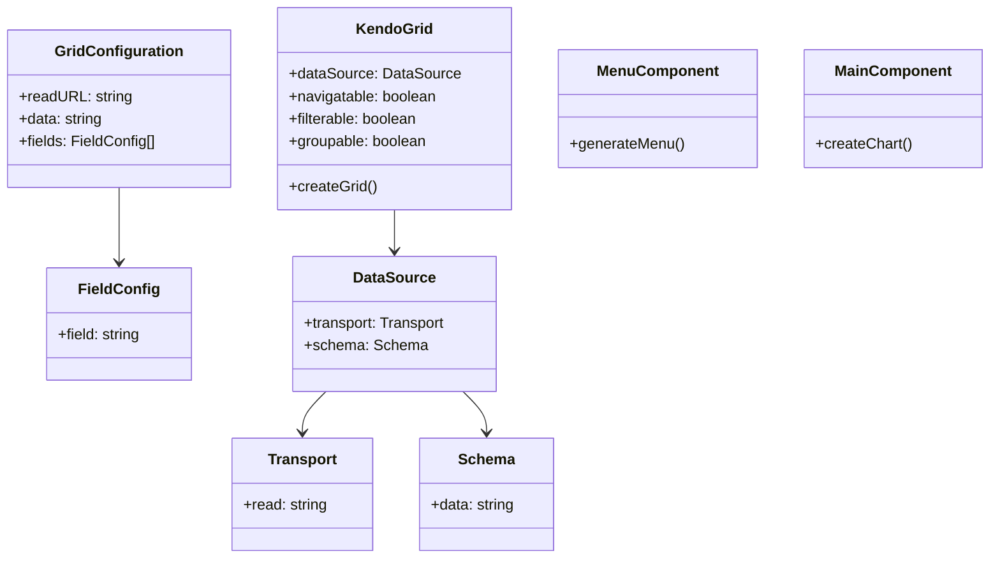
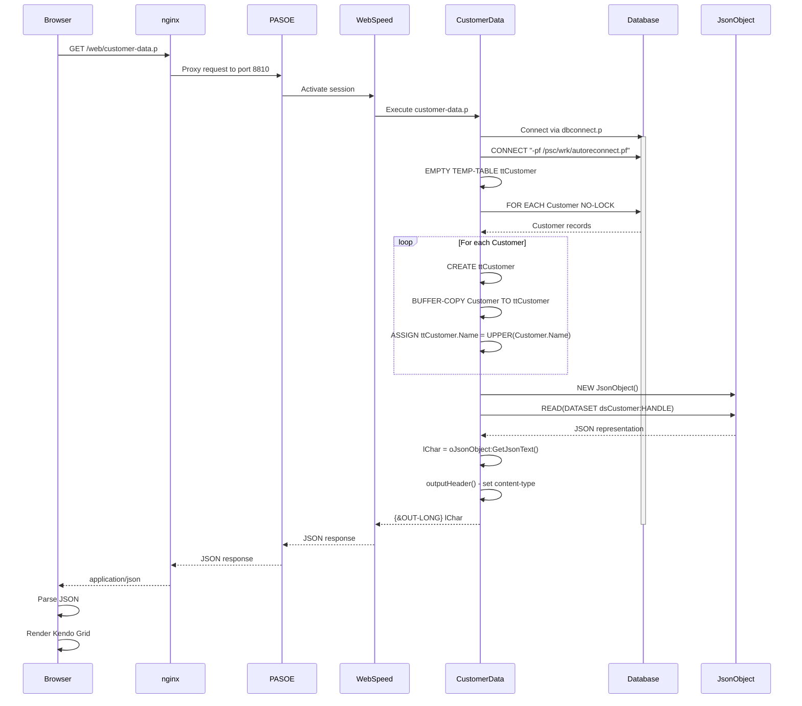
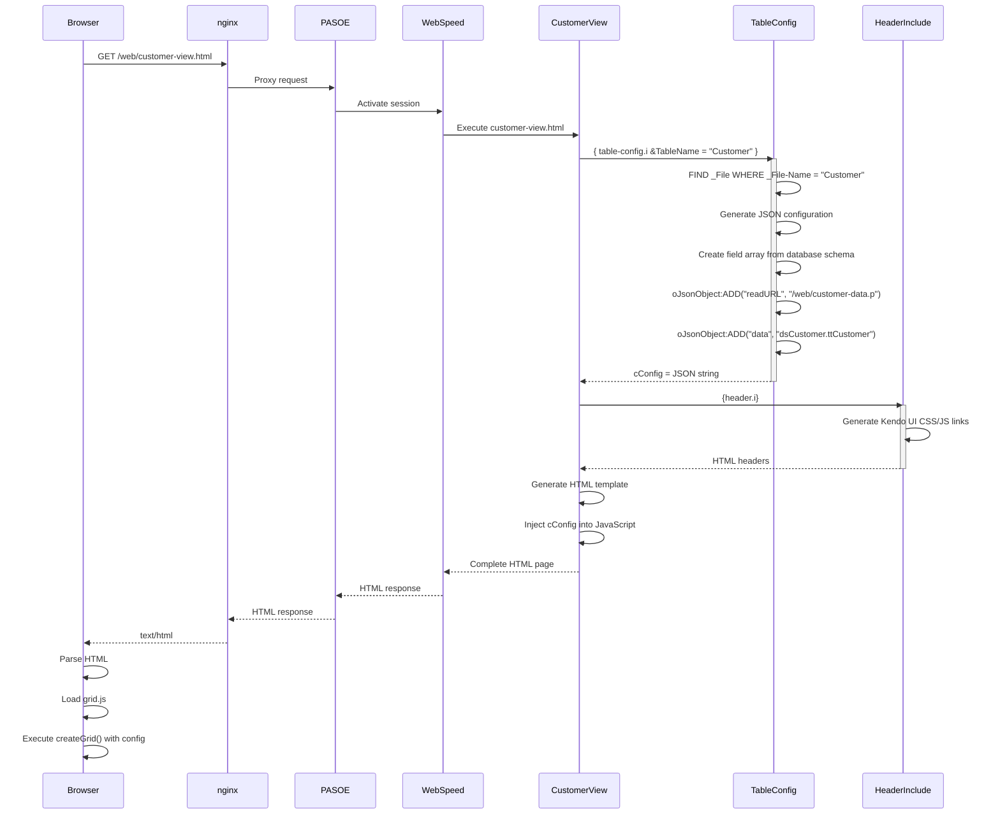
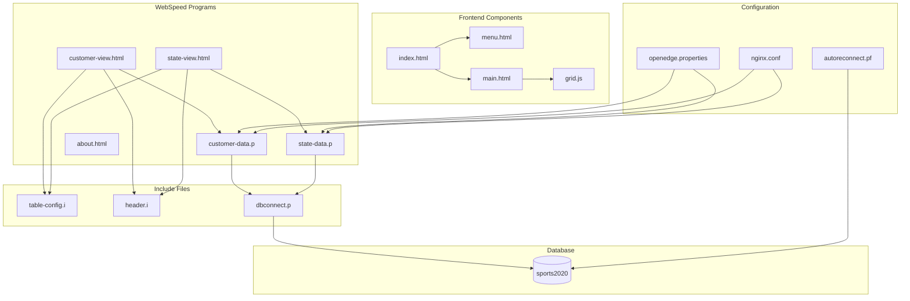
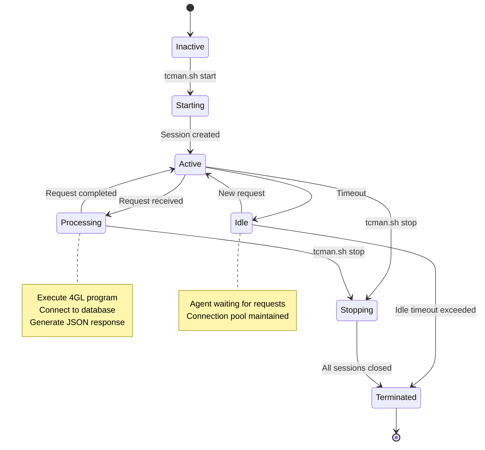
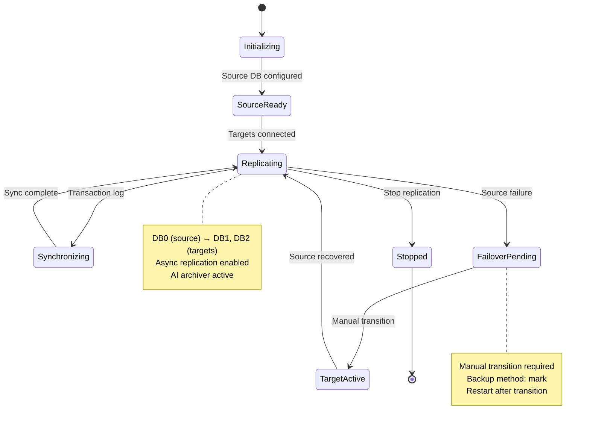

# Diagrammes UML

## Diagramme de Classes

## Diagramme de Classes Frontend

## Diagramme de Séquence - Requête Customer Data

## Diagramme de Séquence - Rendu Customer View

## Diagramme de Composants

## Diagramme d'États - Session PASOE

## Diagramme d'États - Réplication Base de Données

Ces diagrammes UML fournissent une vue détaillée de la structure, du comportement et des interactions des composants de l'application Sports.