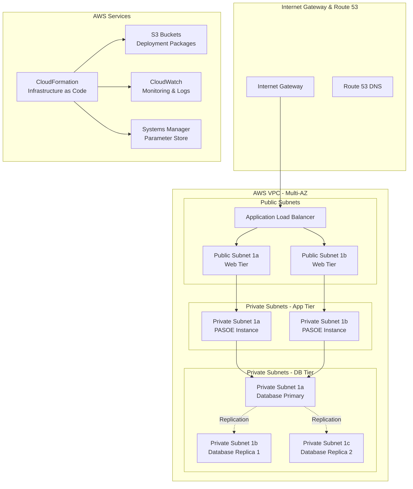

# Configuration AWS

## Vue d'Ensemble

Ce document détaille la configuration AWS pour le déploiement cloud de l'application Sports. Il couvre l'architecture CloudFormation, la configuration des services AWS, les paramètres de sécurité et les meilleures pratiques pour un déploiement production.

## Architecture AWS

### Vue d'Ensemble de l'Infrastructure



## Configuration CloudFormation

### Template Principal (master.template.yaml)

#### Paramètres de Déploiement
```yaml
Parameters:
  KeyPairName:
    Type: AWS::EC2::KeyPair::KeyName
    Description: EC2 Key Pair for SSH access
    Default: OEAWSQS
    
  InstanceType:
    Type: String
    Default: t3a.medium
    AllowedValues: [t3a.small, t3a.medium, t3a.large, t3a.xlarge]
    Description: EC2 instance type for application servers
    
  MinScalingInstances:
    Type: Number
    Default: 2
    MinValue: 1
    MaxValue: 10
    Description: Minimum number of instances in Auto Scaling Group
    
  MaxScalingInstances:
    Type: Number  
    Default: 3
    MinValue: 2
    MaxValue: 20
    Description: Maximum number of instances in Auto Scaling Group
    
  AvailabilityZones:
    Type: CommaDelimitedList
    Default: "us-east-1a,us-east-1b"
    Description: List of Availability Zones
    
  DeployBucket:
    Type: String
    Description: S3 bucket containing deployment packages
    Default: sports-app-deploy-bucket
    
  QSS3BucketName:
    Type: String
    Description: S3 bucket for CloudFormation templates
    Default: sports-app-quickstart-bucket
```

#### Configuration des Buckets S3
```yaml
Resources:
  DeploymentBucket:
    Type: AWS::S3::Bucket
    Properties:
      BucketName: !Ref DeployBucket
      VersioningConfiguration:
        Status: Enabled
      PublicAccessBlockConfiguration:
        BlockPublicAcls: true
        BlockPublicPolicy: true
        IgnorePublicAcls: true
        RestrictPublicBuckets: true
      BucketEncryption:
        ServerSideEncryptionConfiguration:
          - ServerSideEncryptionByDefault:
              SSEAlgorithm: AES256
            BucketKeyEnabled: true
            
  PublicAssetsBucket:
    Type: AWS::S3::Bucket
    Properties:
      BucketName: !Sub "${QSS3BucketName}-public"
      PublicAccessBlockConfiguration:
        BlockPublicAcls: false
        BlockPublicPolicy: false
        IgnorePublicAcls: false
        RestrictPublicBuckets: false
      WebsiteConfiguration:
        IndexDocument: index.html
        ErrorDocument: error.html
```

### Configuration VPC et Réseau

#### Virtual Private Cloud
```yaml
VPC:
  Type: AWS::EC2::VPC
  Properties:
    CidrBlock: 10.0.0.0/16
    EnableDnsHostnames: true
    EnableDnsSupport: true
    Tags:
      - Key: Name
        Value: !Sub "${AWS::StackName}-VPC"

InternetGateway:
  Type: AWS::EC2::InternetGateway
  Properties:
    Tags:
      - Key: Name
        Value: !Sub "${AWS::StackName}-IGW"

VPCGatewayAttachment:
  Type: AWS::EC2::VPCGatewayAttachment
  Properties:
    VpcId: !Ref VPC
    InternetGatewayId: !Ref InternetGateway
```

#### Subnets Multi-AZ
```yaml
PublicSubnet1:
  Type: AWS::EC2::Subnet
  Properties:
    VpcId: !Ref VPC
    CidrBlock: 10.0.1.0/24
    AvailabilityZone: !Select [0, !Ref AvailabilityZones]
    MapPublicIpOnLaunch: true
    Tags:
      - Key: Name
        Value: !Sub "${AWS::StackName}-Public-Subnet-1"

PrivateSubnetApp1:
  Type: AWS::EC2::Subnet
  Properties:
    VpcId: !Ref VPC
    CidrBlock: 10.0.10.0/24
    AvailabilityZone: !Select [0, !Ref AvailabilityZones]
    Tags:
      - Key: Name
        Value: !Sub "${AWS::StackName}-App-Subnet-1"

PrivateSubnetDB1:
  Type: AWS::EC2::Subnet
  Properties:
    VpcId: !Ref VPC
    CidrBlock: 10.0.20.0/24
    AvailabilityZone: !Select [0, !Ref AvailabilityZones]
    Tags:
      - Key: Name
        Value: !Sub "${AWS::StackName}-DB-Subnet-1"
```

#### Tables de Routage
```yaml
PublicRouteTable:
  Type: AWS::EC2::RouteTable
  Properties:
    VpcId: !Ref VPC
    Tags:
      - Key: Name
        Value: !Sub "${AWS::StackName}-Public-Routes"

PublicRoute:
  Type: AWS::EC2::Route
  DependsOn: VPCGatewayAttachment
  Properties:
    RouteTableId: !Ref PublicRouteTable
    DestinationCidrBlock: 0.0.0.0/0
    GatewayId: !Ref InternetGateway

PrivateRouteTable:
  Type: AWS::EC2::RouteTable
  Properties:
    VpcId: !Ref VPC
    Tags:
      - Key: Name
        Value: !Sub "${AWS::StackName}-Private-Routes"
```

### Configuration des Security Groups

#### Security Group Web Tier
```yaml
WebSecurityGroup:
  Type: AWS::EC2::SecurityGroup
  Properties:
    GroupDescription: Security group for web tier
    VpcId: !Ref VPC
    SecurityGroupIngress:
      - IpProtocol: tcp
        FromPort: 80
        ToPort: 80
        CidrIp: 0.0.0.0/0
        Description: HTTP access from anywhere
      - IpProtocol: tcp
        FromPort: 443
        ToPort: 443
        CidrIp: 0.0.0.0/0
        Description: HTTPS access from anywhere
      - IpProtocol: tcp
        FromPort: 22
        ToPort: 22
        SourceSecurityGroupId: !Ref BastionSecurityGroup
        Description: SSH access from bastion
    Tags:
      - Key: Name
        Value: !Sub "${AWS::StackName}-Web-SG"
```

#### Security Group Application Tier
```yaml
AppSecurityGroup:
  Type: AWS::EC2::SecurityGroup
  Properties:
    GroupDescription: Security group for application tier
    VpcId: !Ref VPC
    SecurityGroupIngress:
      - IpProtocol: tcp
        FromPort: 8080
        ToPort: 8080
        SourceSecurityGroupId: !Ref WebSecurityGroup
        Description: HTTP from web tier
      - IpProtocol: tcp
        FromPort: 8810
        ToPort: 8810
        SourceSecurityGroupId: !Ref WebSecurityGroup
        Description: PASOE from web tier
      - IpProtocol: tcp
        FromPort: 22
        ToPort: 22
        SourceSecurityGroupId: !Ref BastionSecurityGroup
        Description: SSH access from bastion
    Tags:
      - Key: Name
        Value: !Sub "${AWS::StackName}-App-SG"
```

#### Security Group Database Tier
```yaml
DatabaseSecurityGroup:
  Type: AWS::EC2::SecurityGroup
  Properties:
    GroupDescription: Security group for database tier
    VpcId: !Ref VPC
    SecurityGroupIngress:
      - IpProtocol: tcp
        FromPort: 20000
        ToPort: 20000
        SourceSecurityGroupId: !Ref AppSecurityGroup
        Description: Database access from app tier
      - IpProtocol: tcp
        FromPort: 20000
        ToPort: 20000
        SourceSecurityGroupId: !Ref DatabaseSecurityGroup
        Description: Replication between DB instances
      - IpProtocol: tcp
        FromPort: 22
        ToPort: 22
        SourceSecurityGroupId: !Ref BastionSecurityGroup
        Description: SSH access from bastion
    Tags:
      - Key: Name
        Value: !Sub "${AWS::StackName}-DB-SG"
```

## Configuration Load Balancer

### Application Load Balancer
```yaml
ApplicationLoadBalancer:
  Type: AWS::ElasticLoadBalancingV2::LoadBalancer
  Properties:
    Name: !Sub "${AWS::StackName}-ALB"
    Scheme: internet-facing
    Type: application
    SecurityGroups:
      - !Ref WebSecurityGroup
    Subnets:
      - !Ref PublicSubnet1
      - !Ref PublicSubnet2
    Tags:
      - Key: Name
        Value: !Sub "${AWS::StackName}-ALB"

TargetGroup:
  Type: AWS::ElasticLoadBalancingV2::TargetGroup
  Properties:
    Name: !Sub "${AWS::StackName}-TG"
    Port: 8080
    Protocol: HTTP
    VpcId: !Ref VPC
    HealthCheckIntervalSeconds: 30
    HealthCheckPath: /
    HealthCheckProtocol: HTTP
    HealthCheckTimeoutSeconds: 5
    HealthyThresholdCount: 2
    UnhealthyThresholdCount: 3
    TargetType: instance

HTTPListener:
  Type: AWS::ElasticLoadBalancingV2::Listener
  Properties:
    DefaultActions:
      - Type: forward
        TargetGroupArn: !Ref TargetGroup
    LoadBalancerArn: !Ref ApplicationLoadBalancer
    Port: 80
    Protocol: HTTP
```

## Configuration Auto Scaling

### Launch Configuration
```yaml
LaunchConfiguration:
  Type: AWS::AutoScaling::LaunchConfiguration
  Properties:
    ImageId: !Ref LatestAmiId
    InstanceType: !Ref InstanceType
    KeyName: !Ref KeyPairName
    SecurityGroups:
      - !Ref WebSecurityGroup
      - !Ref AppSecurityGroup
    IamInstanceProfile: !Ref InstanceProfile
    UserData:
      Fn::Base64: !Sub |
        #!/bin/bash
        yum update -y
        yum install -y aws-cli
        
        # Download deployment packages
        aws s3 cp s3://${DeployBucket}/web.tar.gz /tmp/
        aws s3 cp s3://${DeployBucket}/pas.tar.gz /tmp/
        
        # Extract and deploy
        cd /tmp
        tar xzf web.tar.gz
        tar xzf pas.tar.gz
        
        # Configure environment variables
        export DBHostName=${DatabaseInstance1.PrivateIp}
        export DBHostName1=${DatabaseInstance2.PrivateIp}
        export DBHostName2=${DatabaseInstance3.PrivateIp}
        export PASOEURL="http://127.0.0.1:8810"
        export HTTP_PORT=8080
        
        # Run deployment script
        chmod +x app/deploy.sh
        app/deploy.sh

AutoScalingGroup:
  Type: AWS::AutoScaling::AutoScalingGroup
  Properties:
    VPCZoneIdentifier:
      - !Ref PublicSubnet1
      - !Ref PublicSubnet2
    LaunchConfigurationName: !Ref LaunchConfiguration
    MinSize: !Ref MinScalingInstances
    MaxSize: !Ref MaxScalingInstances
    DesiredCapacity: !Ref MinScalingInstances
    TargetGroupARNs:
      - !Ref TargetGroup
    HealthCheckType: ELB
    HealthCheckGracePeriod: 300
    Tags:
      - Key: Name
        Value: !Sub "${AWS::StackName}-ASG-Instance"
        PropagateAtLaunch: true
```

### Scaling Policies
```yaml
ScaleUpPolicy:
  Type: AWS::AutoScaling::ScalingPolicy
  Properties:
    AdjustmentType: ChangeInCapacity
    AutoScalingGroupName: !Ref AutoScalingGroup
    Cooldown: 300
    ScalingAdjustment: 1

ScaleDownPolicy:
  Type: AWS::AutoScaling::ScalingPolicy
  Properties:
    AdjustmentType: ChangeInCapacity
    AutoScalingGroupName: !Ref AutoScalingGroup
    Cooldown: 300
    ScalingAdjustment: -1

CPUAlarmHigh:
  Type: AWS::CloudWatch::Alarm
  Properties:
    AlarmDescription: Scale up on high CPU
    MetricName: CPUUtilization
    Namespace: AWS/EC2
    Statistic: Average
    Period: 300
    EvaluationPeriods: 2
    Threshold: 80
    ComparisonOperator: GreaterThanThreshold
    Dimensions:
      - Name: AutoScalingGroupName
        Value: !Ref AutoScalingGroup
    AlarmActions:
      - !Ref ScaleUpPolicy
```

## Configuration des Instances de Base de Données

### Instance Primaire (DB0)
```yaml
DatabaseInstance1:
  Type: AWS::EC2::Instance
  Properties:
    ImageId: !Ref LatestAmiId
    InstanceType: !Ref InstanceType
    KeyName: !Ref KeyPairName
    SubnetId: !Ref PrivateSubnetDB1
    SecurityGroupIds:
      - !Ref DatabaseSecurityGroup
    IamInstanceProfile: !Ref InstanceProfile
    UserData:
      Fn::Base64: !Sub |
        #!/bin/bash
        yum update -y
        aws s3 cp s3://${DeployBucket}/db.tar.gz /tmp/
        cd /tmp && tar xzf db.tar.gz
        
        export OE_ENV=db0
        export DBHostName=${DatabaseInstance2.PrivateIp}
        export DBHostName1=${DatabaseInstance3.PrivateIp}
        
        chmod +x app/deploy.sh
        app/deploy.sh
    Tags:
      - Key: Name
        Value: !Sub "${AWS::StackName}-DB0"
      - Key: Role
        Value: database-primary
```

### Instances Répliques (DB1, DB2)
```yaml
DatabaseInstance2:
  Type: AWS::EC2::Instance
  Properties:
    ImageId: !Ref LatestAmiId
    InstanceType: !Ref InstanceType
    KeyName: !Ref KeyPairName
    SubnetId: !Ref PrivateSubnetDB2
    SecurityGroupIds:
      - !Ref DatabaseSecurityGroup
    IamInstanceProfile: !Ref InstanceProfile
    UserData:
      Fn::Base64: !Sub |
        #!/bin/bash
        yum update -y
        aws s3 cp s3://${DeployBucket}/db.tar.gz /tmp/
        cd /tmp && tar xzf db.tar.gz
        
        export OE_ENV=db1
        export DBHostName=${DatabaseInstance1.PrivateIp}
        export DBHostName2=${DatabaseInstance3.PrivateIp}
        
        chmod +x app/deploy.sh
        app/deploy.sh
    Tags:
      - Key: Name
        Value: !Sub "${AWS::StackName}-DB1"
      - Key: Role
        Value: database-replica
```

## Configuration IAM

### Rôle pour Instances EC2
```yaml
InstanceRole:
  Type: AWS::IAM::Role
  Properties:
    AssumeRolePolicyDocument:
      Version: '2012-10-17'
      Statement:
        - Effect: Allow
          Principal:
            Service: ec2.amazonaws.com
          Action: sts:AssumeRole
    Policies:
      - PolicyName: S3Access
        PolicyDocument:
          Version: '2012-10-17'
          Statement:
            - Effect: Allow
              Action:
                - s3:GetObject
                - s3:ListBucket
              Resource:
                - !Sub "${DeploymentBucket}/*"
                - !Sub "${DeploymentBucket}"
      - PolicyName: CloudWatchLogs
        PolicyDocument:
          Version: '2012-10-17'
          Statement:
            - Effect: Allow
              Action:
                - logs:CreateLogGroup
                - logs:CreateLogStream
                - logs:PutLogEvents
                - logs:DescribeLogStreams
              Resource: "*"

InstanceProfile:
  Type: AWS::IAM::InstanceProfile
  Properties:
    Roles:
      - !Ref InstanceRole
```

## Configuration CloudWatch

### Métriques Personnalisées
```yaml
ApplicationDashboard:
  Type: AWS::CloudWatch::Dashboard
  Properties:
    DashboardName: !Sub "${AWS::StackName}-Dashboard"
    DashboardBody: !Sub |
      {
        "widgets": [
          {
            "type": "metric",
            "properties": {
              "metrics": [
                ["AWS/ApplicationELB", "RequestCount", "LoadBalancer", "${ApplicationLoadBalancer/LoadBalancerFullName}"],
                [".", "TargetResponseTime", ".", "."],
                [".", "HTTPCode_Target_2XX_Count", ".", "."]
              ],
              "period": 300,
              "stat": "Sum",
              "region": "${AWS::Region}",
              "title": "Application Load Balancer Metrics"
            }
          },
          {
            "type": "metric",
            "properties": {
              "metrics": [
                ["AWS/EC2", "CPUUtilization", "AutoScalingGroupName", "${AutoScalingGroup}"],
                [".", "NetworkIn", ".", "."],
                [".", "NetworkOut", ".", "."]
              ],
              "period": 300,
              "stat": "Average",
              "region": "${AWS::Region}",
              "title": "EC2 Instance Metrics"
            }
          }
        ]
      }

LogGroup:
  Type: AWS::Logs::LogGroup
  Properties:
    LogGroupName: !Sub "/aws/ec2/${AWS::StackName}"
    RetentionInDays: 30
```

### Alertes CloudWatch
```yaml
HighErrorRateAlarm:
  Type: AWS::CloudWatch::Alarm
  Properties:
    AlarmName: !Sub "${AWS::StackName}-HighErrorRate"
    AlarmDescription: High error rate detected
    MetricName: HTTPCode_Target_5XX_Count
    Namespace: AWS/ApplicationELB
    Statistic: Sum
    Period: 300
    EvaluationPeriods: 2
    Threshold: 10
    ComparisonOperator: GreaterThanThreshold
    Dimensions:
      - Name: LoadBalancer
        Value: !GetAtt ApplicationLoadBalancer.LoadBalancerFullName
    AlarmActions:
      - !Ref SNSTopicArn

DatabaseConnectionAlarm:
  Type: AWS::CloudWatch::Alarm
  Properties:
    AlarmName: !Sub "${AWS::StackName}-DatabaseConnection"
    AlarmDescription: Database connection issues
    MetricName: StatusCheckFailed
    Namespace: AWS/EC2
    Statistic: Maximum
    Period: 60
    EvaluationPeriods: 2
    Threshold: 0
    ComparisonOperator: GreaterThanThreshold
    Dimensions:
      - Name: InstanceId
        Value: !Ref DatabaseInstance1
    AlarmActions:
      - !Ref SNSTopicArn
```

## Outputs

### Endpoints et Informations de Connexion
```yaml
Outputs:
  ApplicationURL:
    Description: URL of the application
    Value: !Sub "http://${ApplicationLoadBalancer.DNSName}"
    Export:
      Name: !Sub "${AWS::StackName}-AppURL"
      
  DatabasePrimaryIP:
    Description: Private IP of primary database
    Value: !GetAtt DatabaseInstance1.PrivateIp
    Export:
      Name: !Sub "${AWS::StackName}-DB-Primary-IP"
      
  VPCId:
    Description: VPC ID
    Value: !Ref VPC
    Export:
      Name: !Sub "${AWS::StackName}-VPC-ID"
      
  LoadBalancerArn:
    Description: Load Balancer ARN
    Value: !Ref ApplicationLoadBalancer
    Export:
      Name: !Sub "${AWS::StackName}-ALB-ARN"
```

## Scripts de Déploiement

### Script de Création Stack
```bash
#!/bin/bash
# create_stack.sh

STACK_NAME=${1:-sports-app}
PUBLIC_BUCKET=sports-app-public-bucket
PRIVATE_BUCKET=sports-app-private-bucket

# Synchroniser les templates
aws s3 sync templates s3://${PUBLIC_BUCKET}/templates/ --delete --acl public-read

# Créer la stack
aws cloudformation create-stack \
    --stack-name $STACK_NAME \
    --capabilities CAPABILITY_IAM \
    --template-url https://s3.amazonaws.com/${PUBLIC_BUCKET}/templates/master.yaml \
    --parameters \
        ParameterKey=KeyPairName,ParameterValue=sports-app-key \
        ParameterKey=InstanceType,ParameterValue=t3a.medium \
        ParameterKey=MinScalingInstances,ParameterValue=2 \
        ParameterKey=MaxScalingInstances,ParameterValue=3 \
        ParameterKey=DeployBucket,ParameterValue=${PRIVATE_BUCKET} \
        ParameterKey=QSS3BucketName,ParameterValue=${PUBLIC_BUCKET} \
        "ParameterKey=AvailabilityZones,ParameterValue='us-east-1a,us-east-1b'"

# Surveiller le déploiement
aws cloudformation wait stack-create-complete --stack-name $STACK_NAME
echo "Stack création terminée"

# Afficher les outputs
aws cloudformation describe-stacks --stack-name $STACK_NAME \
    --query 'Stacks[0].Outputs' --output table
```

### Monitoring du Déploiement
```bash
#!/bin/bash
# monitor_deployment.sh

STACK_NAME=${1:-sports-app}

echo "Monitoring deployment of $STACK_NAME..."

while true; do
    STATUS=$(aws cloudformation describe-stacks --stack-name $STACK_NAME \
        --query 'Stacks[0].StackStatus' --output text 2>/dev/null)
    
    if [ $? -ne 0 ]; then
        echo "Stack not found or error occurred"
        break
    fi
    
    echo "$(date): Stack status: $STATUS"
    
    case $STATUS in
        CREATE_COMPLETE|UPDATE_COMPLETE)
            echo "Deployment successful!"
            break
            ;;
        CREATE_FAILED|UPDATE_FAILED|ROLLBACK_COMPLETE)
            echo "Deployment failed!"
            aws cloudformation describe-stack-events --stack-name $STACK_NAME \
                --query 'StackEvents[?ResourceStatus==`CREATE_FAILED`].[Timestamp,ResourceType,LogicalResourceId,ResourceStatusReason]' \
                --output table
            break
            ;;
    esac
    
    sleep 30
done
```

Cette configuration AWS fournit une infrastructure robuste, scalable et hautement disponible pour l'application Sports, avec toutes les bonnes pratiques de sécurité et de monitoring intégrées.