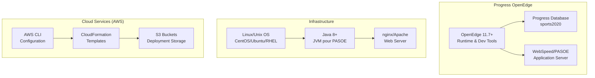

# Guide de Déploiement

## Vue d'Ensemble

Ce guide fournit des instructions détaillées pour déployer l'application Sports dans différents environnements. Il couvre les prérequis, la configuration, les étapes de déploiement et les vérifications post-déploiement.

## Prérequis Généraux

### Logiciels Requis



#### Versions Testées
- **Progress OpenEdge**: 11.7.x, 12.2.x, 12.3.x
- **Java**: OpenJDK 8, 11
- **nginx**: 1.14+
- **Apache**: 2.4+
- **OS**: CentOS 7/8, Ubuntu 18.04/20.04, RHEL 7/8

### Variables d'Environnement

```bash
# Progress OpenEdge
export DLC=/psc/dlc                    # Installation OpenEdge
export PATH=$DLC/bin:$PATH             # Outils Progress
export TERM=xterm                      # Terminal type
export display_banner=no               # Supprime bannière startup

# Application
export WRKDIR=/psc/wrk                 # Répertoire de travail
export PROPATH=.:$WRKDIR               # Chemin des programmes
```

## Déploiement Local - Version 122 (PASOE)

### Étape 1: Préparation de l'Environnement

#### Installation des Dépendances
```bash
# CentOS/RHEL
sudo yum update -y
sudo yum install -y nginx java-11-openjdk-devel

# Ubuntu/Debian
sudo apt update
sudo apt install -y nginx openjdk-11-jdk

# Configuration firewall
sudo firewall-cmd --permanent --add-port=8080/tcp
sudo firewall-cmd --permanent --add-port=8810/tcp
sudo firewall-cmd --reload
```

#### Création des Répertoires
```bash
sudo mkdir -p /psc/wrk
sudo mkdir -p /artifacts
sudo chmod 777 /artifacts /psc/wrk
```

### Étape 2: Configuration de la Base de Données

#### Création Base Sports2020
```bash
cd /psc/wrk
export DLC=/psc/dlc
export PATH=$DLC/bin:$PATH

# Créer la base de données
prodb sports2020 sports2020

# Démarrer le serveur de base
proserve sports2020 -S 20000

# Vérifier la connexion
echo "Connected to sports2020" | pro -db sports2020 -S 20000
```

#### Configuration Auto-Reconnect
```bash
# Créer le fichier de connexion
cat > /psc/wrk/autoreconnect.pf << EOF
-db sports2020 -H localhost -S 20000 -ct 1
-retryConnect 1
-retryConnectPause 2
-s 80000
EOF
```

### Étape 3: Build de l'Application

#### Compilation des Sources
```bash
# Depuis le répertoire racine du projet
./build.sh 122
```

#### Contenu du Build
Le script `build.sh` exécute les tâches suivantes:
1. **Compilation 4GL**: Transformation .p → .r
2. **Compilation SpeedScript**: Transformation .html → .w → .r  
3. **Copie Assets**: Fichiers statiques HTML/JS
4. **Création Packages**: web.tar.gz, pas.tar.gz, db.tar.gz

#### Vérification du Build
```bash
# Vérifier les artefacts générés
ls -la /artifacts/sports-app/122/
# Devrait contenir: webui/, webspeed/, conf/, scripts/, db/

# Vérifier la compilation
ls -la /artifacts/sports-app/122/webspeed/*.r
# Devrait contenir: customer-data.r, state-data.r, etc.
```

### Étape 4: Déploiement PASOE

#### Création Instance PASOE
```bash
cd /psc/wrk
pasman create -v oepas1

# Vérifier la création
ls -la oepas1/
```

#### Configuration PASOE
```bash
# Copier la configuration
cp /artifacts/sports-app/122/conf/openedge.properties /psc/wrk/oepas1/conf/
cp /artifacts/sports-app/122/conf/anonymousLoginModel.xml /psc/wrk/oepas1/webapps/ROOT/WEB-INF/spring/

# Copier les programmes compilés
cp /artifacts/sports-app/122/webspeed/*.r /psc/wrk/oepas1/openedge/

# Copier la configuration de connexion DB
cp /psc/wrk/autoreconnect.pf /psc/wrk/oepas1/
```

#### Démarrage PASOE
```bash
cd /psc/wrk/oepas1
./bin/tcman.sh start

# Vérifier le démarrage
./bin/tcman.sh status
# Devrait afficher: PASOE server instance status is RUNNING
```

#### Configuration Démarrage Automatique
```bash
# Créer script rc.local
sudo tee /etc/rc.local << EOF
#!/bin/sh
export DLC=/psc/dlc
export PATH=\$DLC/bin:\$PATH
cd /psc/wrk/oepas1
/psc/wrk/oepas1/bin/tcman.sh start
exit 0
EOF

sudo chmod +x /etc/rc.local
```

### Étape 5: Configuration nginx

#### Configuration Site
```bash
# Copier la configuration nginx
sudo cp /artifacts/sports-app/122/conf/default /etc/nginx/sites-available/default

# Ou pour CentOS/RHEL sans sites-available
sudo cp /artifacts/sports-app/122/conf/nginx.conf /etc/nginx/nginx.conf
```

#### Paramétrage Variables
```bash
# Remplacer les variables de template
sudo sed -i 's|HTTP_PORT|8080|g' /etc/nginx/sites-available/default
sudo sed -i 's|PASOEURL|http://127.0.0.1:8810|g' /etc/nginx/sites-available/default

# Vérifier la configuration
sudo nginx -t
```

#### Déploiement Fichiers Statiques
```bash
# Copier les fichiers web
sudo cp /artifacts/sports-app/122/webui/* /var/www/html/

# Vérifier les permissions
sudo chown -R nginx:nginx /var/www/html/
sudo chmod -R 644 /var/www/html/*
```

#### Démarrage nginx
```bash
sudo systemctl enable nginx
sudo systemctl start nginx
sudo systemctl status nginx
```

### Étape 6: Tests et Validation

#### Tests de Connectivité
```bash
# Test page d'accueil
curl -I http://localhost:8080/

# Test API Customer
curl -s http://localhost:8080/web/customer-data.p | head -20

# Test API State  
curl -s http://localhost:8080/web/state-data.p | head -20
```

#### Tests Complets
```bash
# Exécuter la suite de tests
./test.sh localhost:8080
```

#### Vérification Logs
```bash
# Logs nginx
sudo tail -f /var/log/nginx/access.log
sudo tail -f /var/log/nginx/error.log

# Logs PASOE
tail -f /psc/wrk/oepas1/logs/oepas1.agent.log
tail -f /psc/wrk/oepas1/logs/catalina.out
```

## Déploiement AWS Cloud

### Étape 1: Préparation AWS

#### Configuration AWS CLI
```bash
# Installation AWS CLI
curl "https://awscli.amazonaws.com/awscli-exe-linux-x86_64.zip" -o "awscliv2.zip"
unzip awscliv2.zip
sudo ./aws/install

# Configuration credentials
aws configure
# AWS Access Key ID: [YOUR_ACCESS_KEY]
# AWS Secret Access Key: [YOUR_SECRET_KEY]
# Default region: us-east-1
# Default output format: json
```

#### Création Buckets S3
```bash
# Variables
PublicBucket="sports-app-public-$(date +%s)"
PrivateBucket="sports-app-private-$(date +%s)"

# Création buckets
aws s3api create-bucket --bucket $PublicBucket --acl public-read
aws s3api create-bucket --bucket $PrivateBucket

# Vérification
aws s3 ls
```

### Étape 2: Build pour AWS

#### Build Version Cloud
```bash
# Build pour version 123 (cloud)
./build.sh 123

# Vérifier les packages
ls -la /artifacts/sports-app/123/
# Devrait contenir: web.tar.gz, pas.tar.gz, db.tar.gz
```

#### Upload Packages S3
```bash
# Upload des packages de déploiement
aws s3 cp /artifacts/sports-app/123/web.tar.gz s3://$PrivateBucket/
aws s3 cp /artifacts/sports-app/123/pas.tar.gz s3://$PrivateBucket/
aws s3 cp /artifacts/sports-app/123/db.tar.gz s3://$PrivateBucket/

# Vérification upload
aws s3 ls s3://$PrivateBucket/
```

### Étape 3: Déploiement CloudFormation

#### Configuration Stack
```bash
# Éditer le script de création
nano scripts/create_stack.sh

# Modifier les variables
PublicBucket=$PublicBucket
PrivateBucket=$PrivateBucket
```

#### Lancement Stack
```bash
# Déployer l'infrastructure AWS
./deploy.sh aws

# Ou manuellement
./scripts/create_stack.sh sports-app-prod
```

#### Monitoring Déploiement
```bash
# Suivre le progrès
aws cloudformation describe-stacks --stack-name sports-app-prod \
    --query 'Stacks[0].StackStatus'

# Événements détaillés
aws cloudformation describe-stack-events --stack-name sports-app-prod \
    --query 'StackEvents[0:10].[Timestamp,ResourceStatus,ResourceType,LogicalResourceId]' \
    --output table
```

### Étape 4: Configuration Post-Déploiement

#### Récupération des Endpoints
```bash
# Load Balancer URL
aws cloudformation describe-stacks --stack-name sports-app-prod \
    --query 'Stacks[0].Outputs[?OutputKey==`ApplicationURL`].OutputValue' \
    --output text

# Instances créées
aws ec2 describe-instances --filters "Name=tag:aws:cloudformation:stack-name,Values=sports-app-prod" \
    --query 'Reservations[*].Instances[*].[InstanceId,State.Name,PublicIpAddress,PrivateIpAddress]' \
    --output table
```

#### Tests de Production
```bash
# Récupérer l'URL de l'application
APP_URL=$(aws cloudformation describe-stacks --stack-name sports-app-prod \
    --query 'Stacks[0].Outputs[?OutputKey==`ApplicationURL`].OutputValue' --output text)

# Tests de validation
curl -I $APP_URL
curl -s $APP_URL/web/customer-data.p | head -20
```

## Configuration de la Réplication

### Étape 1: Setup Réplication Source (DB0)

#### Préparation Base Source
```bash
# Sur l'instance DB0
export DLC=/psc/dlc
cd /psc/wrk

# Activer la réplication source
proutil sports2020 -C enableSiteReplication source

# Créer backup pour les targets
probkup sports2020 sports2020_backup
probkup incremental sports2020 sports2020_backup_incremental

# Configurer AI archiver
rfutil sports2020 -C aimage begin
rfutil sports2020 -C aiarchiver enable
```

#### Démarrage Services Réplication
```bash
# Démarrer avec service de réplication
proserve sports2020 -DBService replserv -S 20000 -aiarcdir aiArchives
```

### Étape 2: Setup Réplication Targets (DB1, DB2)

#### Configuration sur chaque Target
```bash
# Restaurer la base depuis le backup
prorest sports2020 /install/app/db/sports2020_backup
prorest sports2020 /install/app/db/sports2020_backup_incremental

# Ajouter structure AI
prostrct add sports2020 /install/app/db/addai.st

# Activer réplication target
proutil sports2020 -C enableSiteReplication target

# Démarrer agent de réplication
proserve sports2020 -DBService replagent -S 20000 -aiarcdir aiArchives
```

#### Configuration Properties
```bash
# Copier et adapter la configuration
cp /install/app/db/targetDB1.repl.properties sports2020.repl.properties

# Remplacer les variables d'environnement
sed -i "s/DBHostName/${DB0_HOST}/" sports2020.repl.properties
sed -i "s/DBHostName1/${DB1_HOST}/" sports2020.repl.properties
sed -i "s/DBHostName2/${DB2_HOST}/" sports2020.repl.properties
```

## Troubleshooting

### Problèmes Courants

#### Erreur de Connexion PASOE
```bash
# Vérifier le statut
cd /psc/wrk/oepas1
./bin/tcman.sh status

# Redémarrer si nécessaire
./bin/tcman.sh stop
./bin/tcman.sh start

# Vérifier les logs
tail -f logs/catalina.out
```

#### Erreur de Connexion Base de Données
```bash
# Vérifier le serveur DB
proutil sports2020 -C idxcheck

# Tester la connexion
echo "Connected successfully" | pro -db sports2020 -S 20000 -b

# Vérifier les processus
ps aux | grep _progres
```

#### Erreur nginx 502/503
```bash
# Vérifier la configuration
sudo nginx -t

# Tester PASOE directement
curl -I http://localhost:8810/web/

# Vérifier les logs
sudo tail -f /var/log/nginx/error.log
```

### Commands de Diagnostic

#### Vérification Complète du Système
```bash
#!/bin/bash
echo "=== System Health Check ==="

# Version OpenEdge
echo "DLC: $DLC"
$DLC/bin/pro -v

# État base de données  
echo "Database status:"
proutil sports2020 -C idxcheck

# État PASOE
echo "PASOE status:"
cd /psc/wrk/oepas1 && ./bin/tcman.sh status

# État nginx
echo "nginx status:"
sudo systemctl status nginx

# Test connectivité
echo "Connectivity test:"
curl -I http://localhost:8080/
```

#### Collecte de Logs
```bash
#!/bin/bash
LOG_DIR="/tmp/sports-app-logs-$(date +%Y%m%d-%H%M%S)"
mkdir -p $LOG_DIR

# Logs système
cp /var/log/nginx/* $LOG_DIR/ 2>/dev/null
cp /psc/wrk/oepas1/logs/* $LOG_DIR/ 2>/dev/null

# Configuration
cp /etc/nginx/sites-available/default $LOG_DIR/nginx.conf
cp /psc/wrk/oepas1/conf/openedge.properties $LOG_DIR/

echo "Logs collected in: $LOG_DIR"
tar czf $LOG_DIR.tar.gz $LOG_DIR
```

## Maintenance

### Mises à Jour Application
```bash
# Build nouvelle version
./build.sh 122

# Arrêt services
cd /psc/wrk/oepas1
./bin/tcman.sh stop

# Backup configuration
cp conf/openedge.properties conf/openedge.properties.bak

# Déploiement nouvelle version
cp /artifacts/sports-app/122/webspeed/*.r openedge/
cp /artifacts/sports-app/122/webui/* /var/www/html/

# Redémarrage
./bin/tcman.sh start
```

### Sauvegarde Base de Données
```bash
# Backup complet
probkup sports2020 /backups/sports2020-full-$(date +%Y%m%d).backup

# Backup incrémental
probkup incremental sports2020 /backups/sports2020-incr-$(date +%Y%m%d).backup
```

Ce guide couvre tous les aspects essentiels du déploiement, de la configuration initiale à la maintenance en passant par le troubleshooting. Suivre ces procédures garantit un déploiement réussi et stable de l'application Sports.