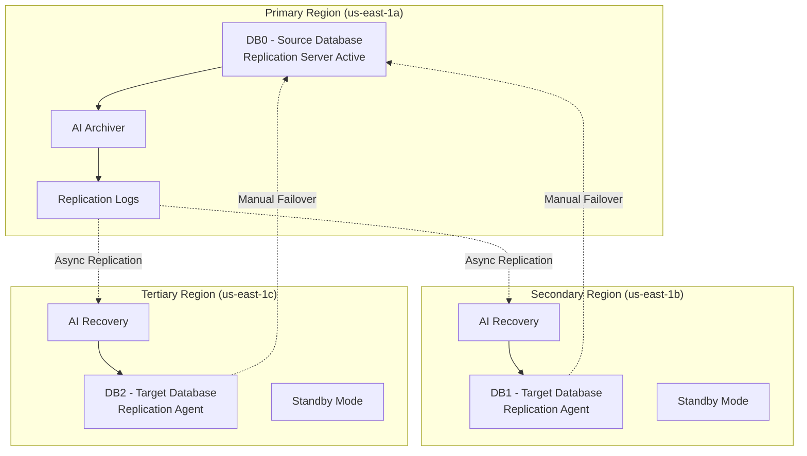

# Scénarios de Déploiement

## Vue d'Ensemble

L'application Sports supporte plusieurs scénarios de déploiement, depuis l'environnement de développement local jusqu'au déploiement cloud AWS avec haute disponibilité. Ce document détaille chaque scénario avec ses spécificités, configurations et cas d'usage.

## Scénario 1: Développement Local

### Configuration de Base


#### DEV-001: Environnement de Développement
- **Objectif**: Développement et tests locaux des programmes 4GL
- **Prérequis**:
  - Progress OpenEdge 11.7+ installé
  - Variable `$DLC` configurée
  - Base de données sports2020 créée localement
- **Configuration**:
  ```bash
  export DLC=/psc/dlc
  export PATH=$DLC/bin:$PATH
  prodb sports2020 sports2020
  proserve sports2020 -S 20000
  ```

#### Commandes de Build
```bash
# Compilation des sources
mpro -b -db sports2020 -S 20000 -p src/compile.p \
     -param src=src/webspeed,target=/artifacts/

# Tests unitaires
./test.sh localhost:20000
```

**Avantages**:
- Cycle de développement rapide
- Debug interactif disponible
- Contrôle total de l'environnement

**Limitations**:
- Pas de simulation de charge
- Pas de tests de réplication
- Configuration mono-utilisateur

## Scénario 2: Déploiement Local Version 117

### Architecture WebSpeed/Apache


#### LOC117-001: Configuration WebSpeed Classique
- **Objectif**: Déploiement traditionnel WebSpeed avec Apache
- **Architecture**: CGI/WebSpeed avec broker unifié
- **Configuration**:
  ```bash
  ./build.sh 117
  ./deploy.sh 117
  ```

#### Configuration Apache
```apache
<VirtualHost *:80>
    DocumentRoot /var/www/html
    ScriptAlias /web "/usr/lib/cgi-bin/wspd_cgi.sh"
</VirtualHost>
```

#### Configuration WebSpeed Broker
```properties
[UBroker.WS.wsbroker1]
    portNumber=3055
    srvrStartupParam=-p web/objects/web-disp.p -db sports2020 -S 20000
    wsRoot=/webspeed117
```

**Avantages**:
- Architecture éprouvée et stable
- Compatible avec versions antérieures
- Outils de debug WebSpeed complets

**Cas d'Usage**:
- Migration d'applications existantes
- Environnements legacy
- Formation sur WebSpeed traditionnel

## Scénario 3: Déploiement Local Version 122

### Architecture PASOE/nginx


#### LOC122-001: Configuration PASOE Moderne
- **Objectif**: Déploiement moderne avec PASOE et nginx
- **Architecture**: REST/JSON avec proxy reverse nginx
- **Configuration**:
  ```bash
  ./build.sh 122
  ./deploy.sh 122
  ```

#### Configuration nginx
```nginx
server {
    listen 8080 default_server;
    root /var/www/html;
    
    location /web {
        proxy_pass http://127.0.0.1:8810/web;
        proxy_hide_header X-Frame-Options;
    }
}
```

#### Configuration PASOE
```properties
[AppServer.SessMgr]
    agentStartupParam=-T "${catalina.base}/temp" -pf /psc/wrk/autoreconnect.pf
    minAgents=1
    maxAgents=2

[oepas1.ROOT.WEB]
    adapterEnabled=1
    wsRoot=/static/webspeed
```

**Avantages**:
- Architecture moderne et scalable
- Support REST natif
- Monitoring avancé
- Configuration flexible

**Cas d'Usage**:
- Nouvelles applications
- Architecture microservices
- Déploiement cloud-ready

## Scénario 4: Déploiement AWS Cloud

### Architecture Multi-Tiers AWS


#### AWS-001: Déploiement Production Cloud
- **Objectif**: Haute disponibilité et scalabilité automatique
- **Architecture**: 3-tiers avec réplication de base de données
- **Configuration**:
  ```bash
  ./build.sh 123
  ./deploy.sh aws
  ```

#### CloudFormation Stack
```bash
aws cloudformation create-stack --stack-name sports-app \
    --template-url https://s3.amazonaws.com/${PublicBucket}/templates/master.yaml \
    --parameters ParameterKey=InstanceType,ParameterValue=t3a.medium \
                 ParameterKey=MinScalingInstances,ParameterValue=2 \
                 ParameterKey=MaxScalingInstances,ParameterValue=3
```

#### Packages de Déploiement
- **web.tar.gz**: Fichiers statiques nginx + configuration
- **pas.tar.gz**: Applications PASOE + configuration + programmes 4GL
- **db.tar.gz**: Base de données + scripts de réplication

**Caractéristiques**:
- **Scalabilité**: Auto Scaling Group 1-3 instances
- **Disponibilité**: Multi-AZ deployment
- **Réplication**: Base de données 3 nœuds avec failover
- **Monitoring**: CloudWatch intégré
- **Sécurité**: VPC, Security Groups, SSL/TLS

## Scénario 5: Réplication Base de Données

### Configuration Multi-Régions



#### REPL-001: Configuration Source (DB0)
```bash
# Activation réplication source
proutil sports2020 -C enableSiteReplication source
proserve sports2020 -DBService replserv -S 20000 -aiarcdir aiArchives
```

#### REPL-002: Configuration Target (DB1, DB2)
```bash
# Activation réplication target
proutil sports2020 -C enableSiteReplication target
proserve sports2020 -DBService replagent -S 20000 -aiarcdir aiArchives
```

#### Configuration Replication Properties
```properties
[server]
    control-agents=agent1,agent2
    database=sports2020
    transition=manual

[control-agent.agent1]
    host=DBHostName1
    port=20000
    replication-method=async
    critical=0
```

**Fonctionnalités**:
- **Réplication Asynchrone**: Performance optimisée
- **Failover Manuel**: Contrôle de la transition
- **Multiple Targets**: Redondance géographique
- **Recovery Point**: Minimisation de la perte de données

## Scénario 6: CI/CD Pipeline

### Pipeline GitHub Actions


#### CI-001: Pipeline Automatisé
- **Trigger**: Push sur branch master
- **Étapes**:
  1. **Build**: `./build.sh 122`
  2. **Deploy Local**: `./deploy.sh 122`
  3. **Test**: `./test.sh localhost:8080`
  4. **Deploy Cloud**: `./deploy.sh aws`

#### Configuration GitHub Actions
```yaml
name: CI
on: [push]
jobs:
  build:
    runs-on: self-hosted
    steps:
    - name: Build Project
      run: ./build.sh 122
  
  deploy_local:
    needs: build
    steps:
    - name: Deploy to Local Env
      run: ./deploy.sh 122
  
  test_local:
    needs: deploy_local
    steps:
    - name: Test Local Env
      run: ./test.sh localhost:8080
  
  deploy_cloud:
    needs: test_local
    steps:
    - name: Deploy to Cloud Env
      run: ./deploy.sh aws
```

## Comparaison des Scénarios

| Scénario | Complexité | Coût | Scalabilité | Disponibilité | Usage |
|----------|------------|------|-------------|---------------|-------|
| Développement Local | Faible | Très faible | Limitée | Faible | Dev/Test |
| Local v117 | Moyenne | Faible | Limitée | Moyenne | Legacy/Migration |
| Local v122 | Moyenne | Faible | Moyenne | Moyenne | Test/Staging |
| AWS Cloud | Élevée | Élevé | Excellente | Excellente | Production |
| Réplication | Élevée | Moyen | Excellente | Excellente | DR/HA |
| CI/CD | Moyenne | Moyen | Bonne | Bonne | DevOps |

## Recommandations d'Usage

### Par Phase de Projet

**Phase de Développement**:
- Utiliser le scénario développement local
- Tests unitaires avec base locale
- Compilation et debug interactif

**Phase de Test**:
- Déploiement local version 122
- Tests d'intégration complets
- Validation des APIs REST

**Phase de Staging**:
- AWS avec infrastructure réduite
- Tests de charge et performance
- Validation de la réplication

**Phase de Production**:
- AWS Cloud complet avec réplication
- Monitoring et alertes activés
- CI/CD pour les mises à jour

### Critères de Choix

**Choisir le développement local si**:
- Développement actif de nouvelles fonctionnalités
- Debug et troubleshooting requis
- Ressources limitées

**Choisir PASOE local si**:
- Test d'architecture moderne
- Validation REST/JSON
- Préparation migration cloud

**Choisir AWS Cloud si**:
- Besoin de haute disponibilité
- Charge utilisateur élevée
- Environnement de production

Cette approche multi-scénarios permet une flexibilité maximale selon les besoins du projet, de la phase de développement jusqu'à la production à grande échelle.