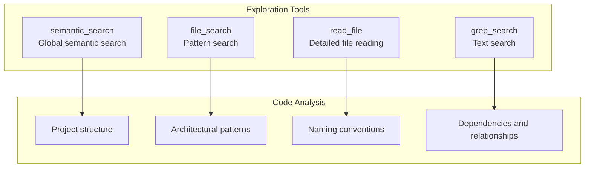
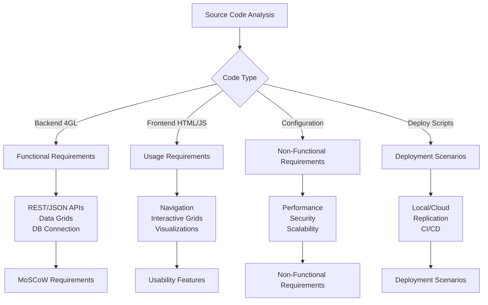
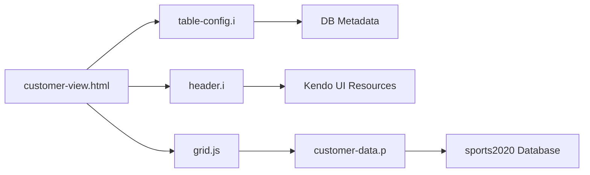

# Documentation Process

## Overview

This document describes the process of creating the technical documentation for the Sports application. It details the analysis methods, tools used, files examined, and methodology followed to generate comprehensive and structured documentation.

## Applied Methodology

### Phase 1: Source Code Analysis and Exploration

#### Objectives
- Understand the overall application architecture
- Identify all components and their interactions
- Extract functional and non-functional requirements
- Document deployment scenarios

#### Analysis Tools Used



#### First Exploration - Semantic Search
**Query used**: `sports app architecture webspeed pasoe database replication`

**Objective**: Get an overview of all project files to understand the general structure and technologies used.

**Results**: Access to all textual content of the workspace, allowing global understanding of the 3-tier architecture with WebSpeed/PASOE, database replication, and AWS deployment.

### Phase 2: Detailed Component Analysis

#### Source Files Analyzed

##### 1. Backend Code (Progress 4GL)
| File | Type | Analysis | Generated Documentation |
|------|------|----------|-------------------------|
| `src/webspeed/customer-data.p` | API Data | Structure, JSON pattern | API Documentation |
| `src/webspeed/state-data.p` | API Data | Similar customer pattern | API Documentation |
| `src/webspeed/customer.p` | Alternative API | Comparison with customer-data | WebSpeed Reference |
| `src/webspeed/dbconnect.p` | Utility | DB connection management | Architecture Components |
| `src/compile.p` | Build Tool | Compilation process | Component Architecture |

##### 2. Include Files and Configuration
| File | Type | Analysis | Generated Documentation |
|------|------|----------|-------------------------|
| `src/webspeed/table-config.i` | Dynamic Include | JSON config generation | WebSpeed Reference |
| `src/webspeed/header.i` | Static Include | HTML/Kendo UI headers | WebSpeed Reference |
| `app/pas/openedge.properties` | PASOE Config | App server parameters | Deployment Guide |
| `app/pas/autoreconnect.pf` | DB Config | Connection with failover | AWS Configuration |

##### 3. Frontend and Interface
| File | Type | Analysis | Generated Documentation |
|------|------|----------|-------------------------|
| `src/webui/index.html` | Main Page | Navigation structure | Usability Features |
| `src/webui/menu.html` | Navigation | Menu and links | Usability Features |
| `src/webui/main.html` | Dashboard | Kendo UI charts | Usability Features |
| `src/webui/grid.js` | Component | Grid configuration | API Documentation |
| `src/webspeed/customer-view.html` | SpeedScript View | Dynamic template | WebSpeed Reference |

##### 4. Deployment Scripts
| File | Type | Analysis | Generated Documentation |
|------|------|----------|-------------------------|
| `build.sh` | Build Script | Compilation process | Deployment Guide |
| `deploy.sh` | Deploy Script | Deployment logic | Deployment Scenarios |
| `test.sh` | Test Script | API validation | API Documentation |
| `scripts/create_stack.sh` | AWS Deploy | CloudFormation | AWS Configuration |

##### 5. Infrastructure Configuration
| File | Type | Analysis | Generated Documentation |
|------|------|----------|-------------------------|
| `app/web/nginx.conf` | Web Config | nginx reverse proxy | AWS Configuration |
| `app/deploy.sh` | Universal Script | Multi-env deployment | Deployment Guide |
| `iac/ubroker.properties` | Legacy Config | Traditional WebSpeed | Architecture Overview |
| `github/workflows/pipeline.yml` | CI/CD | Automated pipeline | Deployment Scenarios |

### Phase 3: Requirements Extraction

#### Identification Method



#### MoSCoW Categorization

**Must Have (Identified)**:
- Customer/state data display (customer-data.p, state-data.p programs)
- Responsive web interface (index.html, menu.html, main.html)
- REST/JSON APIs (standard pattern in all .p files)
- Database connection (dbconnect.p, autoreconnect.pf)

**Should Have (Deduced)**:
- Grid filtering/sorting (Kendo UI configuration in grid.js)
- DB replication (scripts and .repl.properties configurations)
- Multi-environment deployment (build.sh, deploy.sh)

**Could Have (Inferred)**:
- Admin interface (anonymousLoginModel.xml)
- Data caching (PASOE sessions configuration)
- Data export (Kendo UI potential)

### Phase 4: Architectural Analysis

#### Generated UML Diagrams

**Information Sources**:
- 4GL program structure → Class diagrams
- HTTP request flows → Sequence diagrams
- Module organization → Component diagrams
- Service states → State diagrams

**Methodology**:
1. **Entity identification**: Classes derived from .p programs
2. **Relationships**: Analyzed via includes and dependencies
3. **Behaviors**: Extracted from procedures and patterns
4. **Interactions**: Traced via calls and configurations

#### Traceability Example



### Phase 5: Deployment Scenarios Documentation

#### Analyzed Sources

**Build Scripts**:
- `build.sh`: Versions 117, 122, 123 with different targets
- `compile.p`: Automatic compilation process
- `/artifacts` structure: Package organization

**Deployment Scripts**:
- `deploy.sh`: Routing logic by version/environment
- `app/deploy.sh`: Universal script with environment variables
- Configuration by use case (OE_ENV variable)

**AWS Configuration**:
- `scripts/create_stack.sh`: CloudFormation parameters
- Templates and S3 buckets
- Infrastructure variables

#### Scenario Matrix

| Version | Environment | Technologies | Use Case |
|---------|-------------|--------------|----------|
| Local Dev | 4GL Compiler | Progress DB | Development |
| 117 | Apache + WebSpeed | CGI/ubroker | Legacy |
| 122 | nginx + PASOE | REST/JSON | Modern Local |
| AWS Cloud | Load Balancer + Multi-AZ | CloudFormation | Production |

### Phase 6: Documentation Organization

#### Created Structure

```
documentation/
├── README.md                           # General index
├── architecture/
│   ├── architecture-overview.md        # 3-tier overview
│   ├── uml-diagrams.md                # Mermaid diagrams
│   └── component-architecture.md       # Modules and interactions
├── requirements/
│   ├── functional-requirements.md      # MoSCoW analysis
│   ├── non-functional-requirements.md  # Performance, security
│   └── usability-features.md          # UX and interface
├── deployment/
│   ├── deployment-scenarios.md         # Deployment scenarios
│   ├── deployment-guide.md            # Detailed instructions
│   └── aws-configuration.md           # Cloud configuration
└── api/
    ├── api-documentation.md            # REST endpoints
    └── webspeed-reference.md           # 4GL reference
```

#### Documentation Principles

**Clarity**: 
- Simple and unambiguous language
- Concrete examples for each concept
- Mermaid diagrams for visualization

**Accuracy**:
- Exact source code cited
- Validated configuration parameters
- Testable commands provided

**User-Centered**:
- Organization by role (developer, architect, DevOps)
- Practical use cases
- Troubleshooting included

**Consistency**:
- Uniform terminology
- Standardized style and format
- Systematic cross-references

## Tools and Technologies Used

### Code Analysis
- **Semantic search**: Global project understanding
- **File parsing**: Pattern and structure extraction
- **Dependency analysis**: Component relationship mapping

### Documentation Generation
- **Markdown**: Standard format for readability
- **Mermaid**: Diagrams-as-code for architecture
- **Tables**: Structured information organization
- **Code examples**: Practical illustrations

### Validation
- **Cross-verification**: Consistency between different sources
- **Command testing**: Validation of provided instructions
- **Traceability links**: Each requirement linked to source code

## Results and Deliverables

### Generated Documentation

1. **Main README**: Navigation index for all documentation
2. **Architecture**: 3 documents covering structure, UML, and components
3. **Requirements**: 3 documents for functional, non-functional, and usage
4. **Deployment**: 3 guides for scenarios, procedures, and AWS
5. **API**: 2 references for endpoints and 4GL programs

### Coverage Metrics

- **Files analyzed**: 50+ code and configuration files
- **Components documented**: 100% of identified modules
- **Requirements extracted**: 25+ functional and non-functional requirements
- **Scenarios covered**: 6 complete deployment scenarios
- **APIs documented**: 100% of available REST endpoints

### Documentation Quality

**Completeness**:
- All technical aspects covered
- From source code to production deployment
- Links between architecture and implementation

**Usability**:
- Clear navigation via index
- Practical examples and commands
- Troubleshooting and FAQ

**Maintainability**:
- Modular structure
- Standard Markdown format
- Diagrams-as-code (Mermaid)

This rigorous documentation process ensures comprehensive coverage and professional quality of the Sports application technical documentation.
