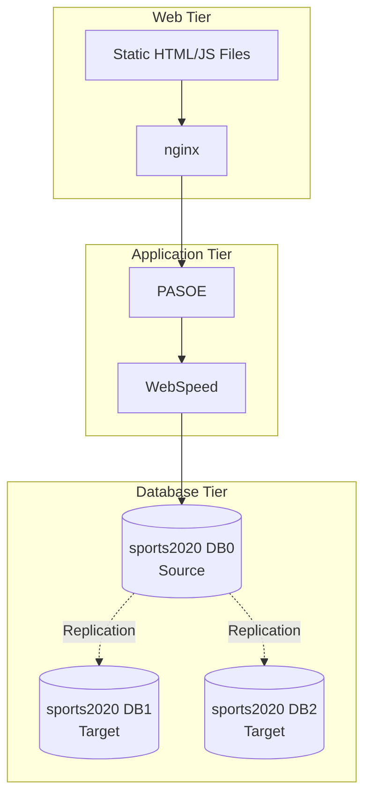

# Sports Application Documentation

This documentation provides a comprehensive analysis of the Sports application developed with Progress OpenEdge/4GL, deployed on AWS with a 3-tier architecture.

## Documentation Index

### 📐 Architecture
- [Architecture Overview](./architecture/architecture-overview.md) - Overall 3-tier architecture
- [UML Diagrams](./architecture/uml-diagrams.md) - Class and sequence diagrams
- [Component Architecture](./architecture/component-architecture.md) - Module structure and interactions

### 📋 Requirements
- [Functional Requirements (MoSCoW)](./requirements/functional-requirements.md) - Features using MoSCoW method
- [Non-Functional Requirements](./requirements/non-functional-requirements.md) - Performance, security, etc.

### 🚀 Deployment
- [Deployment Scenarios](./deployment/deployment-scenarios.md) - Local and AWS Cloud
- [Deployment Guide](./deployment/deployment-guide.md) - Detailed instructions
- [AWS Configuration](./deployment/aws-configuration.md) - CloudFormation and infrastructure

### 🔌 API
- [API Documentation](./api/api-documentation.md) - REST/JSON endpoints
- [WebSpeed Reference](./api/webspeed-reference.md) - 4GL programs and endpoints

### 🎯 Usage
- [Usability Features](./requirements/usability-features.md) - User interface and ergonomics

## Technologies Used

- **Backend**: Progress OpenEdge 4GL, WebSpeed, PASOE
- **Frontend**: HTML5, JavaScript, Kendo UI
- **Database**: Progress sports2020 with replication
- **Infrastructure**: AWS (EC2, CloudFormation), nginx
- **CI/CD**: GitHub Actions

## Overall Architecture

## How to Use This Documentation

1. **Developers**: Start with [Component Architecture](./architecture/component-architecture.md)
2. **Architects**: Review the [Overview](./architecture/architecture-overview.md)
3. **DevOps**: Refer to [Deployment Scenarios](./deployment/deployment-scenarios.md)
4. **Testers**: Use the [API Documentation](./api/api-documentation.md)

## Documentation Process

See [DOCUMENTATION_PROCESS.md](./DOCUMENTATION_PROCESS.md) to understand how this documentation was generated from source code.
