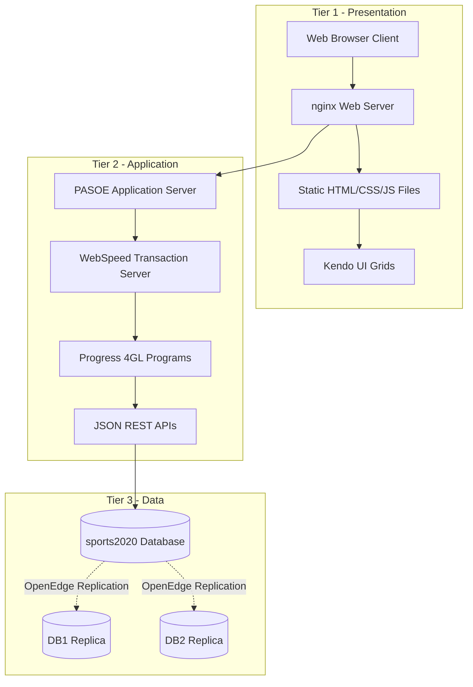
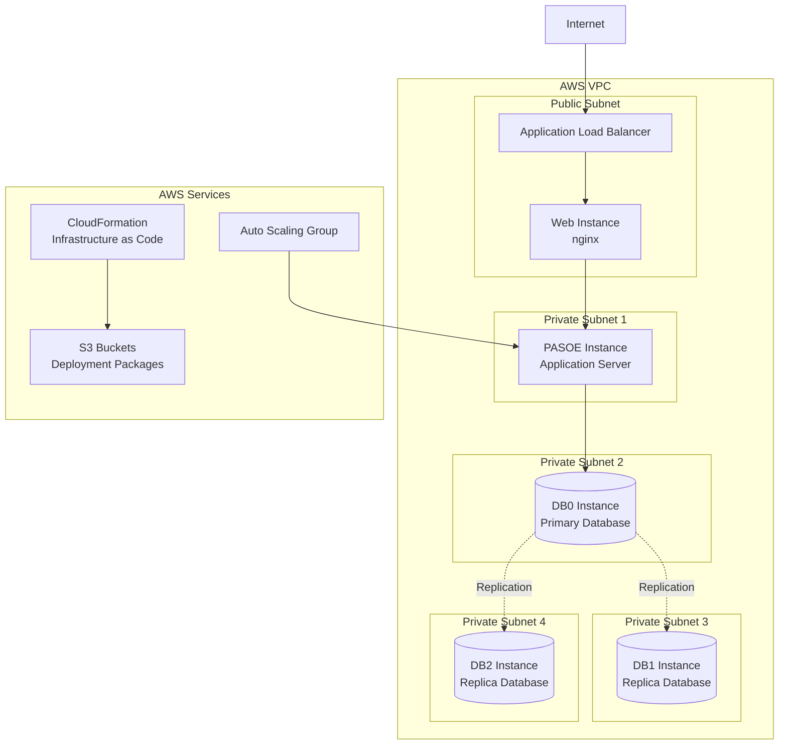
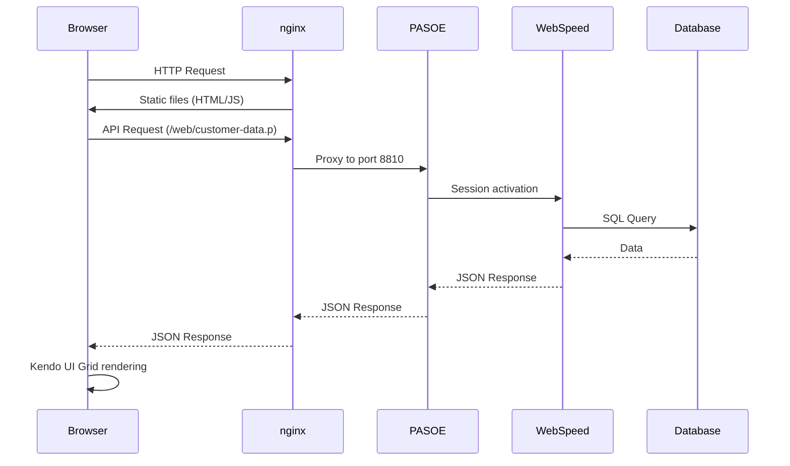

# Architecture Overview

## Introduction

The Sports application is a multi-tier application developed with Progress OpenEdge 4GL that demonstrates database replication capabilities and cloud deployment patterns. It comprises WebSpeed/PASOE backend services, database components, and a web frontend interface deployed via AWS infrastructure.

## 3-Tier Architecture

## Main Components

### 1. Web Tier (Tier 1)
- **nginx**: Web server serving static files and reverse proxy to PASOE
- **User interface**: HTML5 with Kendo UI components
- **Dynamic grids**: Display of Customer and State data

### 2. Application Tier (Tier 2)
- **PASOE**: Progress Application Server for OpenEdge
- **WebSpeed**: Transaction server for 4GL programs
- **REST APIs**: JSON endpoints for data access

### 3. Data Tier (Tier 3)
- **Primary database**: sports2020 (replication source)
- **Replicated databases**: DB1 and DB2 (replication targets)
- **OpenEdge replication**: Automatic data synchronization

## AWS Deployment Architecture

## Data Flow

## Technologies and Frameworks

### Backend
- **Progress OpenEdge 11.7+**: 4GL development platform
- **WebSpeed**: Web framework for Progress 4GL
- **PASOE**: Modern application server
- **Progress.Json.ObjectModel**: Native JSON serialization

### Frontend
- **Kendo UI 2017.3.1026**: UI component library
- **jQuery**: DOM manipulation and AJAX
- **Progress JSDO**: JavaScript data binding

### Infrastructure
- **nginx**: Web server and reverse proxy
- **AWS EC2**: Virtual instances
- **AWS CloudFormation**: Infrastructure as Code
- **AWS S3**: Deployment package storage

## Architectural Patterns

### 1. Repository Pattern
4GL programs follow the repository pattern with:
- Temp-tables for data manipulation
- Datasets for JSON serialization
- Centralized connection procedures

### 2. Proxy Pattern
nginx acts as a reverse proxy:
- Routing static vs dynamic requests
- Load balancing to PASOE instances
- SSL/TLS termination

### 3. MVC Pattern (Client Side)
- **Model**: Dynamically generated JSON configuration
- **View**: HTML templates with placeholders
- **Controller**: Kendo UI JavaScript scripts

## Security

### Authentication
- Anonymous configuration for public access
- Spring Security for endpoint protection
- Security headers (X-Frame-Options, XSS-Protection)

### Network
- AWS VPC with private/public subnets
- Security Groups to control access
- Load Balancer for traffic distribution

## Scalability

### Horizontal
- Auto Scaling Groups for PASOE instances
- Multi-region database replication
- Load Balancer for traffic distribution

### Vertical
- PASOE agent configuration (min/max)
- Connection pool parameters
- User session cache

## Monitoring and Observability

### Logs
- nginx logs: access and errors
- PASOE logs: agents and sessions
- Database logs: replication and transactions

### Metrics
- PASOE metrics collection enabled
- AWS CloudWatch monitoring
- Performance alerts

This architecture ensures high availability, scalability, and optimal maintainability for the Sports application.
