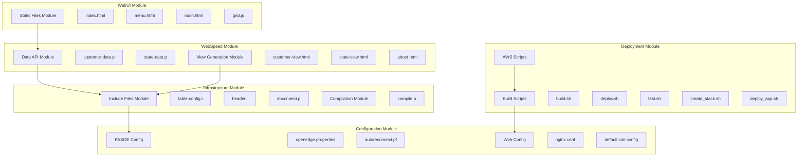
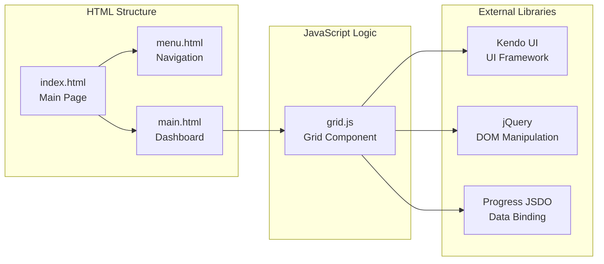
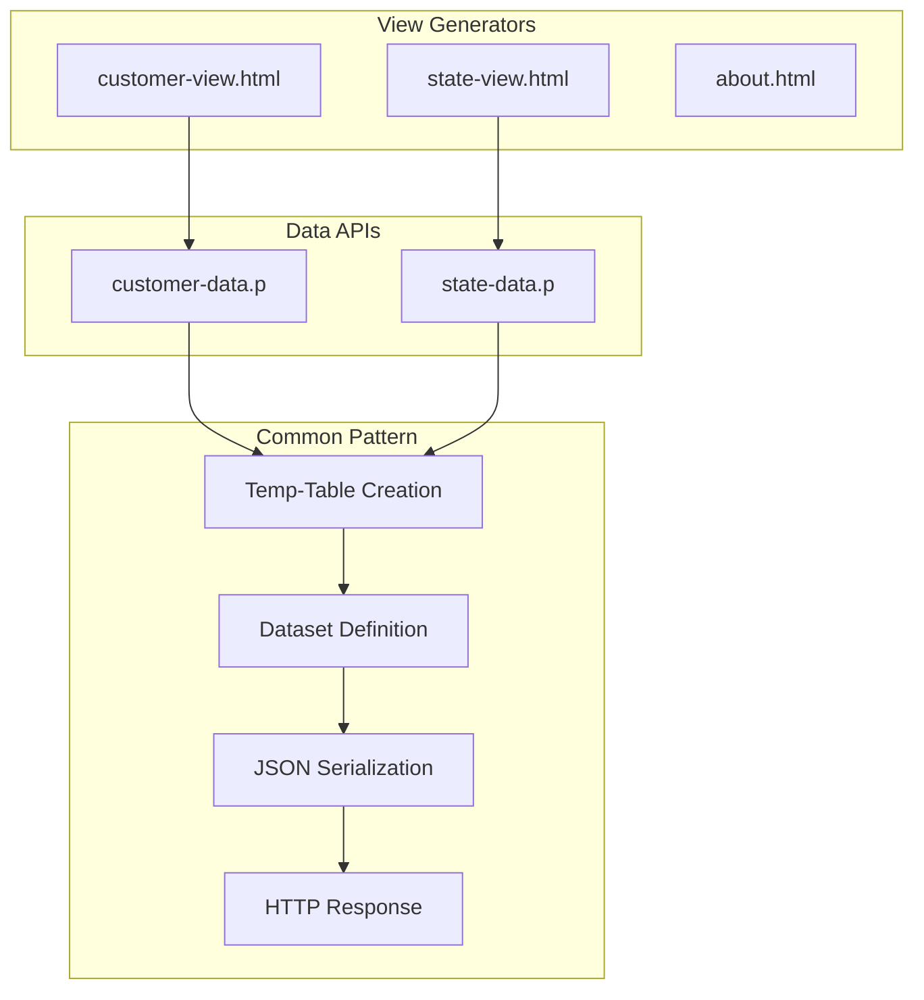
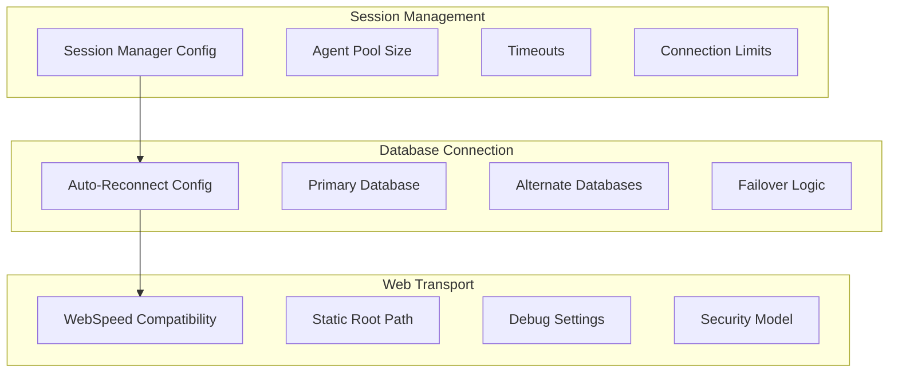
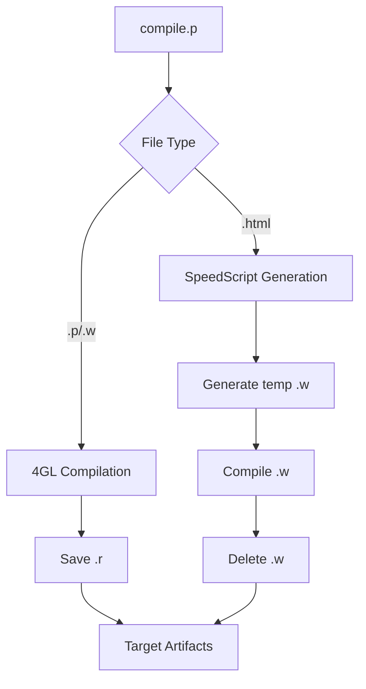
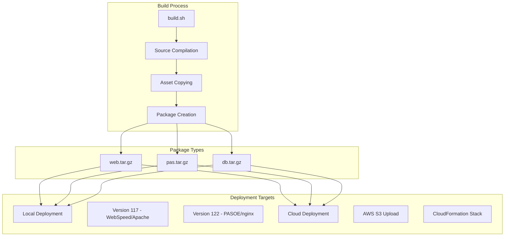
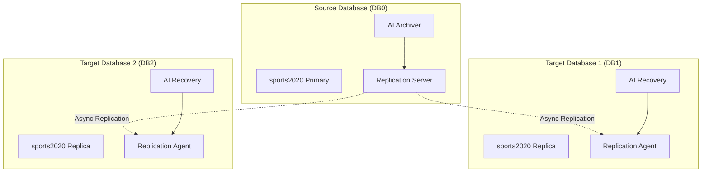
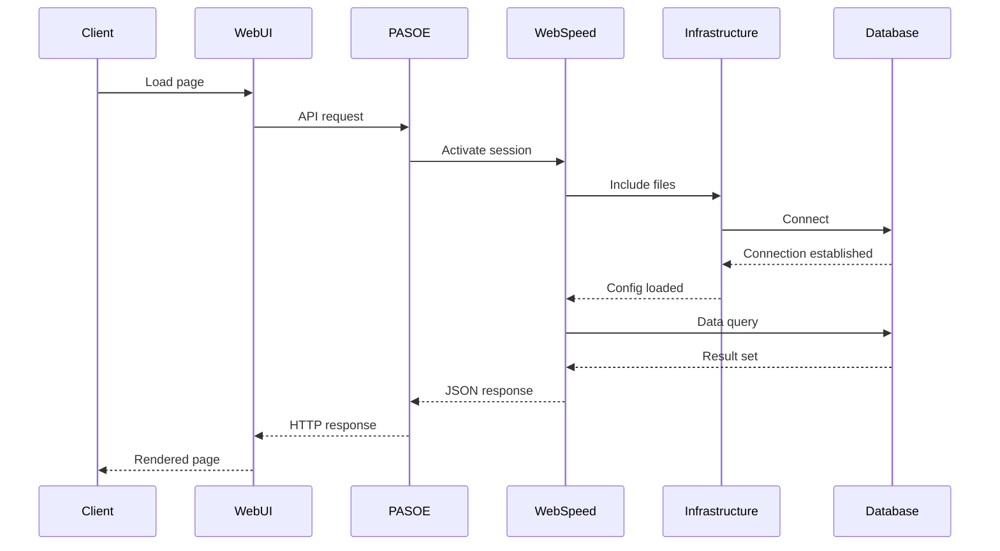

# Component Architecture

## Module Overview

The Sports application is organized into distinct modules, each with specific responsibilities and well-defined interfaces.



## WebUI Module - User Interface

### Static Components



#### Responsibilities
- **index.html**: Entry point with iframe layout
- **menu.html**: Navigation between views
- **main.html**: Dashboard with Kendo UI chart
- **grid.js**: Reusable component for data grids

## WebSpeed Module - 4GL Backend

### Data APIs



#### Common Data Pattern

```progress
// Standard pattern for data APIs
DEFINE TEMP-TABLE tt{Entity} LIKE {Entity}.
DEFINE DATASET ds{Entity} FOR tt{Entity}.

PROCEDURE process-web-request :
    // 1. Empty temp-table
    EMPTY TEMP-TABLE tt{Entity}.
    
    // 2. Load data from DB
    FOR EACH {Entity} NO-LOCK:
        CREATE tt{Entity}.
        BUFFER-COPY {Entity} TO tt{Entity}.
    END.
    
    // 3. Serialize to JSON
    oJsonObject = NEW JsonObject().
    oJsonObject:READ(DATASET ds{Entity}:HANDLE).
    
    // 4. Return response
    lChar = oJsonObject:GetJsonText().
    {&OUT-LONG} lChar.
END PROCEDURE.
```

## Infrastructure Module - Utilities

### Include Files

```mermaid
graph TB
    subgraph "Dynamic Configuration"
        A[table-config.i]
        A1[JSON config generation]
        A2[Schema metadata]
        A3[Grid configuration]
    end
    
    subgraph "Web Headers"
        B[header.i]
        B1[Kendo UI CSS links]
        B2[JavaScript scripts]
        B3[JSDO configuration]
    end
    
    subgraph "DB Connection"
        C[dbconnect.p]
        C1[sports2020 connection]
        C2[Connection parameters]
    end
    
    A --> A1
    A1 --> A2
    A2 --> A3
    
    B --> B1
    B1 --> B2
    B2 --> B3
    
    C --> C1
    C1 --> C2
```



#### table-config.i - Configuration Generator

This include file dynamically generates JSON configuration for Kendo UI grids by analyzing the database schema.

**Features**:
- Table metadata analysis
- Field configuration generation
- Automatic API URLs
- Grid column configuration

## PASOE Module - Application Server

### Configuration and Properties



#### Key Configuration (openedge.properties)

```properties
# Automatic session activation
sessionActivateProc=dbconnect.p

# Agent configuration
minAgents=1
maxAgents=2
numInitialAgents=1

# Timeouts
idleSessionTimeout=1800000
connectionWaitTimeout=3000

# WebSpeed compatibility
wsRoot=/static/webspeed
```

## Compilation Module

### Build Process



#### Compiler Features

- **Multi-format support**: .p, .w, .html
- **SpeedScript**: HTML to 4GL conversion
- **Organization**: Source/target directory structure
- **Parameters**: Configuration via session arguments

## Deployment Module

### Build Architecture



## Database Module

### OpenEdge Replication



#### Replication Configuration

**Source Database**:
- Service: `replserv`
- Control agents: agent1, agent2
- Method: asynchronous

**Target Databases**:
- Service: `replagent`
- Connection to other agents
- Manual transition enabled

## Module Interactions

### Complete Request Flow



## Architectural Patterns

### 1. Template Method Pattern
WebSpeed programs use a template method pattern:
- Common structure (temp-table + dataset + JSON)
- Variations by entity (Customer, State)
- Include files for reuse

### 2. Configuration Pattern
Include files implement a configuration pattern:
- `table-config.i`: Dynamic configuration based on metadata
- `header.i`: Static header configuration
- Parameterization via global variables

### 3. Proxy Pattern
nginx acts as a proxy with multiple responsibilities:
- Static vs dynamic request routing
- Load balancing to PASOE
- SSL termination and security headers

This modular architecture ensures clear separation of responsibilities, high maintainability, and optimal scalability.
