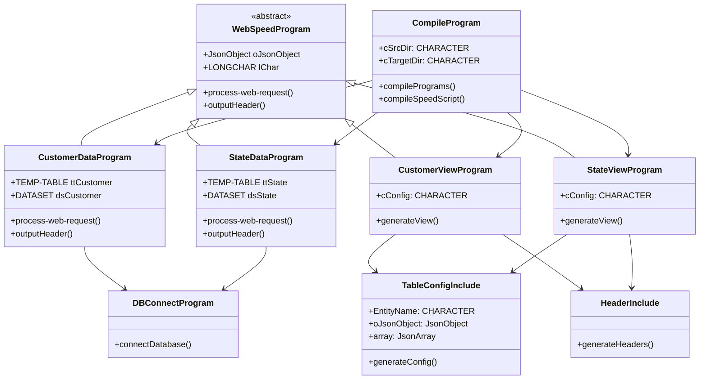
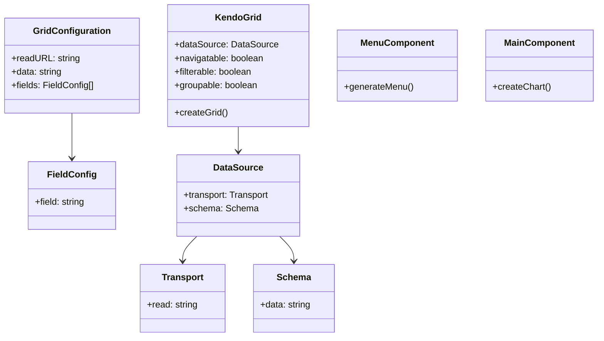
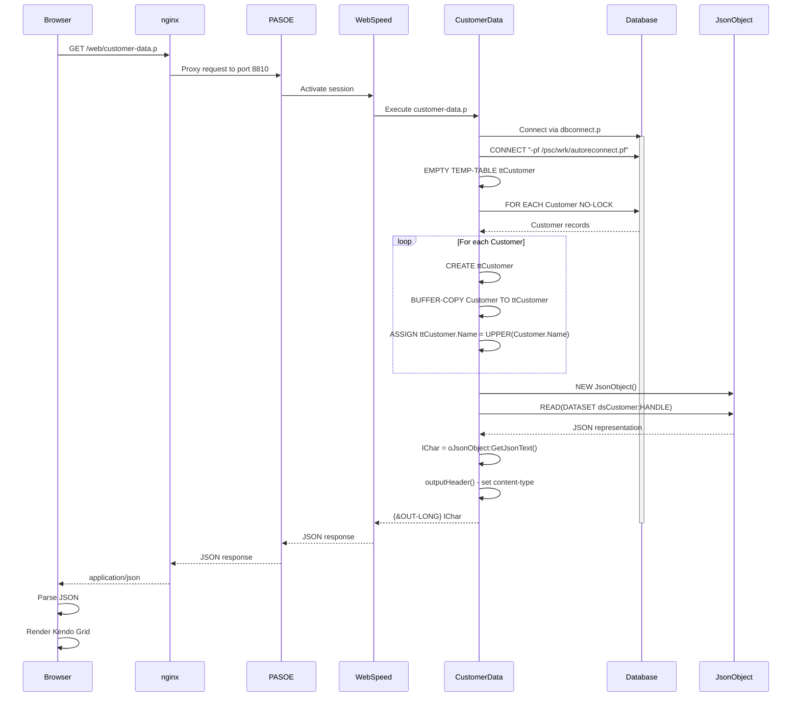
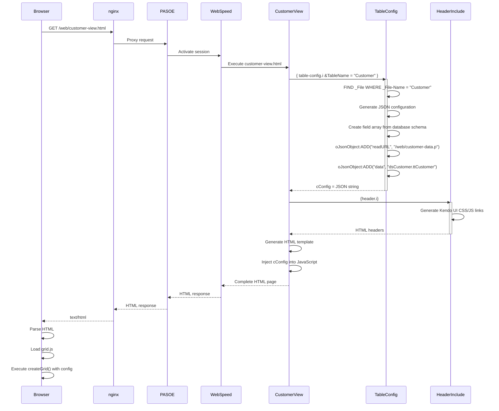
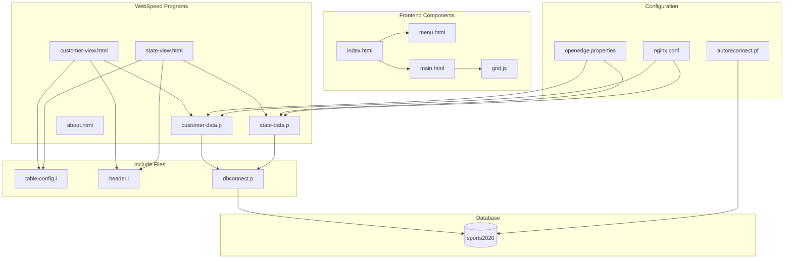
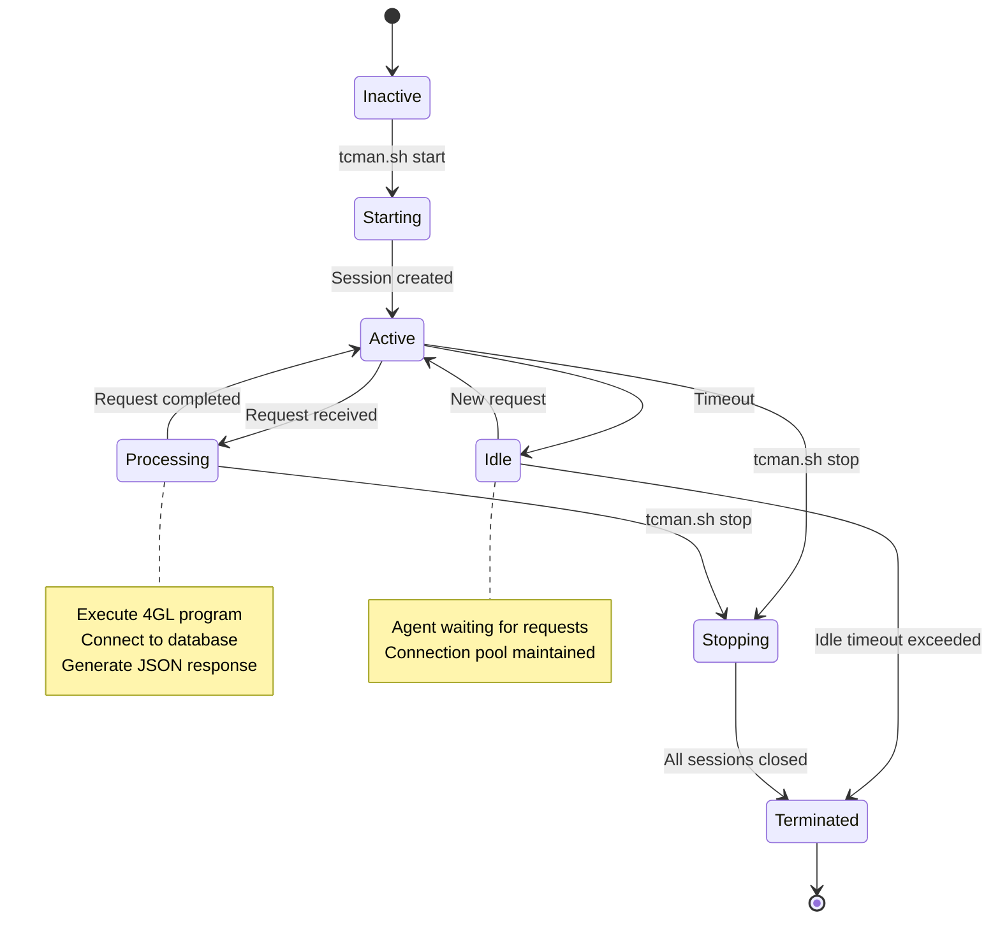

# UML Diagrams

> **Note**: This is an English translation. For the complete French version, see [French UML Diagrams](../../fr/architecture/uml-diagrams.md)

## Class Diagram

## Frontend Class Diagram

## Sequence Diagram - Customer Data Request

## Sequence Diagram - Customer View Rendering

## Component Diagram

## State Diagram - PASOE Session

## State Diagram - Database Replication

```mermaid
stateDiagram-v2
    [*] --> Initializing
    
    Initializing --> SourceReady : Source DB configured
    SourceReady --> Replicating : Targets connected
    
    Replicating --> Synchronizing : Transaction log
    Synchronizing --> Replicating : Sync complete
    
    Replicating --> FailoverPending : Source failure
    FailoverPending --> TargetActive : Manual transition
    TargetActive --> Replicating : Source recovered
    
    Replicating --> Stopped : Stop replication
    Stopped --> [*]
    
    note right of Replicating
        DB0 (source) → DB1, DB2 (targets)
        Async replication enabled
        AI archiver active
    end note
    
    note right of FailoverPending
        Manual transition required
        Backup method: mark
        Restart after transition
    end note
```

These UML diagrams provide a detailed view of the structure, behavior, and interactions of the Sports application components.

---

**For complete documentation with detailed descriptions, see the [French version](../../fr/architecture/uml-diagrams.md).**
