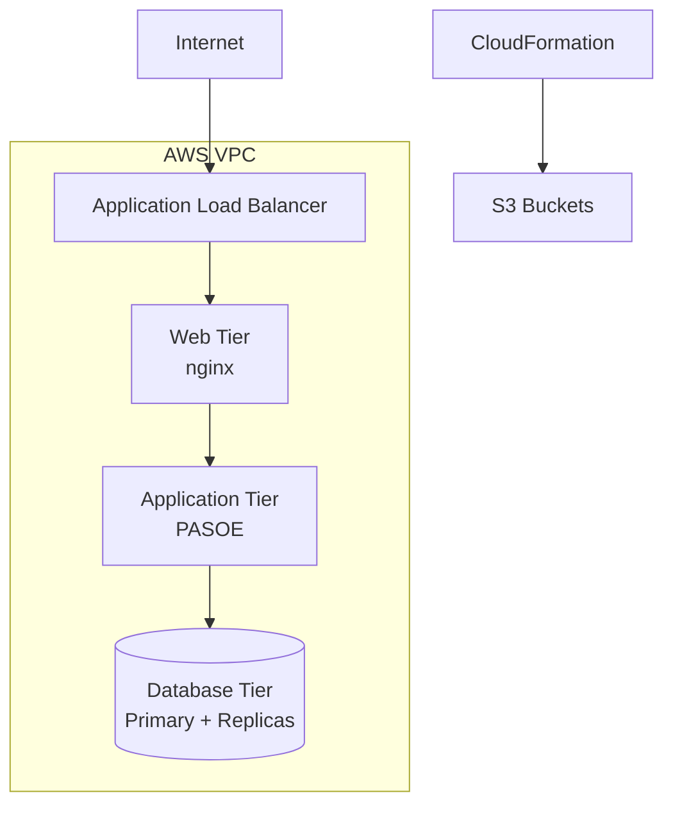

# AWS Configuration

> **📖 Complete Version**: For detailed AWS configuration with CloudFormation templates, see [French AWS Configuration](../../fr/deployment/aws-configuration.md)

## Quick Reference

### Architecture



### Key Parameters

```yaml
InstanceType: t3a.medium
MinScalingInstances: 2
MaxScalingInstances: 3
AvailabilityZones: us-east-1a,us-east-1b
```

### Deployment Commands

```bash
# Create stack
./scripts/create_stack.sh sports-app-prod

# Monitor progress
aws cloudformation describe-stacks --stack-name sports-app-prod

# Get application URL
aws cloudformation describe-stacks --stack-name sports-app-prod \
    --query 'Stacks[0].Outputs[?OutputKey==`ApplicationURL`].OutputValue' \
    --output text
```

## VPC Configuration

### Subnets
- **Public**: Web tier (ALB, nginx)
- **Private App**: PASOE instances
- **Private DB**: Database instances

### Security Groups
- **Web SG**: Ports 80, 443 from Internet
- **App SG**: Port 8810 from Web SG
- **DB SG**: Port 20000 from App SG

## Load Balancer

```yaml
Type: Application Load Balancer
Scheme: internet-facing
HealthCheck: HTTP:8080/
TargetGroup: PASOE instances
```

## Auto Scaling

```yaml
MinSize: 2
MaxSize: 3
DesiredCapacity: 2
HealthCheckType: ELB
ScaleUp: CPU > 80%
ScaleDown: CPU < 20%
```

## Deployment Packages

### S3 Buckets
- **Private Bucket**: Deployment packages
  - `web.tar.gz`
  - `pas.tar.gz`
  - `db.tar.gz`
- **Public Bucket**: CloudFormation templates

### User Data Script

Instances automatically:
1. Download packages from S3
2. Extract deployment files
3. Configure environment variables
4. Execute `app/deploy.sh`

## Database Configuration

### Primary (DB0)
```bash
export OE_ENV=db0
export DBHostName1=<DB1-IP>
export DBHostName2=<DB2-IP>
```

### Replicas (DB1, DB2)
```bash
export OE_ENV=db1  # or db2
export DBHostName=<DB0-IP>
```

## Monitoring

### CloudWatch Metrics
- **ALB**: Request count, response time, 5XX errors
- **EC2**: CPU, network I/O, disk I/O
- **Custom**: Application-specific metrics

### CloudWatch Alarms
- High error rate (5XX > 10 in 5 minutes)
- High CPU (> 80% for 10 minutes)
- Database connection failures

## IAM Roles

### EC2 Instance Role
Permissions for:
- S3 bucket access (deployment packages)
- CloudWatch logs
- CloudWatch metrics

## Outputs

After stack creation:

```bash
# Application URL
OutputKey: ApplicationURL
OutputValue: http://[alb-dns-name]

# Database IPs
OutputKey: DatabasePrimaryIP
OutputValue: 10.0.20.x

# VPC ID
OutputKey: VPCId
OutputValue: vpc-xxxxxx
```

## Cost Optimization

### Instance Types
- **Development**: t3a.small
- **Staging**: t3a.medium
- **Production**: t3a.large or t3a.xlarge

### Scaling Strategy
- **Off-hours**: Scale to minimum (2 instances)
- **Business hours**: Scale based on load (2-3 instances)
- **Peak**: Increase max capacity

## Security Best Practices

1. **VPC**: Private subnets for app and database tiers
2. **Security Groups**: Least-privilege access
3. **SSL/TLS**: HTTPS on load balancer
4. **IAM**: Role-based access control
5. **Encryption**: S3 bucket encryption enabled

## Deployment Workflow

```bash
# 1. Build application
./build.sh 123

# 2. Upload to S3
aws s3 cp /artifacts/sports-app/123/web.tar.gz s3://deploy-bucket/
aws s3 cp /artifacts/sports-app/123/pas.tar.gz s3://deploy-bucket/
aws s3 cp /artifacts/sports-app/123/db.tar.gz s3://deploy-bucket/

# 3. Create CloudFormation stack
./scripts/create_stack.sh my-app-stack

# 4. Wait for completion
aws cloudformation wait stack-create-complete --stack-name my-app-stack

# 5. Get application URL
aws cloudformation describe-stacks --stack-name my-app-stack \
    --query 'Stacks[0].Outputs' --output table
```

## Troubleshooting

### Stack Creation Failed
```bash
# View failed events
aws cloudformation describe-stack-events --stack-name my-app \
    --query 'StackEvents[?ResourceStatus==`CREATE_FAILED`]'
```

### Instance Not Healthy
```bash
# Check instance logs
aws logs tail /aws/ec2/my-app --follow

# SSH to instance (via bastion)
./scripts/ssh_linux_bastion.sh
```

### Database Replication Issues
```bash
# Connect to DB instance
ssh -i key.pem ec2-user@<db-instance-ip>

# Check replication status
proutil sports2020 -C busy
```

## Cleanup

```bash
# Delete stack
./scripts/delete_stack.sh my-app-stack

# Delete S3 buckets (after stack deletion)
aws s3 rb s3://deploy-bucket --force
aws s3 rb s3://public-bucket --force
```

---

**📚 For complete AWS configuration including:**
- Full CloudFormation templates
- Detailed security configuration
- Network architecture
- Advanced monitoring setup
- Cost analysis and optimization
- Disaster recovery procedures

**See the [complete French documentation](../../fr/deployment/aws-configuration.md)**
