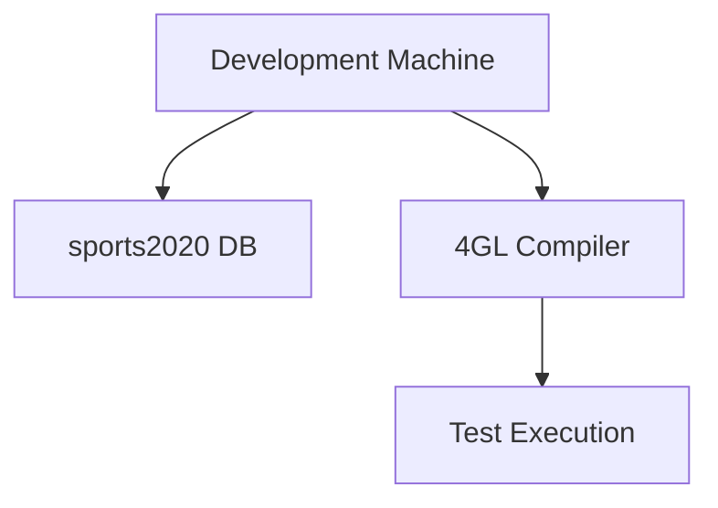
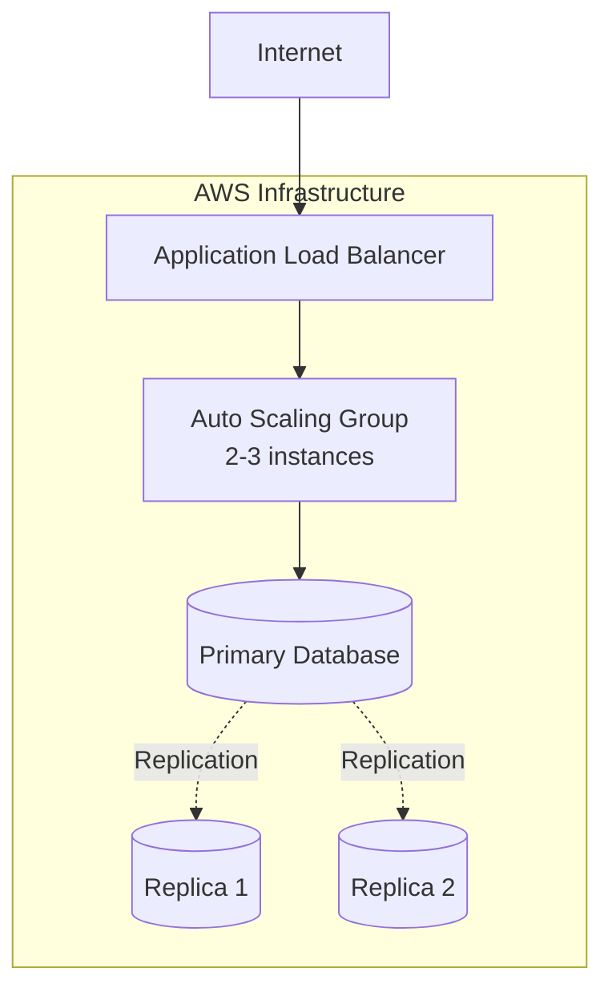
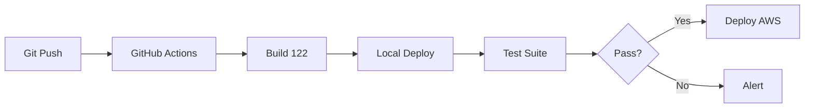
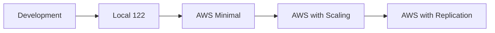

# Deployment Scenarios

> **📖 Complete Version**: For detailed scenarios and configurations, see [French Deployment Scenarios](../../fr/deployment/deployment-scenarios.md)

## Overview

The Sports application supports multiple deployment scenarios from local development to cloud production.

## Scenario Matrix

| Scenario | Complexity | Cost | Scalability | Use Case |
|----------|------------|------|-------------|----------|
| Local Development | Low | Very Low | Limited | Development/Testing |
| Local v117 | Medium | Low | Limited | Legacy/Migration |
| Local v122 | Medium | Low | Medium | Testing/Staging |
| AWS Cloud | High | High | Excellent | Production |
| With Replication | High | Medium | Excellent | HA/DR |
| CI/CD Pipeline | Medium | Medium | Good | DevOps |

## 1. Local Development

**Architecture**: Single machine with OpenEdge compiler



**Setup**:
```bash
export DLC=/psc/dlc
prodb sports2020 sports2020
proserve sports2020 -S 20000
```

**Build & Test**:
```bash
mpro -p src/compile.p -param src=src/webspeed,target=/artifacts/
./test.sh localhost:20000
```

**Use Cases**: Active development, debugging, unit testing

## 2. Local Version 117 (WebSpeed/Apache)

**Architecture**: Traditional WebSpeed with Apache

```bash
./build.sh 117
./deploy.sh 117
```

**Configuration**: CGI/WebSpeed broker on port 3055

**Use Cases**: Legacy application migration, WebSpeed training

## 3. Local Version 122 (PASOE/nginx)

**Architecture**: Modern PASOE with nginx reverse proxy

```bash
./build.sh 122
./deploy.sh 122
```

**Access**: http://localhost:8080

**Features**:
- REST/JSON APIs
- Session management
- Modern architecture
- Cloud-ready

**Use Cases**: Modern development, integration testing, staging

## 4. AWS Cloud Production

**Architecture**: 3-tier with auto-scaling



**Deployment**:
```bash
./build.sh 123
./deploy.sh aws
```

**Features**:
- High availability
- Auto-scaling (2-3 instances)
- Multi-AZ database replication
- Load balancing
- CloudWatch monitoring

**Use Cases**: Production environment, high traffic

## 5. Database Replication

**Architecture**: 1 source + 2 targets

**Source (DB0)**:
```bash
proutil sports2020 -C enableSiteReplication source
proserve sports2020 -DBService replserv -S 20000
```

**Targets (DB1, DB2)**:
```bash
proutil sports2020 -C enableSiteReplication target
proserve sports2020 -DBService replagent -S 20000
```

**Features**:
- Asynchronous replication
- Manual failover
- Geographic redundancy
- Disaster recovery

**Use Cases**: High availability, disaster recovery, load distribution

## 6. CI/CD Pipeline

**Architecture**: Automated build and deployment



**Configuration**: `.github/workflows/pipeline.yml`

**Stages**:
1. Build (compile 4GL)
2. Deploy local (version 122)
3. Test (API validation)
4. Deploy cloud (AWS)

**Use Cases**: Continuous integration, automated deployment

## Quick Comparison

### By Project Phase

**Development Phase**:
- Use: Local Development
- Fast iteration
- Full debugging capabilities

**Testing Phase**:
- Use: Local Version 122
- Integration tests
- REST API validation

**Staging Phase**:
- Use: AWS with reduced capacity
- Production-like environment
- Load testing

**Production Phase**:
- Use: AWS Cloud with Replication
- High availability
- Full monitoring

### By Requirements

**Need High Availability?**
→ AWS Cloud + Replication

**Legacy Application?**
→ Local Version 117

**Modern Development?**
→ Local Version 122

**Budget Constrained?**
→ Local Development/122

**DevOps Culture?**
→ CI/CD Pipeline

## Migration Path



### Step 1: Development → Local 122
- Validate modern architecture
- Test REST APIs
- Performance baseline

### Step 2: Local 122 → AWS Minimal
- Cloud infrastructure setup
- Single instance deployment
- Initial monitoring

### Step 3: AWS Minimal → Scaling
- Add auto-scaling
- Configure load balancer
- Optimize performance

### Step 4: Scaling → Replication
- Enable database replication
- Configure failover
- Full HA/DR capability

## Environment Variables

Each scenario uses specific environment variables:

```bash
# Development
export OE_ENV=dev

# Local 117
export OE_ENV=pas117

# Local 122
export OE_ENV=pas122

# AWS - Web tier
export OE_ENV=web

# AWS - App tier
export OE_ENV=pas

# AWS - DB source
export OE_ENV=db0

# AWS - DB targets
export OE_ENV=db1  # or db2
```

## Commands Summary

```bash
# Build for specific scenario
./build.sh [117|122|123]

# Deploy to specific target
./deploy.sh [117|122|aws]

# Test deployment
./test.sh [hostname:port]

# AWS stack operations
./scripts/create_stack.sh [stack-name]
./scripts/delete_stack.sh [stack-name]
```

---

**📚 For detailed information including:**
- Complete configuration examples
- Troubleshooting procedures
- Performance optimization
- Security configuration
- Cost analysis

**See the [complete French documentation](../../fr/deployment/deployment-scenarios.md)**
