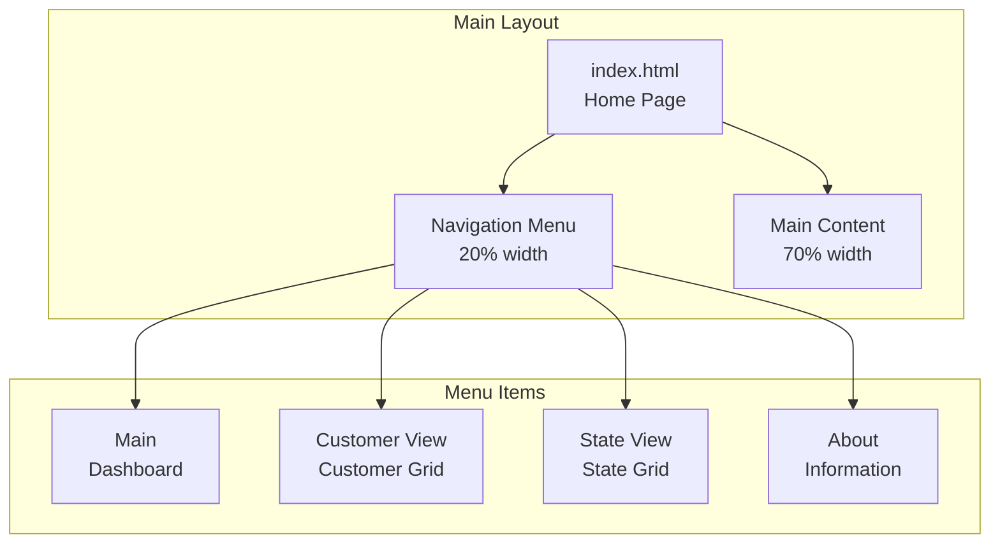
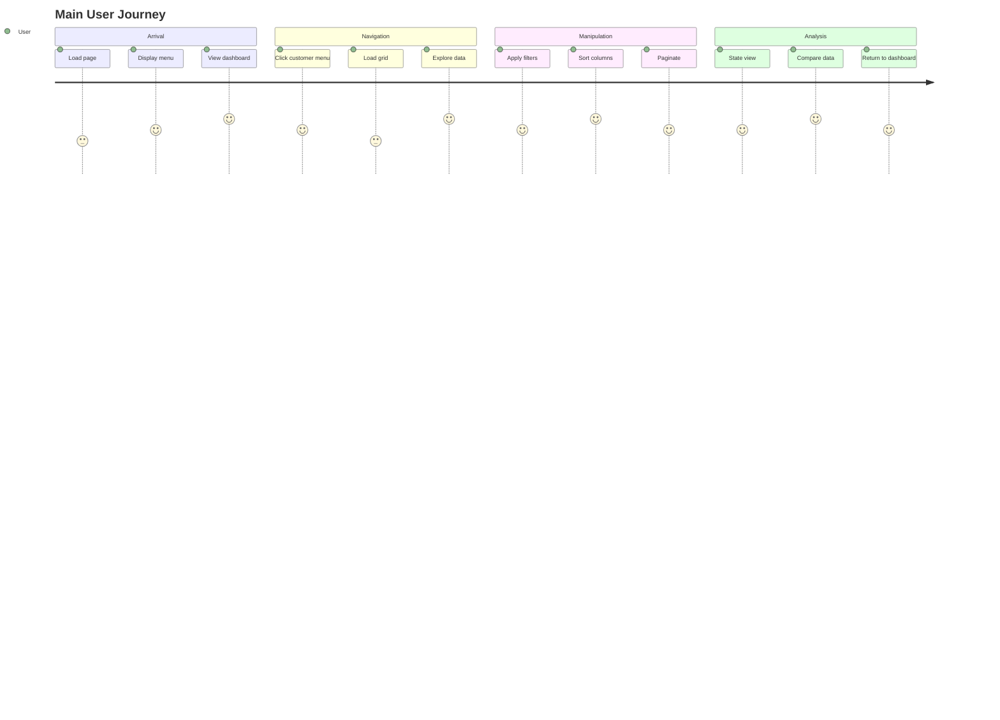

# Usability Features

> **📖 Complete Version**: For detailed usability documentation, see [French Usability Features](../../fr/requirements/usability-features.md)

## User Interface

### Navigation Structure



### Frame-Based Navigation
- **Layout**: Divided interface with persistent menu
- **Navigation**: Menu links target main content frame
- **Benefit**: Partial content loading, clear functional areas

### Interactive Data Grids

**Features**:
- Column filtering
- Multi-column sorting
- Data grouping
- Column reordering
- Column resizing
- Pagination

**Kendo UI Configuration**:
```javascript
$('#grid').kendoGrid({
    navigatable: true,    // Keyboard navigation
    filterable: true,     // Column filters
    groupable: true,      // Data grouping
    reorderable: true,    // Column reordering
    resizable: true,      // Column resizing
    sortable: true,       // Column sorting
    pageable: {           // Pagination
        refresh: true,
        pageSizes: [10, 20, 50]
    }
});
```

### Data Manipulation Features

**Advanced Filtering**:
- Filters per column with appropriate types
- Global text search
- Numeric and date filters
- Comparison operators

**Multi-Column Sorting**:
- Ascending/descending by click
- Secondary sort with Ctrl+click
- Visual sort direction indicators

**Data Grouping**:
- Drag-and-drop columns to grouping area
- Hierarchical multi-grouping
- Expand/collapse groups

**Smart Pagination**:
- Navigation controls (first, previous, next, last)
- Page size selection
- Total record count
- Refresh button

### Analytical Visualizations

**Dashboard with Charts**:
- Interactive pie chart
- Tooltips on hover
- Color-coded legends
- Smooth entry animation
- Automatic responsive design

**Example**:
```javascript
$("#chart").kendoChart({
    title: {
        text: "Distribution of Customers around the World"
    },
    series: [{
        type: "pie",
        data: [/* geographic data */]
    }],
    tooltip: {
        visible: true,
        format: "{0}%"
    }
});
```

## User Experience

### Main User Journey



### Intuitive Workflow
1. **Discovery**: Home page with informative dashboard
2. **Exploration**: Easy navigation to detailed data
3. **Analysis**: Manipulation tools to discover insights
4. **Comparison**: Quick switching between different views

## Accessibility

### WCAG 2.1 Standards

**Keyboard Navigation**:
- Complete navigation without mouse
- Tab/Shift+Tab: Element navigation
- Arrows: Grid navigation
- Enter/Space: Control activation

**Screen Reader Support**:
- Appropriate semantic HTML
- ARIA attributes for complex components
- Explicit labels for form controls

**Contrast and Readability**:
- WCAG AA contrast ratios
- Kendo UI "Blue Opal" theme with good contrast
- Appropriate font sizes (12px-14px)
- Accessible colors for status elements

## Performance

### Perceived Response Times

**Initial Load**: < 3 seconds
- CDN for Kendo UI resources
- CSS/JavaScript minification
- gzip compression

**Smooth Interactions**: Instant response to user actions
- Client-side caching of frequent data
- Lazy-loading pagination
- Optimized CSS animations

### Mobile Optimization

**Touch-Friendly**:
- Touch elements: Minimum 44x44px
- Swipe gestures for navigation
- Appropriate viewport control

**Bandwidth**: Reduced data transfer
- Pagination to minimize transfer
- Optimized images
- Aggressive client caching

## Customization

### User Preferences

**Grid Configuration**:
- Column show/hide
- Sort preference memorization
- Frequent filter saving
- Preferred page size

**Adaptable Interface**:
- Multiple Kendo UI theme support
- Density: Compact/comfortable/spacious
- Dark/light modes (future)

## User Feedback

### Loading Indicators
- Visual indicators during data loading
- Clear connection error messages
- Visual feedback for user actions

### Responsive Design
- Flexible grids adapt to screen size
- Mobile-adapted navigation
- Touch-appropriate element sizes

---

**📚 For complete usability documentation including:**
- Detailed UX patterns
- Accessibility testing
- User behavior analysis
- Mobile experience details

**See the [complete French documentation](../../fr/requirements/usability-features.md)**
