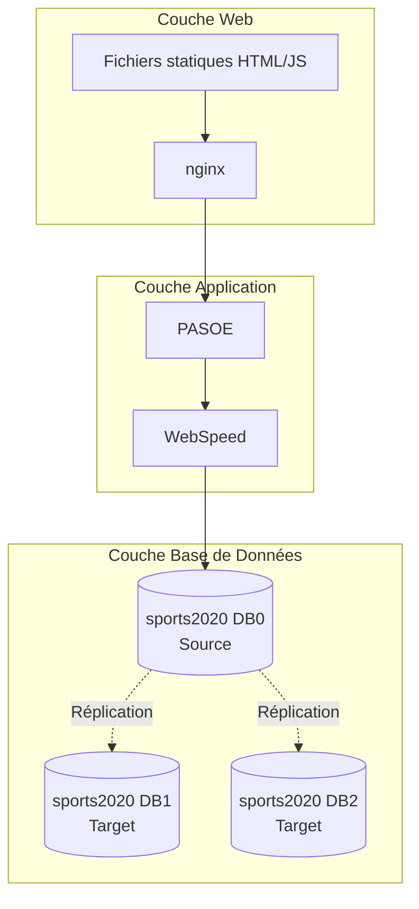

# Documentation de l'Application Sports

Cette documentation fournit une analyse complète de l'application Sports développée avec Progress OpenEdge/4GL, déployée sur AWS avec une architecture 3-tiers.

## Index de la Documentation

### 📐 Architecture
- [Vue d'ensemble de l'architecture](./architecture/architecture-overview.md) - Architecture générale 3-tiers
- [Diagrammes UML](./architecture/uml-diagrams.md) - Diagrammes de classes et de séquences
- [Architecture des composants](./architecture/component-architecture.md) - Structure des modules et interactions

### 📋 Exigences
- [Exigences fonctionnelles (MoSCoW)](./requirements/functional-requirements.md) - Fonctionnalités selon la méthode MoSCoW
- [Exigences non-fonctionnelles](./requirements/non-functional-requirements.md) - Performance, sécurité, etc.

### 🚀 Déploiement
- [Scénarios de déploiement](./deployment/deployment-scenarios.md) - Local et AWS Cloud
- [Guide de déploiement](./deployment/deployment-guide.md) - Instructions détaillées
- [Configuration AWS](./deployment/aws-configuration.md) - CloudFormation et infrastructure

### 🔌 API
- [Documentation API](./api/api-documentation.md) - Points d'accès REST/JSON
- [Référence WebSpeed](./api/webspeed-reference.md) - Programmes 4GL et endpoints

### 🎯 Utilisation
- [Fonctionnalités d'utilisation](./requirements/usability-features.md) - Interface utilisateur et ergonomie

## Technologies Utilisées

- **Backend**: Progress OpenEdge 4GL, WebSpeed, PASOE
- **Frontend**: HTML5, JavaScript, Kendo UI
- **Base de données**: Progress sports2020 avec réplication
- **Infrastructure**: AWS (EC2, CloudFormation), nginx
- **CI/CD**: GitHub Actions

## Architecture Générale

## Comment Utiliser Cette Documentation

1. **Développeurs**: Commencez par l'[architecture des composants](./architecture/component-architecture.md)
2. **Architectes**: Consultez la [vue d'ensemble](./architecture/architecture-overview.md)
3. **DevOps**: Référez-vous aux [scénarios de déploiement](./deployment/deployment-scenarios.md)
4. **Testeurs**: Utilisez la [documentation API](./api/api-documentation.md)

## Processus de Documentation

Voir [DOCUMENTATION_PROCESS.md](./DOCUMENTATION_PROCESS.md) pour comprendre comment cette documentation a été générée à partir du code source.