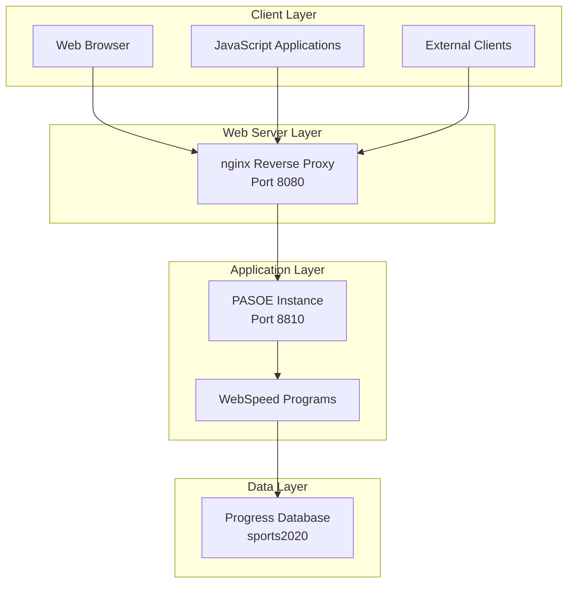

# Documentation API

## Vue d'Ensemble

L'application Sports expose plusieurs endpoints REST/JSON pour l'accès aux données. Cette documentation détaille tous les points d'accès disponibles, leurs paramètres, formats de réponse et exemples d'utilisation.

## Architecture API



## Endpoints Disponibles

### Base URL
```
Local: http://localhost:8080/web/
Production: http://[load-balancer-url]/web/
```

### Liste des Endpoints

| Endpoint | Méthode | Description | Programme 4GL |
|----------|---------|-------------|---------------|
| `/web/customer-data.p` | GET | Données clients en JSON | customer-data.p |
| `/web/state-data.p` | GET | Données états en JSON | state-data.p |
| `/web/customer-view.html` | GET | Vue grille clients | customer-view.html |
| `/web/state-view.html` | GET | Vue grille états | state-view.html |
| `/web/about.html` | GET | Page À propos | about.html |

## APIs de Données

### 1. Customer Data API

#### Endpoint
```
GET /web/customer-data.p
```

#### Description
Retourne la liste complète des clients avec leurs informations de base.

#### Paramètres
Aucun paramètre requis.

#### Format de Réponse
```json
{
  "dsCustomer": {
    "ttCustomer": [
      {
        "CustNum": 1,
        "Country": "USA",
        "Name": "LIFT LINE SKIING",
        "Address": "276 North Drive",
        "Address2": ""
      },
      {
        "CustNum": 2,
        "Country": "USA", 
        "Name": "AEROBIC EXERCISE",
        "Address": "414 Elm Drive",
        "Address2": "Suite 101"
      }
    ]
  }
}
```

#### Structure des Données

| Champ | Type | Description | Exemple |
|-------|------|-------------|---------|
| CustNum | Integer | Numéro unique du client | 1 |
| Country | String | Pays du client | "USA" |
| Name | String | Nom du client (en majuscules) | "LIFT LINE SKIING" |
| Address | String | Adresse principale | "276 North Drive" |
| Address2 | String | Complément d'adresse | "Suite 101" |

#### Exemple d'Utilisation

**Requête cURL**:
```bash
curl -X GET http://localhost:8080/web/customer-data.p \
  -H "Accept: application/json"
```

**Réponse**:
```json
{
  "dsCustomer": {
    "ttCustomer": [
      {
        "CustNum": 1,
        "Country": "USA",
        "Name": "LIFT LINE SKIING",
        "Address": "276 North Drive",
        "Address2": ""
      }
    ]
  }
}
```

**JavaScript/jQuery**:
```javascript
$.ajax({
    url: '/web/customer-data.p',
    method: 'GET',
    dataType: 'json',
    success: function(data) {
        console.log('Clients:', data.dsCustomer.ttCustomer);
    },
    error: function(xhr, status, error) {
        console.error('Erreur:', error);
    }
});
```

#### Code Source
```progress
USING Progress.Json.ObjectModel.JsonObject.

DEFINE TEMP-TABLE ttCustomer LIKE Customer.
DEFINE DATASET dsCustomer FOR ttCustomer.

PROCEDURE process-web-request :
    DEFINE VARIABLE oJsonObject AS Progress.Json.ObjectModel.JsonObject NO-UNDO.
    DEFINE VARIABLE lChar AS LONGCHAR NO-UNDO.
    
    RUN outputHeader.
    
    EMPTY TEMP-TABLE ttCustomer.
    FOR EACH Customer NO-LOCK:
        CREATE ttCustomer.
        BUFFER-COPY Customer TO ttCustomer.
        ASSIGN ttCustomer.Name = UPPER(Customer.Name).
    END.
    
    oJsonObject = NEW JsonObject().
    oJsonObject:READ(DATASET dsCustomer:HANDLE).
    
    lChar = oJsonObject:GetJsonText().
    {&OUT-LONG} lChar.
END PROCEDURE.
```

### 2. State Data API

#### Endpoint
```
GET /web/state-data.p
```

#### Description
Retourne la liste des états américains avec leurs informations régionales.

#### Paramètres
Aucun paramètre requis.

#### Format de Réponse
```json
{
  "dsState": {
    "ttState": [
      {
        "State": "AL",
        "StateName": "Alabama", 
        "Region": "South"
      },
      {
        "State": "AK",
        "StateName": "Alaska",
        "Region": "West"
      }
    ]
  }
}
```

#### Structure des Données

| Champ | Type | Description | Exemple |
|-------|------|-------------|---------|
| State | String | Code état (2 caractères) | "AL" |
| StateName | String | Nom complet de l'état | "Alabama" |
| Region | String | Région géographique | "South" |

#### Exemple d'Utilisation

**Requête cURL**:
```bash
curl -X GET http://localhost:8080/web/state-data.p \
  -H "Accept: application/json"
```

**JavaScript/Fetch**:
```javascript
fetch('/web/state-data.p')
    .then(response => response.json())
    .then(data => {
        const states = data.dsState.ttState;
        console.log(`${states.length} états trouvés`);
        states.forEach(state => {
            console.log(`${state.StateName} (${state.State}) - ${state.Region}`);
        });
    })
    .catch(error => console.error('Erreur:', error));
```

#### Code Source
```progress
USING Progress.Json.ObjectModel.JsonObject.

DEFINE TEMP-TABLE ttState LIKE State.
DEFINE DATASET dsState FOR ttState.

PROCEDURE process-web-request :
    DEFINE VARIABLE oJsonObject AS Progress.Json.ObjectModel.JsonObject NO-UNDO.
    DEFINE VARIABLE lChar AS LONGCHAR NO-UNDO.
    
    RUN outputHeader.
    
    EMPTY TEMP-TABLE ttState.
    FOR EACH State NO-LOCK:
        CREATE ttState.
        BUFFER-COPY State TO ttState.
    END.
    
    oJsonObject = NEW JsonObject().
    oJsonObject:READ(DATASET dsState:HANDLE).
    
    lChar = oJsonObject:GetJsonText().
    {&OUT-LONG} lChar.
END PROCEDURE.
```

## Pages de Vue (HTML)

### 3. Customer View

#### Endpoint
```
GET /web/customer-view.html
```

#### Description
Page HTML générée dynamiquement affichant une grille Kendo UI pour les clients.

#### Fonctionnalités
- Grille interactive avec tri, filtrage, groupement
- Pagination automatique
- Configuration dynamique basée sur métadonnées DB
- Integration JSDO Progress

#### Configuration Générée
```javascript
var config = {
    "readURL": "/web/customer-data.p",
    "data": "dsCustomer.ttCustomer", 
    "fields": [
        {"field": "CustNum"},
        {"field": "Country"},
        {"field": "Name"},
        {"field": "Address"},
        {"field": "Address2"}
    ]
};
```

### 4. State View

#### Endpoint
```
GET /web/state-view.html
```

#### Description
Page HTML pour l'affichage des données d'états en grille.

#### Configuration Générée
```javascript
var config = {
    "readURL": "/web/state-data.p",
    "data": "dsState.ttState",
    "fields": [
        {"field": "State"},
        {"field": "StateName"}, 
        {"field": "Region"}
    ]
};
```

### 5. About Page

#### Endpoint
```
GET /web/about.html
```

#### Description
Page statique d'information sur l'application.

## Configuration des APIs

### Headers HTTP

#### Requêtes
```
Accept: application/json
Content-Type: application/json
User-Agent: [client-info]
```

#### Réponses
```
Content-Type: application/json; charset=utf-8
X-Frame-Options: SAMEORIGIN
Cache-Control: no-cache, no-store, must-revalidate
Pragma: no-cache
Expires: 0
```

### Gestion des Erreurs

#### Codes de Statut HTTP

| Code | Description | Cause Probable |
|------|-------------|----------------|
| 200 | OK | Requête réussie |
| 404 | Not Found | Endpoint inexistant |
| 500 | Internal Server Error | Erreur programme 4GL |
| 502 | Bad Gateway | PASOE indisponible |
| 503 | Service Unavailable | Surcharge système |

#### Format d'Erreur
```json
{
  "error": {
    "code": 500,
    "message": "Internal server error",
    "details": "Database connection failed"
  }
}
```

### Performance et Limitations

#### Limites de Débit
- **Connexions simultanées**: 200 par agent PASOE
- **Timeout requête**: 15 secondes
- **Taille réponse max**: 10 MB (configurable)

#### Optimisations
- Cache nginx pour ressources statiques
- Compression gzip activée
- Keep-alive connections
- Pool de connexions DB

## Intégration Frontend

### Configuration Kendo UI

#### DataSource Standard
```javascript
var dataSource = new kendo.data.DataSource({
    transport: {
        read: {
            url: config.readURL,
            dataType: "json"
        }
    },
    schema: {
        data: config.data
    },
    pageSize: 20,
    serverPaging: false,
    serverFiltering: false,
    serverSorting: false
});
```

#### Grid Configuration
```javascript
$("#grid").kendoGrid({
    dataSource: dataSource,
    navigatable: true,
    filterable: true,
    height: 400,
    groupable: true,
    reorderable: true,
    resizable: true,
    sortable: true,
    pageable: {
        refresh: true,
        pageSizes: [10, 20, 50],
        buttonCount: 5
    },
    columns: config.fields
});
```

### Gestion des Erreurs Frontend

#### Error Handler Global
```javascript
$(document).ajaxError(function(event, xhr, settings, error) {
    var message = "Erreur de communication avec le serveur";
    
    switch(xhr.status) {
        case 404:
            message = "Service non trouvé";
            break;
        case 500:
            message = "Erreur interne du serveur";
            break;
        case 502:
            message = "Service temporairement indisponible";
            break;
        case 503:
            message = "Service surchargé, veuillez réessayer";
            break;
    }
    
    console.error("API Error:", message, xhr);
    
    // Affichage utilisateur
    kendo.alert(message);
});
```

## Tests et Validation

### Tests Automatisés

#### Script de Test
```bash
#!/bin/bash
# test.sh

HostName=${1-localhost:8080}
AppURL=/web

echo "Testing APIs on $HostName..."

# Test Customer Data API
echo "Testing customer-data.p..."
curl -s http://$HostName$AppURL/customer-data.p | json_reformat > /dev/null
if [ $? -eq 0 ]; then 
    echo "✓ Customer API: PASSED"
else 
    echo "✗ Customer API: FAILED"
fi

# Test State Data API
echo "Testing state-data.p..."
curl -s http://$HostName$AppURL/state-data.p | json_reformat > /dev/null
if [ $? -eq 0 ]; then 
    echo "✓ State API: PASSED"
else 
    echo "✗ State API: FAILED"
fi

# Test HTML Views
for page in customer-view.html state-view.html about.html; do
    echo "Testing $page..."
    curl -s http://$HostName$AppURL/$page | grep -q "<!DOCTYPE html"
    if [ $? -eq 0 ]; then 
        echo "✓ $page: PASSED"
    else 
        echo "✗ $page: FAILED"
    fi
done
```

#### Validation JSON
```bash
# Validation format JSON
curl -s http://localhost:8080/web/customer-data.p | jq .

# Validation structure
curl -s http://localhost:8080/web/customer-data.p | \
  jq '.dsCustomer.ttCustomer | length'

# Test champs requis
curl -s http://localhost:8080/web/customer-data.p | \
  jq '.dsCustomer.ttCustomer[0] | has("CustNum") and has("Name")'
```

### Tests de Performance

#### Load Testing avec ab
```bash
# Test charge API customers
ab -n 1000 -c 10 http://localhost:8080/web/customer-data.p

# Test charge API states  
ab -n 1000 -c 10 http://localhost:8080/web/state-data.p
```

#### Monitoring Performance
```bash
# Temps de réponse moyen
curl -o /dev/null -s -w "Time: %{time_total}s\n" \
  http://localhost:8080/web/customer-data.p

# Taille de réponse
curl -o /dev/null -s -w "Size: %{size_download} bytes\n" \
  http://localhost:8080/web/customer-data.p
```

## Sécurité API

### Authentification
- Configuration anonyme pour démo
- Spring Security avec rôles configurables
- Support JWT pour versions futures

### Validation d'Entrée
- Pas de paramètres utilisateur actuellement
- Validation côté serveur pour extensions futures
- Échappement automatique des caractères spéciaux

### Protection CSRF
- CSRF désactivé pour APIs REST
- Headers de sécurité configurés
- Same-origin policy appliquée

Cette documentation fournit toutes les informations nécessaires pour intégrer et utiliser efficacement les APIs de l'application Sports.