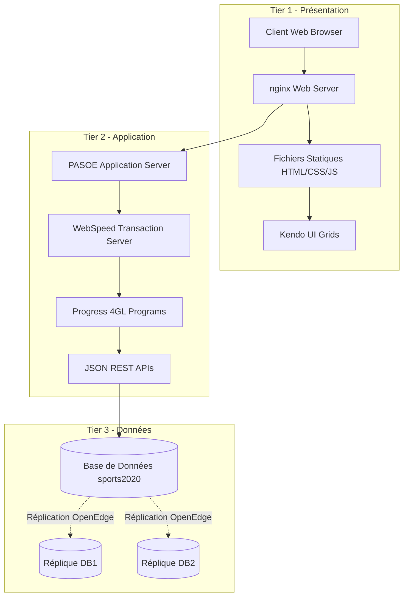
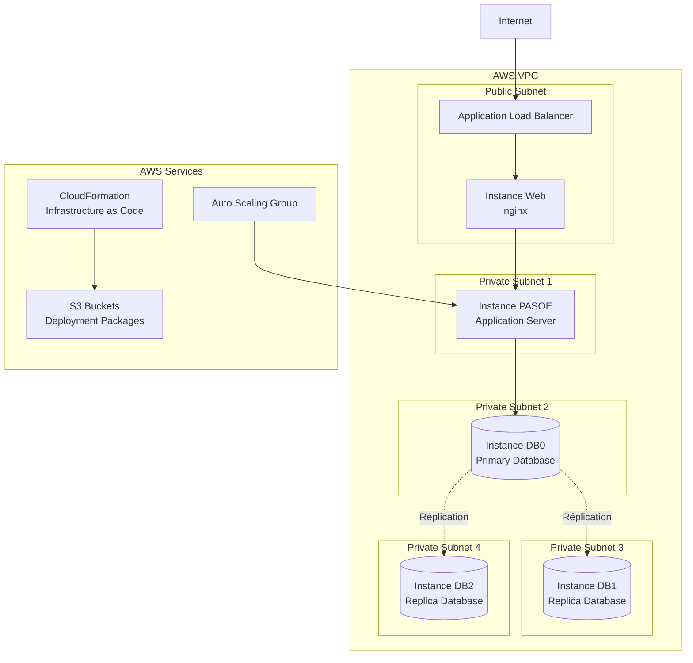
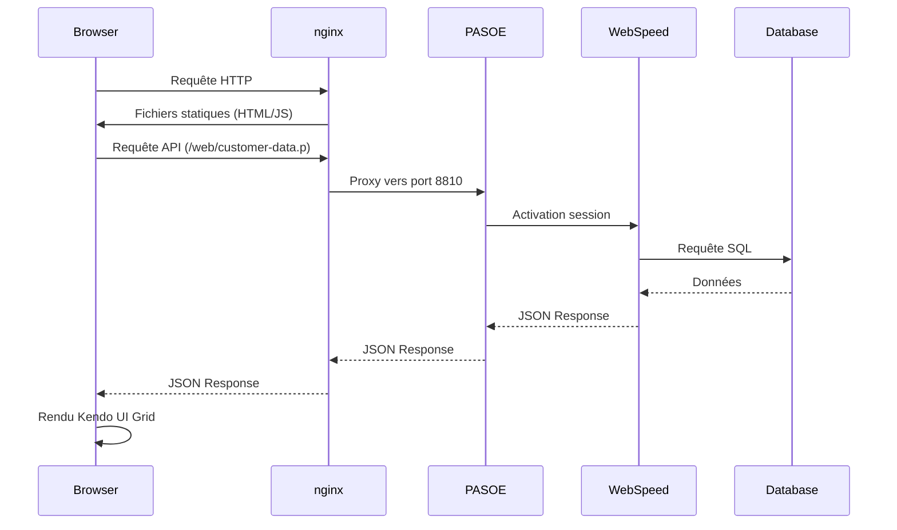

# Vue d'Ensemble de l'Architecture

## Introduction

L'application Sports est une application multi-tiers développée avec Progress OpenEdge 4GL qui démontre les capacités de réplication de base de données et les modèles de déploiement cloud. Elle comprend des services backend WebSpeed/PASOE, des composants de base de données et une interface web frontend déployée via l'infrastructure AWS.

## Architecture 3-Tiers

## Composants Principaux

### 1. Couche Web (Tier 1)
- **nginx**: Serveur web servant les fichiers statiques et proxy inverse vers PASOE
- **Interface utilisateur**: HTML5 avec composants Kendo UI
- **Grilles dynamiques**: Affichage des données Customer et State

### 2. Couche Application (Tier 2)
- **PASOE**: Progress Application Server for OpenEdge
- **WebSpeed**: Serveur de transactions pour les programmes 4GL
- **APIs REST**: Endpoints JSON pour l'accès aux données

### 3. Couche Données (Tier 3)
- **Base de données principale**: sports2020 (source de réplication)
- **Bases de données répliquées**: DB1 et DB2 (cibles de réplication)
- **Réplication OpenEdge**: Synchronisation automatique des données

## Architecture de Déploiement AWS

## Flux de Données

## Technologies et Frameworks

### Backend
- **Progress OpenEdge 11.7+**: Plateforme de développement 4GL
- **WebSpeed**: Framework web pour Progress 4GL
- **PASOE**: Serveur d'applications moderne
- **Progress.Json.ObjectModel**: Sérialisation JSON native

### Frontend
- **Kendo UI 2017.3.1026**: Bibliothèque de composants UI
- **jQuery**: Manipulation DOM et AJAX
- **Progress JSDO**: Liaison de données JavaScript

### Infrastructure
- **nginx**: Serveur web et proxy inverse
- **AWS EC2**: Instances virtuelles
- **AWS CloudFormation**: Infrastructure as Code
- **AWS S3**: Stockage des packages de déploiement

## Patterns Architecturaux

### 1. Pattern Repository
Les programmes 4GL suivent le pattern repository avec:
- Temp-tables pour la manipulation des données
- Datasets pour la sérialisation JSON
- Procédures de connexion centralisées

### 2. Pattern Proxy
nginx agit comme proxy inverse:
- Routage des requêtes statiques vs dynamiques
- Load balancing vers les instances PASOE
- Terminaison SSL/TLS

### 3. Pattern MVC (Côté Client)
- **Model**: Configuration JSON générée dynamiquement
- **View**: Templates HTML avec placeholders
- **Controller**: Scripts JavaScript Kendo UI

## Sécurité

### Authentification
- Configuration anonyme pour l'accès public
- Spring Security pour la protection des endpoints
- Headers de sécurité (X-Frame-Options, XSS-Protection)

### Réseau
- VPC AWS avec subnets privés/publics
- Security Groups pour contrôler l'accès
- Load Balancer pour la distribution du trafic

## Scalabilité

### Horizontale
- Auto Scaling Groups pour les instances PASOE
- Réplication de base de données multi-région
- Load Balancer pour distribution du trafic

### Verticale
- Configuration des agents PASOE (min/max)
- Paramètres de pool de connexions
- Cache des sessions utilisateur

## Monitoring et Observabilité

### Logs
- Logs nginx: accès et erreurs
- Logs PASOE: agents et sessions
- Logs base de données: réplication et transactions

### Métriques
- Collecte de métriques PASOE activée
- Monitoring AWS CloudWatch
- Alertes sur les performances

Cette architecture assure une haute disponibilité, une scalabilité et une maintenabilité optimales pour l'application Sports.