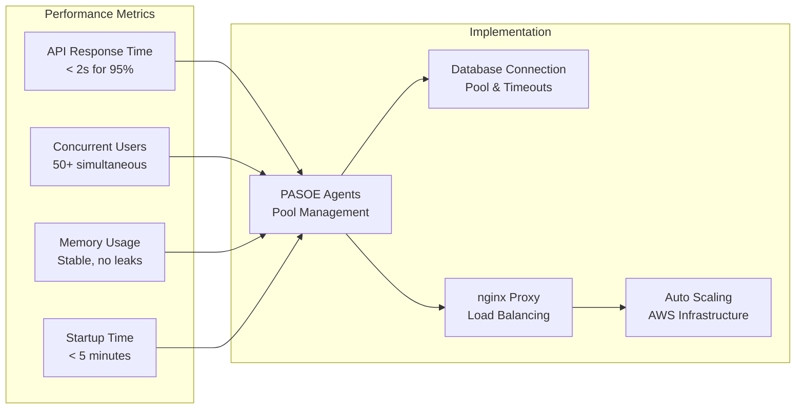
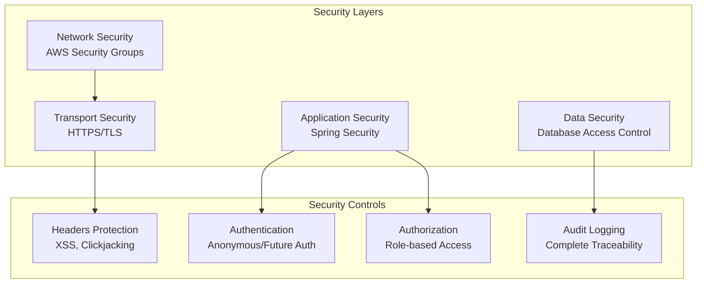
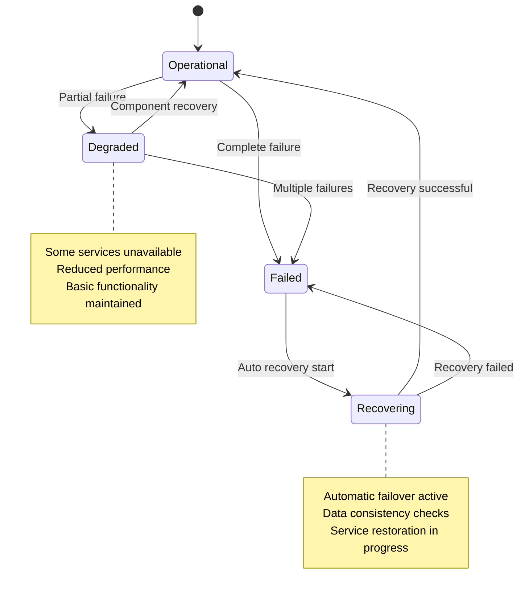

# Exigences Non-Fonctionnelles

## Vue d'Ensemble

Ce document détaille les exigences non-fonctionnelles de l'application Sports, couvrant les aspects de performance, sécurité, fiabilité, utilisabilité, maintenabilité et autres qualités systémiques dérivées de l'analyse du code et de l'architecture.

## Performance

### PER-001: Temps de Réponse des APIs
- **Exigence**: Les APIs REST doivent répondre en moins de 2 secondes pour 95% des requêtes
- **Mesure**: Temps entre requête HTTP et réponse JSON complète
- **Implémentation actuelle**:
  - Timeout de requête PASOE: 15 secondes (`requestWaitTimeout=15000`)
  - Timeout de connexion DB: 3 secondes (`connectionWaitTimeout=3000`)
- **Validation**: Tests de charge, monitoring applicatif

### PER-002: Capacité Concurrent d'Utilisateurs
- **Exigence**: Support de 50 utilisateurs simultanés minimum
- **Mesure**: Sessions PASOE actives sans dégradation
- **Implémentation actuelle**:
  - Agents PASOE: 1 minimum, 2 maximum (`minAgents=1, maxAgents=2`)
  - Sessions par agent: 200 maximum (`maxABLSessionsPerAgent=200`)
  - Connexions par agent: 200 maximum (`maxConnectionsPerAgent=200`)
- **Scalabilité**: Auto Scaling Group AWS pour extension horizontale

### PER-003: Utilisation Mémoire
- **Exigence**: Consommation mémoire stable sans fuites
- **Mesure**: Utilisation RAM des processus PASOE et nginx
- **Implémentation actuelle**:
  - Pool de sessions configuré (`numInitialSessions=5`)
  - Timeout d'inactivité: 30 minutes (`idleSessionTimeout=1800000`)
  - Collecte de métriques activée (`collectMetrics=1`)

### PER-004: Temps de Démarrage
- **Exigence**: Démarrage de l'application en moins de 5 minutes
- **Mesure**: Temps entre lancement et disponibilité des services
- **Implémentation actuelle**:
  - Démarrage automatique PASOE configuré (`rc.local`)
  - Agents initiaux prêts au démarrage
  - Base de données avec auto-démarrage



## Sécurité

### SEC-001: Authentification et Autorisation
- **Exigence**: Accès contrôlé aux ressources sensibles
- **Implémentation actuelle**:
  - Modèle anonyme pour accès public (`anonymousLoginModel.xml`)
  - Spring Security configuré avec rôles `ROLE_ANONYMOUS`
  - Protection des endpoints administratifs
- **Évolution**: Authentification forte pour version production

### SEC-002: Protection contre les Attaques Web
- **Exigence**: Protection contre XSS, CSRF, Clickjacking
- **Implémentation actuelle**:
  ```xml
  <headers defaults-disabled="false">
      <frame-options policy="SAMEORIGIN"/>
      <xss-protection block="false"/>
  </headers>
  <csrf disabled="true"/>
  ```
- **Validation**: Tests de sécurité automatisés

### SEC-003: Chiffrement des Communications
- **Exigence**: HTTPS pour tous les échanges en production
- **Implémentation actuelle**:
  - SSL/TLS configuré dans nginx
  - Certificats SSL disponibles
  - Redirection HTTP vers HTTPS

### SEC-004: Audit et Logging
- **Exigence**: Traçabilité complète des accès et opérations
- **Implémentation actuelle**:
  - Logs nginx: accès et erreurs (`/var/log/nginx/`)
  - Logs PASOE: agents et sessions (`${catalina.base}/logs/`)
  - Logs base de données: connexions et transactions



## Fiabilité

### REL-001: Disponibilité du Service
- **Exigence**: 99.5% de disponibilité (moins de 36 heures d'arrêt par an)
- **Implémentation actuelle**:
  - Réplication de base de données multi-région
  - Auto Scaling Group pour redondance des instances
  - Health checks et auto-recovery
- **Monitoring**: CloudWatch, alertes automatiques

### REL-002: Récupération après Panne
- **Exigence**: RTO (Recovery Time Objective) de 15 minutes maximum
- **Implémentation actuelle**:
  - Failover automatique entre répliques DB
  - Configuration `autoreconnect.pf` pour reconnexion automatique
  - Backup et restauration automatisés
- **Tests**: Simulations de panne régulières

### REL-003: Intégrité des Données
- **Exigence**: Aucune perte de données lors des opérations normales
- **Implémentation actuelle**:
  - Réplication asynchrone OpenEdge
  - Sauvegarde incrementale automatique
  - Validation d'intégrité périodique

### REL-004: Tolérance aux Pannes
- **Exigence**: Fonctionnement dégradé en cas de panne partielle
- **Implémentation actuelle**:
  - Multiple agents PASOE pour redondance
  - Connexions alternatives de base de données
  - Retry automatique des connexions



## Scalabilité

### SCA-001: Scalabilité Horizontale
- **Exigence**: Capacité d'ajouter des instances sans modification du code
- **Implémentation actuelle**:
  - Auto Scaling Group AWS configuré
  - Load Balancer pour distribution du trafic
  - Session stateless pour PASOE
- **Configuration**: 1-3 instances selon la charge

### SCA-002: Scalabilité Verticale
- **Exigence**: Support de l'augmentation des ressources d'une instance
- **Implémentation actuelle**:
  - Configuration dynamique des agents PASOE
  - Pool de connexions ajustable
  - Types d'instances EC2 configurables (t3a.small à t3a.large)

### SCA-003: Scalabilité de Données
- **Exigence**: Gestion de l'augmentation du volume de données
- **Implémentation actuelle**:
  - Pagination des résultats dans les APIs
  - Indexation de base de données optimisée
  - Réplication pour distribution de charge

## Maintenabilité

### MAIN-001: Facilité de Déploiement
- **Exigence**: Déploiement automatisé et reproductible
- **Implémentation actuelle**:
  - Scripts de build automatisés (`build.sh`)
  - Pipeline CI/CD avec GitHub Actions
  - Infrastructure as Code avec CloudFormation
- **Validation**: Tests automatisés à chaque déploiement

### MAIN-002: Observabilité
- **Exigence**: Monitoring et debugging facilités
- **Implémentation actuelle**:
  - Logs structurés et centralisés
  - Métriques de performance collectées
  - Health checks automatiques
- **Outils**: CloudWatch, logs PASOE, monitoring nginx

### MAIN-003: Modularité du Code
- **Exigence**: Code organisé en modules réutilisables
- **Implémentation actuelle**:
  - Include files pour fonctionnalités communes
  - Séparation claire des responsabilités
  - Pattern repository pour l'accès aux données

### MAIN-004: Documentation Technique
- **Exigence**: Documentation complète et à jour
- **Implémentation actuelle**:
  - Documentation générée du code
  - Commentaires dans les configurations
  - README et guides de déploiement

## Portabilité

### PORT-001: Indépendance de l'Infrastructure
- **Exigence**: Déploiement possible sur différents environnements
- **Implémentation actuelle**:
  - Support local (version 122) et cloud (AWS)
  - Configuration par variables d'environnement
  - Containerisation possible (Docker ready)

### PORT-002: Compatibilité Navigateur
- **Exigence**: Support des navigateurs modernes
- **Implémentation actuelle**:
  - HTML5 et CSS3 standards
  - JavaScript ES5+ compatible
  - Framework Kendo UI multi-navigateur
- **Support**: Chrome, Firefox, Safari, Edge (versions récentes)

## Utilisabilité

### USA-001: Temps d'Apprentissage
- **Exigence**: Interface intuitive nécessitant moins de 30 minutes de formation
- **Implémentation actuelle**:
  - Navigation simple par menu
  - Grilles standard avec fonctionnalités communes
  - Interface cohérente avec patterns reconnus

### USA-002: Accessibilité
- **Exigence**: Conformité aux standards d'accessibilité WCAG 2.1 AA
- **Implémentation actuelle**:
  - HTML sémantique correct
  - Contraste et lisibilité appropriés
  - Navigation au clavier possible
- **À améliorer**: Tests d'accessibilité automatisés

## Conformité

### CONF-001: Standards Web
- **Exigence**: Respect des standards W3C et bonnes pratiques
- **Implémentation actuelle**:
  - HTML5 valide
  - CSS3 standard
  - REST API suivant les conventions HTTP

### CONF-002: Sécurité des Données
- **Exigence**: Conformité aux réglementations sur la protection des données
- **Implémentation actuelle**:
  - Données de démonstration uniquement
  - Logs sans informations sensibles
  - Chiffrement en transit

Ces exigences non-fonctionnelles assurent que l'application Sports maintient un niveau de qualité élevé en termes de performance, sécurité, fiabilité et utilisabilité, tout en restant maintenable et scalable pour les évolutions futures.