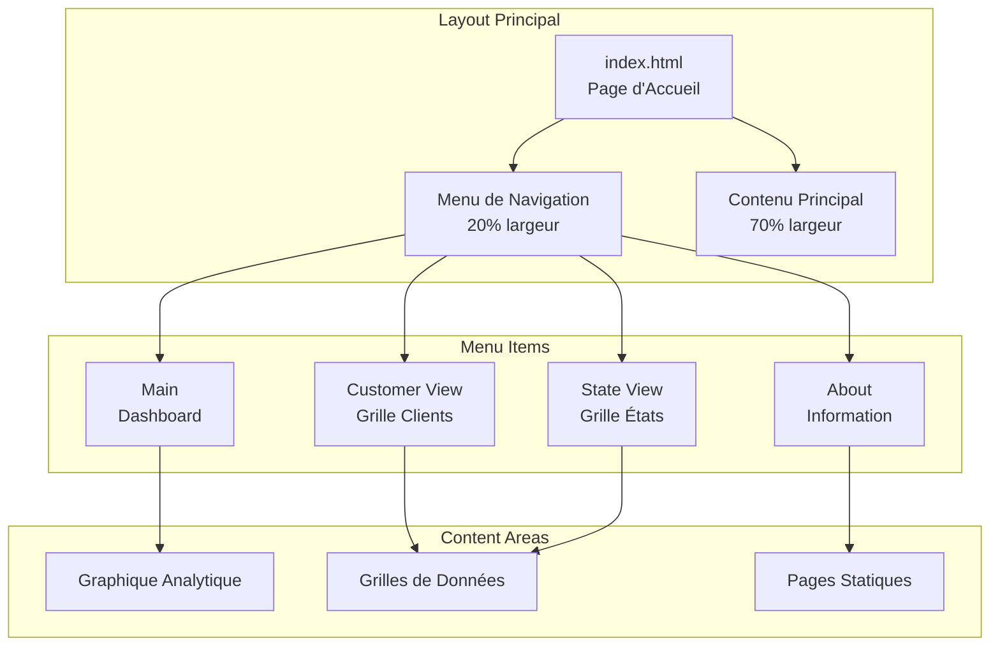
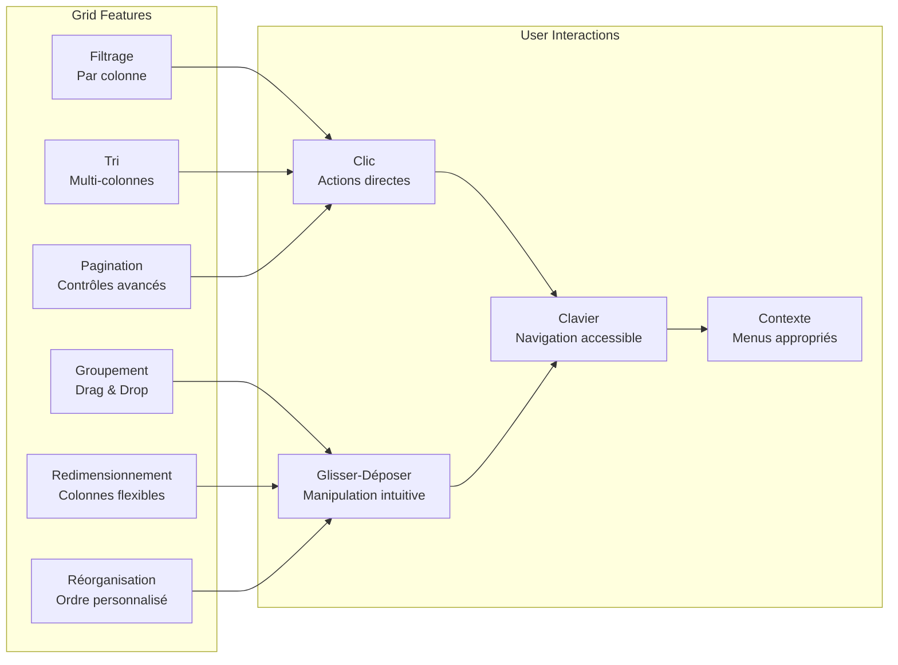
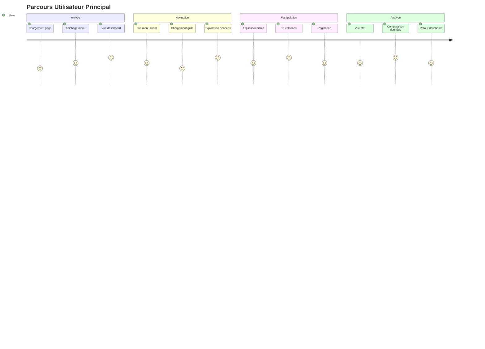
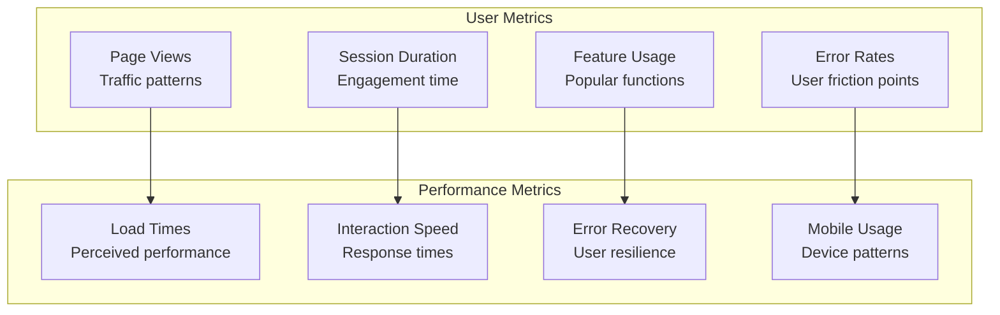

# Fonctionnalités d'Utilisation

## Vue d'Ensemble

Ce document décrit les fonctionnalités d'utilisation et l'expérience utilisateur de l'application Sports. Il couvre l'interface utilisateur, l'ergonomie, l'accessibilité et l'expérience globale d'utilisation basée sur l'analyse du code frontend et des composants d'interface.

## Interface Utilisateur

### Structure de Navigation



#### UX-001: Navigation par Frames
- **Fonctionnalité**: Interface divisée en frames pour navigation et contenu
- **Implémentation**:
  ```html
  <iframe name="menu" src="menu.html" width="20%" height="600"></iframe>
  <iframe name="mainContent" src="main.html" width="70%" height="600"></iframe>
  ```
- **Avantages**: 
  - Menu persistent lors de la navigation
  - Chargement partiel du contenu
  - Séparation claire des zones fonctionnelles
- **Inconvénients**: 
  - Limitation pour le responsive design
  - Problèmes d'accessibilité potentiels

#### UX-002: Menu de Navigation Contextuel
- **Fonctionnalité**: Menu vertical avec liens ciblés
- **Implémentation**:
  ```html
  <li><a target="mainContent" href="main.html">Main</a></li>
  <li><a target="mainContent" href="/web/customer-view.html">Customer View</a></li>
  <li><a target="mainContent" href="/web/state-view.html">State View</a></li>
  ```
- **Caractéristiques**:
  - Navigation directe par clic
  - Indicateur visuel de la section active
  - Hiérarchie claire des fonctionnalités

### Grilles de Données Interactives

#### UX-003: Grille Kendo UI Avancée
- **Fonctionnalité**: Grilles riches avec fonctionnalités d'interaction
- **Configuration**:
  ```javascript
  $('#grid').kendoGrid({
      navigatable: true,    // Navigation au clavier
      filterable: true,     // Filtres par colonne  
      groupable: true,      // Groupement de données
      reorderable: true,    // Réorganisation des colonnes
      resizable: true,      // Redimensionnement des colonnes
      sortable: true,       // Tri par colonne
      pageable: {           // Pagination
          refresh: true
      }
  });
  ```

#### UX-004: Fonctionnalités de Manipulation de Données

**Filtrage Avancé**:
- Filtres par colonne avec types appropriés
- Recherche textuelle globale
- Filtres numériques et de date
- Opérateurs de comparaison (égal, contient, commence par, etc.)

**Tri Multi-Colonnes**:
- Tri ascendant/descendant par clic
- Tri secondaire maintenu avec Ctrl+clic
- Indicateurs visuels de direction de tri

**Groupement de Données**:
- Glisser-déposer des colonnes vers zone de groupement
- Groupement hiérarchique multiple
- Expansion/contraction des groupes

**Pagination Intelligente**:
- Contrôles de navigation (première, précédente, suivante, dernière)
- Sélection de taille de page
- Information sur le nombre total d'enregistrements
- Bouton de rafraîchissement



### Visualisations Analytiques

#### UX-005: Dashboard avec Graphiques
- **Fonctionnalité**: Tableau de bord avec visualisations Kendo UI
- **Implémentation**:
  ```javascript
  $("#chart").kendoChart({
      title: {
          position: "bottom",
          text: "Distribution of Customers around the World"
      },
      series: [{
          type: "pie",
          data: [/* données géographiques */]
      }],
      tooltip: {
          visible: true,
          format: "{0}%"
      }
  });
  ```

**Caractéristiques du Graphique**:
- Graphique en secteurs interactif
- Tooltips informatifs au survol
- Légendes avec couleurs distinctives
- Animation d'entrée fluide
- Responsive design automatique

#### UX-006: Données Contextualisées
- **Distribution Géographique**: Affichage des clients par région
- **Pourcentages Précis**: Valeurs exactes dans les tooltips
- **Couleurs Cohérentes**: Palette professionnelle et accessible
- **Interactivité**: Survol et sélection des segments

## Expérience Utilisateur (UX)

### Flux d'Utilisation Principal



#### UX-007: Workflow Intuitif
1. **Découverte**: Page d'accueil avec dashboard informatif
2. **Exploration**: Navigation facile vers les données détaillées
3. **Analyse**: Outils de manipulation pour découvrir les insights
4. **Comparaison**: Basculement rapide entre vues différentes

### Retour Utilisateur (Feedback)

#### UX-008: Indicateurs de Chargement
- **États de Loading**: Indicateurs visuels pendant le chargement des données
- **Messages d'Erreur**: Affichage clair des problèmes de connexion
- **Confirmations**: Retour visuel des actions utilisateur

#### UX-009: Responsive Design Adaptatif
- **Grilles Flexibles**: Adaptation automatique à la taille d'écran
- **Navigation Mobile**: Menu adapté aux écrans tactiles
- **Éléments Tactiles**: Taille appropriée pour interaction mobile

## Accessibilité

### Standards WCAG 2.1

#### ACC-001: Navigation au Clavier
- **Fonctionnalité**: Navigation complète sans souris
- **Implémentation**: 
  - Kendo UI `navigatable: true`
  - Ordre de tabulation logique
  - Focus visible sur les éléments interactifs
- **Raccourcis**:
  - Tab/Shift+Tab: Navigation entre éléments
  - Flèches: Navigation dans les grilles
  - Enter/Space: Activation des contrôles

#### ACC-002: Lecteurs d'Écran
- **Compatibilité**: Support des technologies d'assistance
- **Implémentation**:
  - HTML sémantique approprié
  - Attributs ARIA pour les composants complexes
  - Labels explicites pour les contrôles de formulaire

#### ACC-003: Contraste et Lisibilité
- **Standards**: Conformité aux ratios de contraste WCAG AA
- **Implémentation**:
  - Thème Kendo UI "Blue Opal" avec bon contraste
  - Tailles de police appropriées (12px-14px)
  - Couleurs accessibles pour les éléments d'état

### Fonctionnalités d'Assistance

#### ACC-004: Alternatives Textuelles
- **Images**: Attributs alt appropriés
- **Graphiques**: Descriptions textuelles des données
- **Icônes**: Labels ou titres descriptifs

#### ACC-005: Structure Sémantique
- **Headings**: Hiérarchie H1-H6 respectée
- **Landmarks**: Zones de page identifiées
- **Lists**: Navigation et menus structurés en listes

## Performance Utilisateur

### Temps de Réponse Perçus

#### PERF-UX-001: Chargement Initial
- **Objectif**: Page visible en moins de 3 secondes
- **Techniques**:
  - CDN pour les ressources Kendo UI
  - Minification CSS/JavaScript
  - Compression gzip des réponses

#### PERF-UX-002: Interactions Fluides
- **Objectif**: Réponse instantanée aux actions utilisateur
- **Techniques**:
  - Cache côté client des données fréquentes
  - Pagination lazy-loading
  - Animations CSS optimisées

### Optimisation Mobile

#### MOB-001: Touch-Friendly
- **Éléments Tactiles**: Taille minimum 44x44px
- **Gestes**: Support swipe pour navigation
- **Zoom**: Contrôle approprié du viewport

#### MOB-002: Bande Passante
- **Données Minimales**: Pagination pour réduire le transfert
- **Images Optimisées**: Formats et tailles appropriés
- **Cache Agressif**: Stockage local des ressources statiques

## Personnalisation

### Préférences Utilisateur

#### CUST-001: Configuration de Grille
- **Colonnes**: Masquage/affichage des colonnes
- **Tri**: Mémorisation des préférences de tri
- **Filtres**: Sauvegarde des filtres fréquents
- **Pagination**: Taille de page préférée

#### CUST-002: Interface Adaptable
- **Thèmes**: Support de thèmes Kendo UI multiples
- **Densité**: Compact/confortable/spacieux
- **Couleurs**: Modes sombre/clair (futur)

## Analyse d'Utilisation

### Métriques UX Collectées



#### ANAL-001: Comportement Utilisateur
- **Pages Populaires**: Tracking des vues les plus consultées
- **Parcours**: Analyse des chemins de navigation
- **Temps de Session**: Durée d'engagement moyen
- **Points d'Abandon**: Identification des frictions

#### ANAL-002: Performance Perçue
- **Temps de Chargement**: Mesure real user monitoring
- **Interactions**: Temps de réponse des actions utilisateur
- **Erreurs**: Fréquence et types d'erreurs rencontrées

Ces fonctionnalités d'utilisation assurent une expérience utilisateur moderne, accessible et performante, conforme aux standards actuels du développement web et aux meilleures pratiques d'ergonomie.